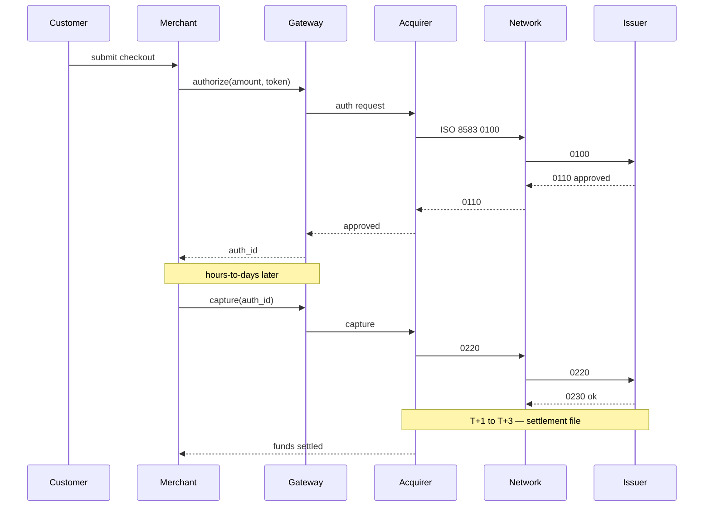

# Payments Card Processing and Gateways

> **One-liner**: Charging a card is two steps (auth, then capture), not one — and there's a five-day gap between "money looks taken" and "money is actually settled".

---

## Quick Reference

| Item | Value / Syntax |
|------|----------------|
| Authorization | Reserve funds on the cardholder's account; no movement yet |
| Capture | Convert an auth into an actual charge |
| Refund | Reverse a captured charge |
| Void | Cancel an uncaptured auth |
| Settlement | Funds actually move from issuer to acquirer (T+1 to T+3 typically) |
| Chargeback | Cardholder disputes the charge; funds clawed back |
| 3-D Secure | Issuer-side step-up auth (3DS 2.x is the current spec) |
| Tokenization | Replace PAN with a non-sensitive token |
| PAN | Primary Account Number — the 16-digit card number |
| BIN | First 6–8 digits of PAN — identifies issuer |
| MCC | Merchant Category Code — 4 digits, classifies the merchant |
| PCI DSS | Standard for handling card data; v4.0 current |
| EMVCo | Sets EMV chip + 3DS specs |
| ISO 8583 | Wire format for card-network messages |
| Standard gateways | Stripe, Adyen, Braintree, Worldpay, Checkout.com |

---

## Core Concept

A card charge is two distinct operations: **authorize** (place a hold on the cardholder's funds, no money moves) and **capture** (convert that hold into a real debit). New engineers routinely conflate them, then ship bugs where the customer's statement shows a charge but the merchant has never captured — or worse, where the merchant ships goods before capture and never collects. The two-step flow exists precisely because there is normally a delay between "customer pays" and "we are ready to fulfil", and the gateway gives you explicit primitives for it.

Settlement is asynchronous and slow. Funds actually leave the issuer and land in the acquirer's bank account on T+1 to T+3 days for most schemes — sometimes longer for international or higher-risk merchants. The money is *not* in your bank account on the day of the order. Reconciliation must therefore match your captures against the gateway's daily settlement files (Stripe payouts, Adyen reports), not against your own order events; otherwise your books will diverge from reality.

PCI DSS scope reduction via tokenization is non-negotiable for almost every modern integration. Use the gateway's hosted fields or SDK so the raw card number never touches your servers, and store only the gateway's token (Stripe `tok_*`, Adyen recurring detail reference, etc.). Anything else dramatically expands your audit and breach exposure.

---

## Diagram



---

## Syntax & API

```csharp
var intentOptions = new PaymentIntentCreateOptions
{
    Amount = 1999,                    // pence/cents — never use decimal here
    Currency = "gbp",
    PaymentMethodTypes = new() { "card" },
    CaptureMethod = "manual",         // explicit two-step
    Metadata = { ["order_id"] = orderId }
};
var intent = await _stripe.PaymentIntents.CreateAsync(intentOptions);
// ... later, after fulfilment readiness ...
await _stripe.PaymentIntents.CaptureAsync(intent.Id);
```

---

## Common Patterns

```csharp
public async Task HandleAsync(StripeEvent e, CancellationToken ct)
{
    if (await _seen.ContainsAsync(e.Id, ct)) return;
    using var tx = await _db.BeginTransactionAsync(ct);
    switch (e.Type)
    {
        case "payment_intent.succeeded": await _orders.MarkPaidAsync(e.Data, ct); break;
        case "charge.refunded":          await _orders.MarkRefundedAsync(e.Data, ct); break;
    }
    await _seen.AddAsync(e.Id, ct);
    await tx.CommitAsync(ct);
}
```

---

## Gotchas & Tips

- **Never** persist the full PAN, CVV, or magnetic-stripe data. PCI DSS prohibits it after authorization.
- Auth without capture **does** show on the cardholder's statement as a hold for up to 7 days — customers will call support.
- Gateway amounts are integers in minor units (cents/pence). Convert at the boundary; use `decimal` everywhere else.
- 3DS 2.x is required for SCA under PSD2 in the EEA — see [[05 - Financial Compliance]].
- Webhooks are at-least-once and out-of-order. Idempotency + ordering on `event.id` is mandatory.

---

## See Also

- [[05 - Retail Banking Accounts and Transfers]]
- [[04 - Order Management Basics]]
- [[05 - Financial Compliance]]
