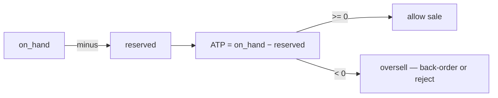

# Inventory and Stock Reservations

> **One-liner**: Inventory has three numbers, not one — on-hand, reserved, and available-to-promise — and oversell incidents come from confusing them.

---

## Quick Reference

| Item | Value / Syntax |
|------|----------------|
| On-hand | Physical units in the warehouse |
| Reserved | On-hand committed to placed-but-not-shipped orders |
| Available (ATP) | `on_hand − reserved` — what's safe to sell now |
| Safety stock | Floor below which you treat the SKU as OOS |
| Reorder point | Trigger to place a PO with the supplier |
| Cycle count | Daily small recount against the WMS |
| Multi-warehouse | Inventory per location; allocation rules per region |
| Oversell | Selling more than you have — usually a race between two orders |
| Backorder | Accept the order knowing fulfilment will be late |
| Cross-dock | Receive and ship same day — no shelf storage |
| EDI 846 | Inventory advice (from supplier → retailer) |
| Concurrency control | Optimistic (version column) or pessimistic (`SELECT ... FOR UPDATE`) |

---

## Core Concept

Stock isn't one number. **On-hand** is what physically exists on the warehouse floor. **Reserved** is what has been committed to orders that haven't shipped yet. **Available-to-promise (ATP)** is `on_hand − reserved` — the only number that is safe to show a customer at checkout. Teams that conflate these three are the teams that oversell.

Oversell is the classic race condition: two checkouts both read ATP=1 and both succeed because neither saw the other's commit. The fix is to make "reserve a unit" a transactional operation with the right concurrency control — either a unique constraint on a reservation row, or a pessimistic lock (`SELECT ... FOR UPDATE`) on the inventory row, or an optimistic version column with a retry loop. Picking one and applying it consistently matters more than which one.

Multi-warehouse adds an allocation step on top: given an order's shipping address, choose the warehouse (or combination) that has stock and minimizes shipping cost. This can split a single order across multiple shipments, which has downstream consequences for tracking, invoicing, and returns.

---

## Diagram



---

## Syntax & API

```sql
CREATE TABLE inventory_reservations (
    id          UUID PRIMARY KEY,
    sku         TEXT NOT NULL,
    warehouse   TEXT NOT NULL,
    order_id    TEXT NOT NULL,
    quantity    INT NOT NULL CHECK (quantity > 0),
    created_at  TIMESTAMPTZ NOT NULL DEFAULT now(),
    released_at TIMESTAMPTZ
);

CREATE TABLE inventory_balance (
    sku         TEXT NOT NULL,
    warehouse   TEXT NOT NULL,
    on_hand     INT NOT NULL,
    version     INT NOT NULL,
    PRIMARY KEY (sku, warehouse)
);
```

---

## Common Patterns

```csharp
public async Task<bool> TryReserveAsync(string sku, string wh, int qty, string orderId, CancellationToken ct)
{
    using var tx = await _db.BeginTransactionAsync(ct);
    var bal = await _db.GetBalanceForUpdateAsync(sku, wh, ct);
    var reserved = await _db.SumReservedAsync(sku, wh, ct);
    if (bal.OnHand - reserved < qty) { await tx.RollbackAsync(ct); return false; }
    await _db.InsertReservationAsync(sku, wh, orderId, qty, ct);
    await tx.CommitAsync(ct);
    return true;
}
```

---

## Gotchas & Tips

- Optimistic concurrency without a retry loop = silent oversell. Always retry on version conflict.
- Reservations leak: an order that never pays should release its reservation after N minutes — wire a job.
- Multi-warehouse rebalancing happens overnight; ATP shown to customers can lag by hours.
- Don't expose ATP to public APIs at unit precision — show "in stock" / "low stock" / "out of stock" bands.

---

## See Also

- [[04 - Order Management Basics]]
- [[08 - Warehouse Management Pick Pack Ship]]
- [[07 - Supply Chain and Procurement]]
