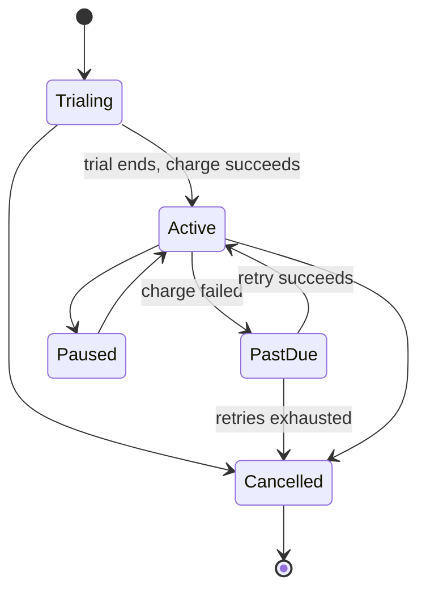

# Subscriptions and Recurring Billing

> **One-liner**: A subscription is a state machine plus a schedule plus a failure-recovery flow ("dunning") — the schedule is the easy part.

---

## Quick Reference

| Item | Value / Syntax |
|------|----------------|
| Plan | Price + interval + features (e.g., "Pro, $20/mo") |
| Subscription | Customer + Plan + start/end + status |
| Billing cycle | The recurring period (monthly, annual, weekly) |
| Anchor date | Day-of-cycle the renewal runs (e.g., the 1st) |
| Proration | Charging a partial period when mid-cycle change happens |
| Dunning | Retry-and-notify flow after a failed renewal charge |
| Trial | Free / discounted period before billing begins |
| MRR | Monthly Recurring Revenue — sum of normalized monthly amounts |
| ARR | Annual Recurring Revenue = MRR × 12 |
| Churn | (cancelled MRR / starting MRR) per period |
| LTV | Lifetime Value = ARPU / churn |
| Upgrade / downgrade | Mid-cycle plan change — prorated |
| Pause | Subscription not billed but retained — track separately |
| Stripe Billing | Reference implementation many companies copy |

---

## Core Concept

A subscription is a long-lived state machine on a schedule. The interesting part isn't the happy path (renew, charge, renew) — it's the failure modes: cards expire, banks decline, customers downgrade mid-cycle. Each of those is its own sub-flow, and the state diagram for a real subscription system has more transitions than the happy path suggests.

Dunning is the procedure for a failed renewal: retry the charge on a backoff schedule (e.g., +3d, +5d, +7d), email the customer to update their card, and eventually cancel if all retries are exhausted. Tuning dunning is where companies recover 20–40% of involuntary churn — too aggressive and you annoy paying customers, too lax and you leak revenue. Treat it as a product surface, not a back-office detail.

Proration math is unintuitive. When a customer upgrades on day 10 of a 30-day cycle, you charge them `(remaining_days / cycle_days) × (new_price − old_price)` immediately, and the new price starts the next cycle. Edge cases multiply quickly: leap years, month boundaries (Feb 28 vs Feb 29), time zones, and refunds on downgrade.

---

## Diagram



---

## Syntax & API

```csharp
public enum SubscriptionStatus { Trialing, Active, PastDue, Paused, Cancelled }

public sealed class Subscription
{
    public string Id { get; init; } = default!;
    public string CustomerId { get; init; } = default!;
    public string PlanId { get; private set; } = default!;
    public SubscriptionStatus Status { get; private set; }
    public DateOnly CurrentPeriodStart { get; private set; }
    public DateOnly CurrentPeriodEnd { get; private set; }
}
```

---

## Common Patterns

```csharp
private static readonly TimeSpan[] RetryDelays = { TimeSpan.FromDays(3), TimeSpan.FromDays(5), TimeSpan.FromDays(7) };

public async Task OnChargeFailedAsync(string subId, int attempt, CancellationToken ct)
{
    if (attempt >= RetryDelays.Length)
    {
        await _subs.CancelAsync(subId, reason: "dunning_exhausted", ct);
        return;
    }
    await _jobs.ScheduleAsync(new RetryCharge(subId, attempt + 1), RetryDelays[attempt], ct);
    await _email.SendCardUpdatePromptAsync(subId, ct);
}
```

---

## Gotchas & Tips

- MRR normalization: annual plans contribute `annual_amount / 12` to MRR, not the annual amount.
- Proration on downgrade is contentious — some companies refund, some credit, some neither. Pick one and document it.
- Trial-to-paid conversion is a critical product metric — instrument the moment of first successful charge.
- Tax may apply differently to recurring charges (B2B reverse-charge vs B2C) — see [[06 - Accounting Ledger and Double-Entry]].

---

## See Also

- [[06 - Payments Card Processing and Gateways]]
- [[02 - Pricing Discounts and Promotions]]
- [[06 - Accounting Ledger and Double-Entry]]
