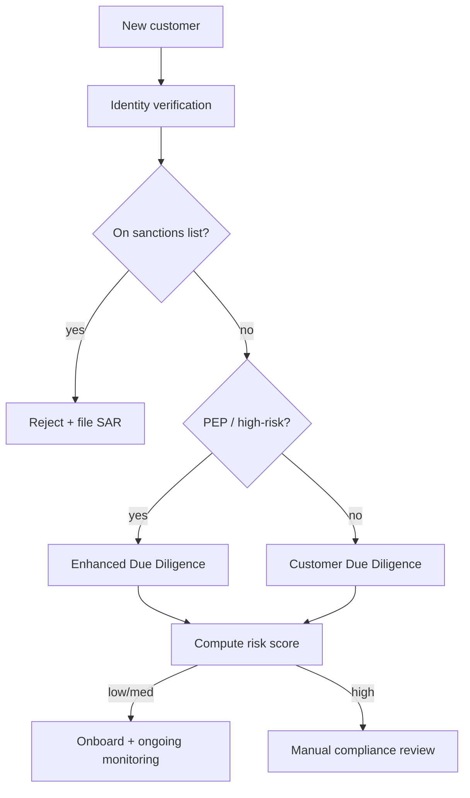

# KYC AML and Sanctions Screening

> **One-liner**: Onboarding a customer to a financial service is part product flow, part regulatory checklist — and "regulator unhappy" is an existential risk, not a UX defect.

---

## Quick Reference

| Item | Value / Syntax |
|------|----------------|
| KYC | Know Your Customer — identity verification |
| AML | Anti-Money-Laundering — transaction-pattern checks |
| CDD | Customer Due Diligence (basic onboarding checks) |
| EDD | Enhanced Due Diligence (higher-risk customers) |
| PEP | Politically Exposed Person — heightened scrutiny |
| Sanctions list | OFAC, UN, EU, UK HMT — denied parties |
| UBO | Ultimate Beneficial Owner — 25%+ ownership |
| SAR | Suspicious Activity Report — filed with FinCEN/FIU |
| Source of funds | Documentation of where money came from |
| Ongoing monitoring | Periodic re-screening against updated lists |
| FATF | Sets global AML/CTF recommendations |
| 4/5/6 AMLD | EU directives — current is 6AMLD |
| Standard providers | Onfido, Jumio, Trulioo, World-Check, Refinitiv |
| Risk score | Composite of geography, occupation, transaction patterns |

---

## Core Concept

KYC is the front door: verify the customer is who they say they are, and that they're not on a sanctions list. AML is the long tail: monitor their transactions for patterns — structuring, smurfing, rapid in/out — that look like money laundering. The two disciplines share infrastructure but answer different questions, and both are required by regulators in any financial service.

The flow has both deterministic checks (does the name match an OFAC entry?) and judgement calls (does the composite risk score exceed our threshold?). Engineers tend to over-trust the deterministic side; in practice false positives dominate sanctions screening because of transliteration, common names, and partial matches. A production system needs a manual-review queue with an SLA, staffed by trained compliance officers, not a yes/no decision.

Ongoing monitoring is the part that fails silently in poorly-built systems. Sanctions lists update constantly — a customer who was clean on day 1 may be sanctioned on day 90 after a geopolitical event. Re-screen the entire customer base on a schedule, not just at onboarding.

---

## Diagram



---

## Syntax & API

```csharp
public enum VerificationOutcome { Pass, Fail, ManualReview }

public sealed record VerificationResult(
    VerificationOutcome Outcome,
    decimal RiskScore,
    IReadOnlyList<string> Flags,
    string ProviderReferenceId
);
```

---

## Common Patterns

```csharp
public async Task<VerificationResult> OnboardAsync(CustomerApplication app, CancellationToken ct)
{
    var identity = await _idProvider.VerifyAsync(app, ct);
    if (identity.Outcome == VerificationOutcome.Fail) return identity;

    var sanctions = await _screening.ScreenAsync(app.FullName, app.DateOfBirth, app.Country, ct);
    if (sanctions.Hit) return new VerificationResult(VerificationOutcome.Fail, 1.0m, sanctions.Reasons, sanctions.RefId);

    var pep = sanctions.IsPep;
    var score = _risk.Score(app, identity, pep);
    return score > _config.HighRiskThreshold
        ? new VerificationResult(VerificationOutcome.ManualReview, score, sanctions.Reasons, sanctions.RefId)
        : new VerificationResult(VerificationOutcome.Pass, score, [], sanctions.RefId);
}
```

---

## Gotchas & Tips

- "Tipping off" is illegal — you cannot tell a customer they're under SAR investigation. Build UX accordingly.
- Storage of identity documents has both retention requirements (you must keep them N years) and deletion rights (GDPR). Both apply.
- Sanctions matching is fuzzy (transliteration, common names) — calibrate thresholds; document the policy.
- "Source of funds" is a different question from "source of wealth" — both can be requested at higher EDD tiers.

---

## See Also

- [[05 - Retail Banking Accounts and Transfers]]
- [[05 - Financial Compliance]]
- [[01 - Marketplaces and Multi-Sided Platforms]]
