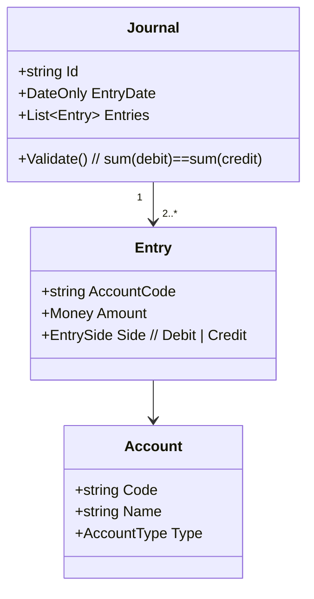

# Accounting Ledger and Double-Entry

> **One-liner**: Every business event is two postings: one debit, one credit, equal amounts, opposite sides — get that right and the books always balance.

---

## Quick Reference

| Item | Value / Syntax |
|------|----------------|
| Account | A bucket in the chart of accounts |
| Chart of Accounts (COA) | Hierarchical list of accounts |
| Account types | Asset, Liability, Equity, Revenue, Expense |
| Debit (Dr) | Increase Asset / Expense; decrease Liability / Equity / Revenue |
| Credit (Cr) | Opposite of debit |
| Journal entry | A balanced set of postings (`sum(debits) = sum(credits)`) |
| Trial balance | Sum of all debits == sum of all credits — must always hold |
| Sub-ledger | Detailed records (per customer, per supplier) feeding a control account |
| Reconciliation | Compare ledger to external source (bank, payment processor) |
| Period close | Lock postings ≤ date; run closing entries |
| Accrual basis | Recognize revenue/expense when earned/incurred, not when cash moves |
| Cash basis | Recognize when cash moves (small businesses) |
| IFRS / GAAP | Standards bodies — IFRS global, GAAP US |

---

## Core Concept

Double-entry is the foundational rule of accounting: every business event creates a journal with at least two entries — one debit, one credit, equal amounts. Sales: debit Cash, credit Revenue. Payroll: debit Wages Expense, credit Cash. Once the rule is enforced at the data layer, the trial balance (sum of all debits equals sum of all credits) is an invariant you can rely on rather than a report you have to verify.

The Chart of Accounts is the namespace. Accounts have a type — Asset, Liability, Equity, Revenue, or Expense — and the debit/credit convention follows from the type. Assets and expenses go up with debits; liabilities, equity, and revenue go up with credits. Memorize that or build it into a lookup; either way, don't let application code guess.

Reconciliation is where most "accounting bugs" surface. Your ledger says you took $X from customers, the payment processor says it sent you $Y, and the bank says it deposited $Z. The differences are real — fees, holds, refunds, chargebacks, FX — and every one of them must be explainable by a journal entry. A reconciliation that "almost balances" is unreconciled.

---

## Diagram



---

## Syntax & API

```csharp
public enum EntrySide { Debit, Credit }
public enum AccountType { Asset, Liability, Equity, Revenue, Expense }

public sealed record Entry(string AccountCode, EntrySide Side, Money Amount);

public sealed record Journal(string Id, DateOnly EntryDate, IReadOnlyList<Entry> Entries)
{
    public void Validate()
    {
        var ccy = Entries[0].Amount.Currency;
        var dr = Entries.Where(e => e.Side == EntrySide.Debit).Sum(e => e.Amount.Amount);
        var cr = Entries.Where(e => e.Side == EntrySide.Credit).Sum(e => e.Amount.Amount);
        if (dr != cr) throw new InvalidOperationException("Journal does not balance");
        if (Entries.Any(e => e.Amount.Currency != ccy))
            throw new InvalidOperationException("Mixed-currency journal needs FX leg");
    }
}
```

---

## Common Patterns

```csharp
var journal = new Journal(
    Id: Guid.NewGuid().ToString(),
    EntryDate: DateOnly.FromDateTime(DateTime.UtcNow),
    Entries: new[]
    {
        new Entry("1010-Cash",         EntrySide.Debit,  new Money(100m, "USD")),
        new Entry("4000-Revenue",      EntrySide.Credit, new Money(100m, "USD")),
    });
journal.Validate();
```

---

## Gotchas & Tips

- Never net a journal — record gross movements and show net as a derived view.
- Multi-currency requires an FX gain/loss account; restate balances at period close.
- Period close locks postings; late corrections are reversed and re-posted in the open period (no editing closed periods).
- Sub-ledgers (AR by customer, AP by supplier) must reconcile to the control account in the GL — if they don't, something is wrong with the integration.

---

## See Also

- [[05 - Retail Banking Accounts and Transfers]]
- [[06 - Insurance Policy Underwriting and Claims]]
- [[05 - Financial Compliance]]
