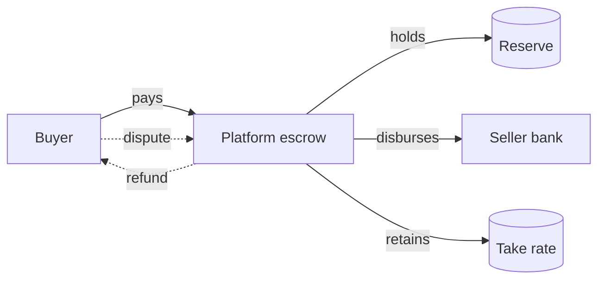

# Marketplaces and Multi-Sided Platforms

> **One-liner**: A marketplace has two customers — buyers and sellers — and the platform's job is to make money flow between them safely while keeping a cut.

---

## Quick Reference

| Item | Value / Syntax |
|------|----------------|
| Two-sided | Buyer + Seller (Amazon, eBay, Etsy) |
| Multi-sided | + driver / host / contractor (Uber, Airbnb, Doordash) |
| Listing | Seller's offer (product or service) |
| Take rate | Platform's percentage cut on each transaction |
| Escrow | Platform holds funds until buyer confirms / delivery confirmed |
| Payout | Periodic transfer to seller's bank |
| Reserve | Funds held back against future refunds/chargebacks |
| KYB | Know Your Business — KYC for sellers |
| Onboarding | Seller signup + verification + bank setup |
| Disputes | Buyer-vs-seller disagreement; platform adjudicates |
| Trust & Safety | Anti-fraud, content moderation, dispute resolution |
| Network effect | Each new seller raises value to buyers (and vice versa) |
| Standard rails | Stripe Connect (Standard/Express/Custom), Adyen MarketPay |
| Regulatory | DAC7, PSD2, money-services-business (MSB) licensing |

---

## Core Concept

A marketplace is commerce, payments, and compliance running in the same system. The platform itself is not a seller — it is the trusted intermediary that lets strangers transact. That trust is what justifies the take rate, and it has to be earned operationally: escrowed funds, dispute resolution, and a trust-and-safety team that intervenes when things go wrong.

Onboarding is asymmetric. Buyer onboarding is light — name, email, payment method, basic KYC. Seller onboarding is heavy because you are letting a business take money on your rails. KYB (Know Your Business) verifies business registration, beneficial ownership, bank account details, and per-jurisdiction tax IDs. Without this, the platform inherits the seller's compliance risk.

Money flow is the load-bearing engineering surface. The path is: capture from buyer → hold in escrow → minus take rate → payout to seller, periodically. Each step needs ledger entries (see [[06 - Accounting Ledger and Double-Entry]]), and refunds and chargebacks must walk the same path in reverse. A reserve sits between escrow and payout to cushion against future disputes. Standard rails like Stripe Connect or Adyen MarketPay implement most of this, but the integration is still substantial — webhooks, payout schedules, dispute callbacks, and per-seller reconciliation.

---

## Diagram



---

## Syntax & API

```csharp
var transfer = await _stripe.Transfers.CreateAsync(new TransferCreateOptions
{
    Amount = grossCents - takeRateCents,
    Currency = "usd",
    Destination = sellerStripeAccountId,
    TransferGroup = orderId,
    Metadata = { ["seller_id"] = sellerId, ["order_id"] = orderId }
});
```

---

## Common Patterns

```csharp
new Journal(
    EntryDate: today,
    Entries: new[]
    {
        new Entry("1010-Cash",            EntrySide.Debit,  new Money(100m, "USD")),
        new Entry("2100-Payable-Seller",  EntrySide.Credit, new Money( 90m, "USD")),
        new Entry("4000-Take-Rate-Rev",   EntrySide.Credit, new Money( 10m, "USD")),
    });
```

---

## Gotchas & Tips

- Holding sellers' money may trigger money-transmitter licensing in some jurisdictions — Stripe Connect's "Standard" model exists specifically to avoid that liability.
- Disputes have a different rhythm from refunds: dispute is initiated externally (cardholder), refund is initiated internally. Both walk the ledger.
- DAC7 (EU) and 1099-K (US) require platforms to report seller earnings — instrument from day one.
- Payouts on weekends/holidays don't move funds until the next banking day; show "settled" vs "in transit".

---

## See Also

- [[06 - Payments Card Processing and Gateways]]
- [[04 - KYC AML and Sanctions Screening]]
- [[06 - Accounting Ledger and Double-Entry]]
