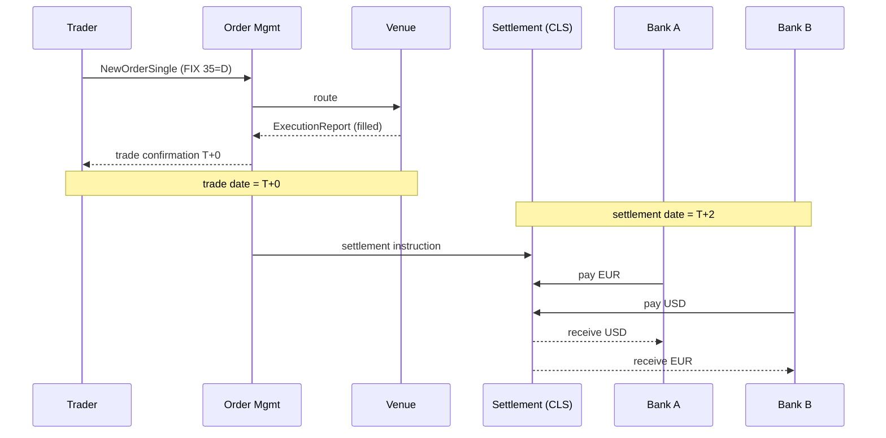

# FX Trading and Settlement

> **One-liner**: FX is two prices and a clock — bid, ask, and two business days until the money actually moves.

---

## Quick Reference

| Item | Value / Syntax |
|------|----------------|
| Currency pair | Base/Quote (e.g., EUR/USD) — `1 EUR = 1.0850 USD` |
| Bid | Highest price buyer will pay for base |
| Ask / Offer | Lowest price seller will accept for base |
| Spread | Ask − Bid |
| Pip | Smallest price increment — 0.0001 for most majors (0.01 for JPY pairs) |
| Order book | Aggregated limit orders, by price level |
| Limit order | Buy/sell at a specified price or better |
| Market order | Buy/sell immediately at best available |
| ECN / STP | Routing models — direct market access vs straight-through |
| Slippage | Difference between expected and executed price |
| FIX | Financial Information eXchange — wire protocol (4.4 / 5.0 SP2) |
| ISO 4217 | Currency codes (USD, EUR, JPY) |
| Settlement | T+2 standard for spot FX (T+1 for USD/CAD) |
| CLS | Continuous Linked Settlement — payment-vs-payment for major currencies |
| Market data | Level 1 (top of book), Level 2 (depth), Level 3 (full book by order) |
| Standard venues | EBS, Reuters Matching, Currenex, Hotspot |

---

## Core Concept

FX trading at its core is matching. Bids and offers meet on a venue — an ECN, an exchange, or a single dealer's internal book — and the agreed price is the trade. The actual movement of money happens later, usually two business days after the trade date. That convention is called "T+2", and it is universal for spot FX with the narrow exception of USD/CAD which settles T+1.

The gap between trade and settlement creates settlement risk: one side pays, the other defaults, and the surviving party is out the full notional. The 1974 collapse of Bankhaus Herstatt mid-settlement is the classic case. CLS (Continuous Linked Settlement) is the post-Herstatt solution: a central utility that settles both legs of an FX trade simultaneously in central-bank money for the major currencies, eliminating principal risk.

Order-book mechanics in FX look the same as any matched market. Limit orders sit at price levels waiting to be hit; market orders consume liquidity off the top of the book and pay whatever depth is required to fill. Partial fills are normal, slippage on market orders gets worse as size grows relative to depth, and on retail venues the spread plus slippage is effectively the user's cost of execution. Latency matters because the price you see is already milliseconds stale by the time your order reaches the matching engine.

---

## Diagram



---

## Syntax & API

```csharp
public enum Side { Buy, Sell }
public enum OrdType { Market, Limit }

public sealed record NewOrder(
    string ClOrdId,         // Tag 11
    string Symbol,          // Tag 55, e.g. "EUR/USD"
    Side Side,              // Tag 54
    decimal OrderQty,       // Tag 38
    OrdType OrdType,        // Tag 40
    decimal? Price          // Tag 44 (limit only)
);
```

---

## Common Patterns

```csharp
public sealed class OrderBook
{
    private readonly SortedDictionary<decimal, Queue<NewOrder>> _bids = new(Comparer<decimal>.Create((a, b) => b.CompareTo(a)));
    private readonly SortedDictionary<decimal, Queue<NewOrder>> _asks = new();

    public IEnumerable<Fill> Submit(NewOrder o)
    {
        // Walk opposite side until filled or no match...
        yield break;
    }
}

public sealed record Fill(string ClOrdId, decimal Quantity, decimal Price, DateTimeOffset At);
```

---

## Gotchas & Tips

- Quote precision varies — most pairs price to 5 decimals, JPY pairs to 3. Don't hard-code 4.
- Order quantity for FX is in base-currency units (e.g., 1,000,000 EUR for 1M EUR/USD).
- Latency is the currency of execution — co-location, kernel bypass, custom NICs are normal for low-latency systems.
- Spot FX is the lowest-margin product; profit comes from spread × volume — your systems must be cheap per trade.

---

## See Also

- [[04 - Derivatives Risk and Margin]]
- [[05 - Financial Compliance]]
- [[05 - Retail Banking Accounts and Transfers]]
