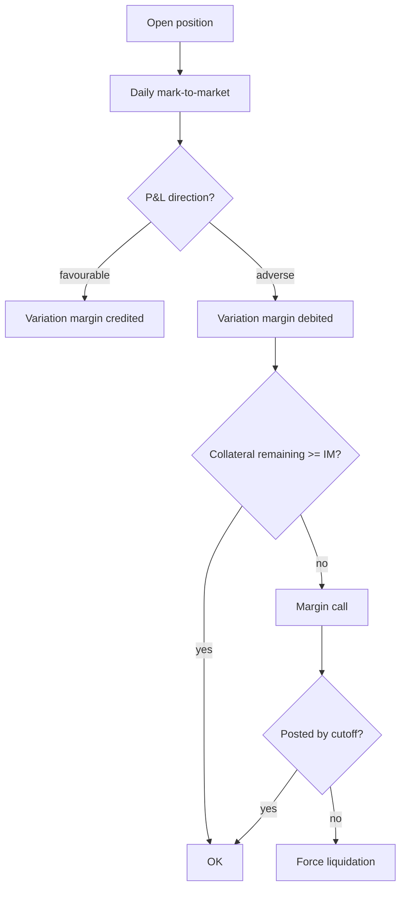

# Derivatives Risk and Margin

> **One-liner**: A derivative's value is leveraged off something else — and "leveraged" is the word that requires margining, risk limits, and a margin-call procedure.

---

## Quick Reference

| Item | Value / Syntax |
|------|----------------|
| Underlying | The asset the derivative derives from (FX rate, stock, rate, commodity) |
| Future | Standardized contract to buy/sell at a date — exchange-traded |
| Forward | Bilateral version of a future — OTC |
| Swap | Exchange of cashflow streams (rates, currencies) |
| Option | Right (not obligation) to buy (call) or sell (put) at strike |
| Strike | The agreed exercise price of an option |
| Premium | Price paid by the option buyer |
| Greeks | Sensitivities: delta, gamma, vega, theta, rho |
| Mark-to-market | Daily revaluation against current price |
| Initial margin | Collateral posted up front |
| Variation margin | Daily P&L settlement against the position |
| Margin call | Demand for more collateral when MTM moves against you |
| VaR | Value-at-Risk — loss not exceeded with X% confidence over N days |
| CVaR / Expected Shortfall | Average loss beyond VaR |
| ISDA Master | Industry-standard OTC derivatives contract |
| Regulations | EMIR (EU), Dodd-Frank Title VII (US) |

---

## Core Concept

A derivative is a contract whose payoff is a function of an underlying — an FX rate, a stock price, an interest rate, a commodity index. Futures and forwards are linear: you owe or are owed in direct proportion to where the underlying ends up. Options are nonlinear because the holder has a choice — exercise if the strike is favourable, walk away if it isn't. Swaps are streams of cashflows exchanged over time.

Because derivative positions are leveraged — a small premium or initial deposit controls a large notional — the exchange or counterparty requires **margin**. Initial margin is posted up front to cover plausible adverse moves. Variation margin flows daily based on mark-to-market: if today's revaluation moved against you, you owe variation margin by cutoff; if it moved in your favour, you receive it. A missed margin call has a tight clock and ends in force-liquidation.

Risk measurement on derivative portfolios goes beyond MTM. Greeks (delta, gamma, vega, theta, rho) describe local sensitivities to underlying price, volatility, and time. VaR aggregates portfolio risk into a single tail-loss number for a confidence level and horizon. Both feed risk limits, and risk limits are operational artefacts — when a limit is breached, an alert fires, and either the position is reduced or a documented override is sought. Regulatory frameworks (EMIR, Dodd-Frank Title VII) layer reporting and clearing obligations on top.

---

## Diagram



---

## Syntax & API

```csharp
public enum OptionType { Call, Put }

public static decimal IntrinsicValue(OptionType type, decimal spot, decimal strike) => type switch
{
    OptionType.Call => Math.Max(spot - strike, 0m),
    OptionType.Put  => Math.Max(strike - spot, 0m),
    _ => 0m
};
```

---

## Common Patterns

```csharp
public async Task PostVariationMarginAsync(string positionId, decimal mtmChange, CancellationToken ct)
{
    if (mtmChange > 0)
        await _ledger.CreditCollateralAsync(positionId, mtmChange, ct);
    else
        await _ledger.DebitCollateralAsync(positionId, -mtmChange, ct);

    var collateral = await _ledger.GetCollateralAsync(positionId, ct);
    var im = await _risk.GetInitialMarginAsync(positionId, ct);
    if (collateral < im) await _margin.IssueCallAsync(positionId, im - collateral, ct);
}
```

---

## Gotchas & Tips

- VaR is a model — it underestimates fat tails. Pair with stress tests (2008, COVID-2020 shock).
- Greeks are local linearizations; under large moves they fail. Use full revaluation for stress scenarios.
- Cross-margining (one collateral pool against many positions) is operationally complex and netting agreements are the load-bearing legal artifact.
- Margin-call SLAs are tight (often same-day); a missed call triggers force-liquidation.

---

## See Also

- [[03 - FX Trading and Settlement]]
- [[05 - Financial Compliance]]
- [[06 - Insurance Policy Underwriting and Claims]]
