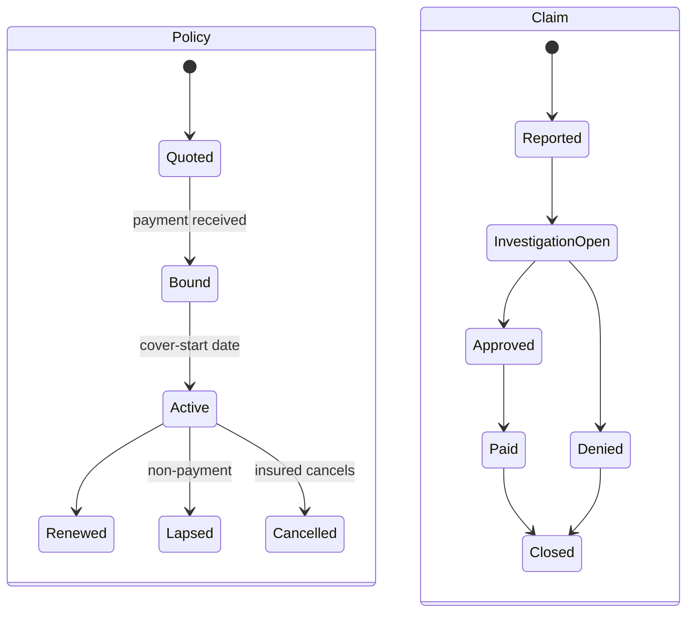

# Insurance Policy Underwriting and Claims

> **One-liner**: Insurance is "price the risk, take the premium, pay valid claims, keep reserves" — and IFRS 17 changed how the reserves are accounted for everywhere.

---

## Quick Reference

| Item | Value / Syntax |
|------|----------------|
| Policy | Contract: insurer covers a peril for a period in exchange for premium |
| Premium | Amount paid by the policyholder |
| Deductible / Excess | Amount the insured pays before insurer pays |
| Peril | The cause of loss covered (fire, flood, theft, illness) |
| Exclusion | What's not covered |
| Underwriting | The decision to accept the risk and at what premium |
| Risk score / Rating | Numerical assessment driving premium |
| Claim | Notification of a covered loss |
| Reserve | Insurer's estimate of future payout — a liability |
| IBNR | Incurred But Not Reported — claims that happened but aren't filed yet |
| Loss ratio | Claims paid / premium earned |
| Combined ratio | (Claims + expenses) / premium earned |
| Reinsurance | Insurer transfers risk to a reinsurer |
| Actuary | Specialist who prices risk and sets reserves |
| Solvency II | EU capital requirements for insurers |
| IFRS 17 | Insurance contracts accounting — current measurement model |
| ACORD | Insurance industry data standards |

---

## Core Concept

Underwriting is the act of pricing risk. Given an applicant's profile — age, address, claims history, vehicle, occupation, health markers — the insurer estimates the expected loss over the cover period and sets a premium that covers that loss plus operating expenses plus a margin for profit and capital. Modern underwriting uses GLMs, gradient-boosted trees, and increasingly neural models, but explainability remains essential because regulators and complaint-handlers will ask why a specific applicant was declined or surcharged.

Claims handling is the long-tail operational surface. A claim is reported, investigated, valued, paid or denied, and finally closed. While the claim is open, the insurer holds a **case reserve** — an actuarial estimate of remaining payout — on its books. Aggregated case reserves plus an IBNR (Incurred But Not Reported) estimate give total claims liability. IBNR exists because some claims have already happened but have not yet been filed with the insurer, especially for long-tail lines like liability.

IFRS 17 (effective 2023) changed insurance accounting globally. The General Measurement Model breaks each contract into present-value-of-future-cashflows, a risk adjustment, and a Contractual Service Margin (CSM) that releases profit as service is delivered. Accounting systems must produce IFRS 17 line items at the level of contract groups — a major systems rebuild for most insurers.

---

## Diagram



---

## Syntax & API

```csharp
public enum PolicyStatus { Quoted, Bound, Active, Lapsed, Cancelled }
public enum ClaimStatus { Reported, InvestigationOpen, Approved, Denied, Paid, Closed }

public sealed record Policy(
    string Id,
    string CustomerId,
    string Product,
    Money AnnualPremium,
    DateOnly CoverStart,
    DateOnly CoverEnd,
    PolicyStatus Status
);

public sealed record Claim(
    string Id,
    string PolicyId,
    DateOnly LossDate,
    DateOnly ReportedDate,
    Money EstimatedReserve,
    ClaimStatus Status
);
```

---

## Common Patterns

```csharp
public sealed record ReserveSummary(Money CaseReserves, Money Ibnr, Money TotalReserve);

public async Task<ReserveSummary> ComputeAsync(string product, DateOnly asOf, CancellationToken ct)
{
    var cases = await _claims.SumOpenReservesAsync(product, asOf, ct);
    var ibnr = await _actuarial.IbnrEstimateAsync(product, asOf, ct);
    return new ReserveSummary(cases, ibnr, cases + ibnr);
}
```

---

## Gotchas & Tips

- IBNR estimation is statistical — never let an engineer override it ad-hoc; it goes through the actuary.
- Fraud detection on claims is its own model — typically tree-based with rule overlays (e.g., "claim within 30d of policy bind on a low-mileage vehicle").
- Reinsurance recoveries are a separate ledger — never net them against gross claims.
- ACORD forms are an XML standard older than your career — they aren't going away.

---

## See Also

- [[05 - Lending and Credit Scoring]]
- [[06 - Accounting Ledger and Double-Entry]]
- [[05 - Financial Compliance]]
