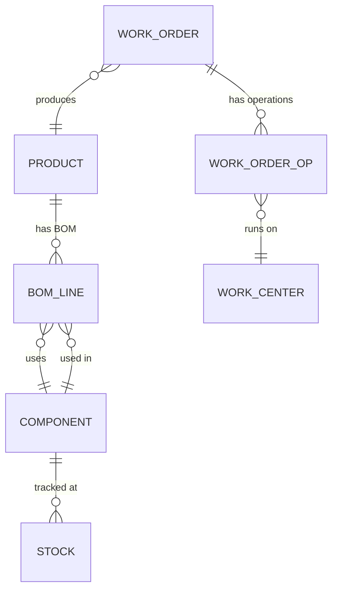

# Manufacturing BOM and MRP

> **One-liner**: Manufacturing turns components into products on a schedule — and MRP is the math that says "to ship N of product on date X, you need Y of component Z by date W".

---

## Quick Reference

| Item | Value / Syntax |
|------|----------------|
| BOM | Bill of Materials — recursive list of components per product |
| Routing | Sequence of operations to produce a product |
| Work order | Authorization to produce N units on a date |
| MRP | Material Requirements Planning — explodes demand into component needs |
| MES | Manufacturing Execution System — shop-floor control |
| Capacity planning | Available machine-hours / labor-hours |
| Takt time | Production rate matching customer demand |
| Kanban | Pull-based replenishment signal |
| Lean / TPS | Toyota Production System — waste elimination |
| Six Sigma | Defect reduction methodology |
| OEE | Overall Equipment Effectiveness = Availability × Performance × Quality |
| WIP | Work in Process — partially-made units |
| Yield | Good output / total input |
| Standards | ISA-95 (enterprise-to-MES), OPC UA (device protocols) |
| ERP integration | SAP, Oracle, Microsoft Dynamics 365 |

---

## Core Concept

A Bill of Materials is a recursive structure. A Product is made of Components, and those Components may themselves be sub-assemblies with their own BOMs, all the way down to raw materials and purchased parts. Walking the tree top-down with multiplication gives the gross requirement per leaf component for any planned output quantity. Real BOMs are versioned, effective-dated, and frequently include phantom assemblies — logical groupings that exist on paper but never as a physical stocked part.

Material Requirements Planning is the classical algorithm that connects demand to procurement. It takes the Master Production Schedule (planned output per week per product), explodes it through current BOMs, subtracts on-hand stock and open purchase orders, and offsets each requirement back in time by the component's lead time. The result is a list of purchase orders to release to suppliers and work orders to release to the shop floor. MRP is traditionally a nightly batch job in ERP systems.

The Manufacturing Execution System sits between MRP/ERP and the actual factory floor. It dispatches work orders to specific machines and operators, captures actuals (yield, downtime, defects, cycle time), and feeds OEE dashboards that show availability times performance times quality. ISA-95 standardises the integration boundary between business systems and MES; OPC UA covers the device layer below it.

---

## Diagram



---

## Syntax & API

```csharp
public sealed record BomLine(string ComponentSku, decimal QtyPerParent);

public IEnumerable<(string Sku, decimal TotalQty)> Explode(string productSku, decimal demand, IDictionary<string, IReadOnlyList<BomLine>> boms)
{
    foreach (var line in boms.GetValueOrDefault(productSku, []))
    {
        var need = line.QtyPerParent * demand;
        if (boms.ContainsKey(line.ComponentSku))
            foreach (var sub in Explode(line.ComponentSku, need, boms)) yield return sub;
        else
            yield return (line.ComponentSku, need);
    }
}
```

---

## Common Patterns

```csharp
public sealed record WorkOrder(string Id, string ProductSku, decimal Quantity, DateOnly DueDate, string Status);

public async Task<WorkOrder> ReleaseAsync(string productSku, decimal qty, DateOnly due, CancellationToken ct)
{
    if (!await _components.AvailableForAsync(productSku, qty, ct))
        throw new InvalidOperationException("Components not available");
    var wo = new WorkOrder(Guid.NewGuid().ToString(), productSku, qty, due, "Released");
    await _wms.ReserveComponentsAsync(productSku, qty, ct);
    return wo;
}
```

---

## Gotchas & Tips

- BOMs are versioned — never edit in place; create a new revision and migrate work orders carefully.
- Phantom assemblies (logical groupings with no physical part) trip up engineers expecting all BOM nodes to map to stocked SKUs.
- MRP runs assume static lead times — in volatile supply chains, expedite logic is bolted on.
- OEE benchmarks: world-class is around 85%; typical is 60–65% — calibrate dashboards accordingly.

---

## See Also

- [[07 - Supply Chain and Procurement]]
- [[01 - Inventory and Stock Reservations]]
- [[08 - Warehouse Management Pick Pack Ship]]
