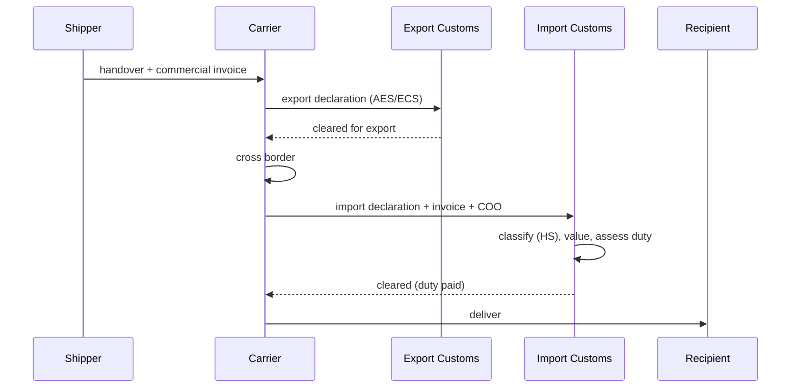

# Cross-Border Logistics and Customs

> **One-liner**: International shipping adds three things to domestic: a customs declaration, an HS classification, and a duty/tax bill — get any of them wrong and your package sits in a warehouse.

---

## Quick Reference

| Item | Value / Syntax |
|------|----------------|
| Incoterms | International commercial terms — who pays/risks what |
| EXW | Ex Works — buyer takes from seller's premises |
| FOB | Free On Board — seller delivers to port; buyer takes from there |
| CIF | Cost, Insurance, Freight — seller pays freight + insurance to dest port |
| DDP | Delivered Duty Paid — seller pays everything including duty |
| DAP | Delivered At Place — seller pays to delivery; buyer pays duty |
| HS code | Harmonized System — 6-digit international classification (2022 ed.) |
| HTS code | US national extension of HS (10 digits) |
| Tariff | Duty rate applied to HS code × declared value |
| Commercial invoice | Required customs document: shipper, consignee, items, values |
| Certificate of origin | Proves where goods were made (for FTA preference) |
| FTA | Free Trade Agreement — preferential tariff rates (USMCA, EU-UK TCA, RCEP) |
| Importer of Record | Legal entity responsible for clearance + duty payment |
| WCO | World Customs Organization — maintains HS |
| AES / ECS | Export filing systems (US AES, EU ECS) |
| EDI 309 | US Customs Manifest |

---

## Core Concept

An international shipment is two domestic legs joined by a customs boundary. At each boundary, the goods are declared, classified by HS code, valued, and assessed for duty and tax. The carrier handles most of the operational steps if the shipper provides the right paperwork: a commercial invoice, packing list, certificate of origin where applicable, and accurate HS codes. Without those, the package goes into a bonded warehouse and waits.

Incoterms are the single most consequential per-shipment decision. They assign responsibility for cost and risk between buyer and seller at each step of the journey. DDP (Delivered Duty Paid) makes the seller responsible for everything including import duty — and that makes the seller's platform the Importer of Record, with all the legal exposure that entails. EXW (Ex Works) shifts everything to the buyer from the seller's loading dock. CIF, FOB, and DAP sit between these extremes. Picking the wrong Incoterm creates surprise bills at the worst possible moment.

HS classification is technical and consequential. A six-digit HS code identifies a product class internationally; countries extend it with national digits (the US HTS goes to ten). A single wrong digit can change duty from 0% to 15%. Companies maintain HS libraries per SKU, and every new SKU requires a classification decision, often involving a customs broker.

---

## Diagram



---

## Syntax & API

```csharp
public sealed record CustomsItem(
    string Description,
    string HsCode,            // 6 or 10 digit
    string OriginCountry,
    int Quantity,
    Money UnitValue,
    Money TotalValue
);

public sealed record CustomsDeclaration(
    string ShipmentId,
    string Incoterm,          // "DDP", "DAP", "EXW", ...
    string Importer,
    string Exporter,
    IReadOnlyList<CustomsItem> Items,
    Money DeclaredTotal,
    string? CertificateOfOriginId
);
```

---

## Common Patterns

```csharp
public async Task<Money> EstimateDutyAsync(CustomsDeclaration decl, string destCountry, CancellationToken ct)
{
    var total = 0m;
    foreach (var item in decl.Items)
    {
        var rate = await _tariff.RateAsync(item.HsCode, destCountry, item.OriginCountry, ct);
        total += item.TotalValue.Amount * rate;
    }
    return new Money(total, decl.DeclaredTotal.Currency);
}
```

---

## Gotchas & Tips

- "Free Trade Agreement" preference requires a valid certificate of origin — without one, default tariff applies regardless of where goods are from.
- Some HS codes trigger non-tariff barriers (CITES, controlled goods, dual-use technology) — clearance can require additional licenses.
- De minimis thresholds (under-which low-value shipments clear without duty) vary by country and change frequently — don't hard-code.
- Incoterms 2020 differ from 2010 — pin the version in contracts.

---

## See Also

- [[07 - Shipping and Delivery Basics]]
- [[08 - Fleet and Last-Mile Delivery]]
- [[07 - Supply Chain and Procurement]]
