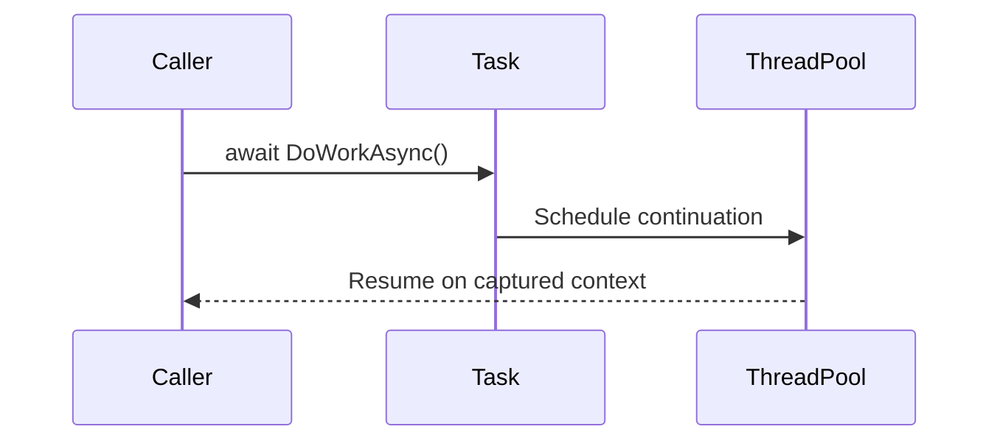
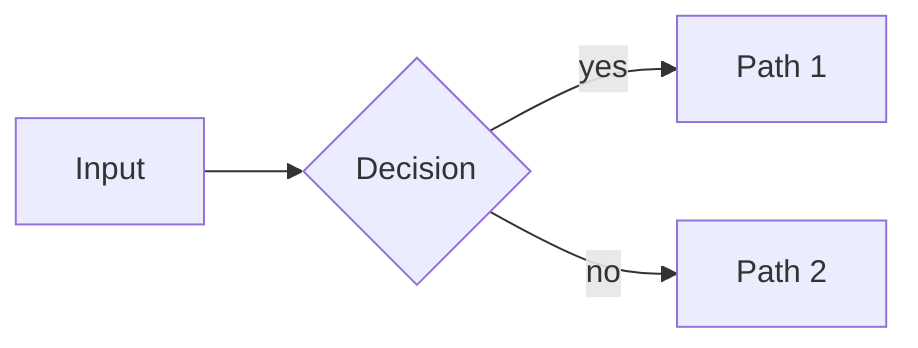

# CLAUDE.md

This file provides guidance to Claude Code (claude.ai/code) when working with code in this repository.

## What This Is

An Obsidian vault serving as a structured .NET Core teacher-authored cheatsheet/notebook — organized from beginner to advanced, intended for students learning the .NET ecosystem.

---

## Vault Folder Structure

```
/
├── 00-Index/
│   ├── Master Index.md          ← single entry point, links to all sections
│   └── Learning Path.md         ← recommended reading order per level
│
├── 01-Beginner/
│   ├── 01 - Dotnet Overview.md
│   ├── 02 - CSharp Basics.md
│   ├── 03 - Control Flow.md
│   ├── 04 - Methods.md
│   ├── 05 - OOP Fundamentals.md
│   ├── 06 - Collections.md
│   ├── 07 - Strings.md
│   ├── 08 - Exception Handling.md
│   ├── 09 - File IO.md
│   └── 10 - LINQ Basics.md
│
├── 02-Intermediate/
│   ├── 01 - OOP Advanced.md
│   ├── 02 - Generics.md
│   ├── 03 - Delegates and Events.md
│   ├── 04 - Lambda and Functional.md
│   ├── 05 - LINQ Advanced.md
│   ├── 06 - Async and Await.md
│   ├── 07 - Threading and Concurrency.md       ★ NEW
│   ├── 08 - Synchronization Primitives.md      ★ NEW
│   ├── 09 - Memory Management and GC.md        ★ NEW
│   ├── 10 - IDisposable and Resource Mgmt.md   ★ NEW
│   ├── 11 - Reflection and Attributes.md       ★ NEW
│   ├── 12 - Serialization.md                   ★ NEW
│   ├── 13 - Dependency Injection.md
│   ├── 14 - ASP.NET Core Basics.md
│   ├── 15 - REST API.md
│   ├── 16 - Entity Framework Core.md
│   ├── 17 - Configuration.md
│   ├── 18 - Logging.md
│   ├── 19 - Middleware.md
│   └── 20 - Testing.md
│
├── 03-Advanced/
│   ├── 01 - Design Patterns.md
│   ├── 02 - Clean Architecture.md
│   ├── 03 - Domain-Driven Design.md
│   ├── 04 - Microservices.md
│   ├── 05 - Security and Auth.md
│   ├── 06 - Performance Optimization.md
│   ├── 07 - Memory Leaks and Profiling.md      ★ NEW
│   ├── 08 - Span and Memory Types.md           ★ NEW
│   ├── 09 - Channels and Pipelines.md          ★ NEW
│   ├── 10 - Parallel and Dataflow.md           ★ NEW
│   ├── 11 - Caching.md
│   ├── 12 - Background Services.md
│   ├── 13 - SignalR.md
│   ├── 14 - gRPC.md
│   ├── 15 - Source Generators.md               ★ NEW
│   ├── 16 - Native Interop and AOT.md          ★ NEW
│   ├── 17 - Docker and Containers.md
│   └── 18 - CI-CD and DevOps.md
│
├── _Assets/
│   └── (Mermaid diagrams are inline; this folder reserved for any future binary assets)
│
└── _Templates/
    └── Note Template.md         ← master template for all notes
```

---

## Diagrams — Mermaid (text-based, native Obsidian rendering)

Diagrams are written as **Mermaid** code blocks directly in the markdown. Obsidian renders them natively — no images, no binary files, fully version-controlled.

**Use a diagram when it clarifies more than prose can.** Don't add diagrams for the sake of it. Each note gets a `## Diagram` section *only if* a diagram genuinely helps.

### Diagram type → use case mapping

| Mermaid type | Use for |
|--------------|---------|
| `flowchart` | request lifecycle, control flow, decision trees, middleware pipeline |
| `sequenceDiagram` | async/await flow, HTTP request/response, auth handshakes (JWT/OAuth) |
| `classDiagram` | OOP hierarchies, interface relationships, design patterns |
| `stateDiagram-v2` | Task states, GC generations, connection lifecycle |
| `erDiagram` | EF Core entity relationships, database schemas |
| `graph LR/TD` | architecture diagrams (clean arch, microservices, DI graph) |

### Example skeleton

````markdown
## Diagram


````

### Diagram authoring rules

- Always wrap in a fenced block with language `mermaid`.
- Keep diagrams under ~15 nodes — split into multiple if larger.
- Use meaningful labels, not single letters (except sequence-diagram participants where short aliases are conventional).
- Place the `## Diagram` section **after Core Concept, before Syntax & API** — students should see the picture before the code.

---

## Note Template (canonical format for every file)

Every note must follow this exact structure. Sections that don't apply can be omitted, but order must be preserved.

````markdown
---
tags: [dotnet, <level>, <category>]
aliases: []
level: Beginner | Intermediate | Advanced
---

# <Topic Title>

> **One-liner**: What this is and why it matters in one sentence.

---

## Quick Reference

| Item | Value / Syntax |
|------|----------------|
| ... | ... |

*(or a compact code block for syntax-heavy topics)*

---

## Core Concept

Plain-English explanation of the concept. No jargon without definition.
Analogies encouraged. Max 3–4 short paragraphs.

---

## Diagram

*(Optional — include only when a diagram clarifies more than prose. Use Mermaid.)*



---

## Syntax & API

```csharp
// Minimal working example — always compilable
```

Sub-sections (### ) for variants or overloads.

---

## Common Patterns

Real-world usage patterns with brief context.

```csharp
// Pattern: <name>
```

---

## Gotchas & Tips

- Bullet list of non-obvious pitfalls, version differences, or performance notes.

---

## See Also

- [[Related Note 1]]
- [[Related Note 2]]
````

---

## Tag Taxonomy

| Tag | Meaning |
|-----|---------|
| `dotnet` | applied to every note |
| `beginner` / `intermediate` / `advanced` | difficulty level |
| `csharp` | pure language topics |
| `aspnetcore` | web framework topics |
| `efcore` | Entity Framework Core |
| `linq` | LINQ-specific |
| `async` | async/await, Task |
| `concurrency` | threading, locks, parallelism |
| `memory` | GC, IDisposable, leaks, Span<T> |
| `architecture` | design patterns, DDD, clean arch |
| `testing` | unit/integration/e2e |
| `devops` | Docker, CI/CD |
| `performance` | optimization, profiling, benchmarking |

---

## Authoring Rules

- Every code block must specify a language: `csharp`, `bash`, `json`, `xml`, `mermaid`. Never plain fenced blocks.
- All internal links use Obsidian wiki-link syntax: `[[Note Title]]`.
- The **Quick Reference** table must exist on every note — it is the cheatsheet anchor students scan first.
- Keep **Core Concept** prose below 300 words; put depth in sub-sections.
- Add a `## Diagram` section only when it clarifies more than prose; place it after Core Concept.
- Number prefixes on filenames (`01 -`, `02 -`) control display order in file explorer.
- `00-Index/Master Index.md` must be updated whenever a new note is added.
- `.obsidian/` — do not edit manually.

---

## Topic Coverage Map

### Beginner (01-Beginner) — 10 notes
| # | File | Topics Covered |
|---|------|----------------|
| 01 | Dotnet Overview | .NET vs .NET Core vs .NET Framework, CLR, SDK vs Runtime, CLI basics |
| 02 | CSharp Basics | Variables, data types, type inference, nullable, constants |
| 03 | Control Flow | if/else, switch expressions, for/foreach/while, pattern matching basics |
| 04 | Methods | Parameters, return types, overloading, optional/named params, ref/out |
| 05 | OOP Fundamentals | Classes, objects, constructors, properties, access modifiers, records |
| 06 | Collections | Array, List<T>, Dictionary<K,V>, HashSet, Queue, Stack |
| 07 | Strings | Interpolation, verbatim, common methods, StringBuilder |
| 08 | Exception Handling | try/catch/finally, custom exceptions, global handlers |
| 09 | File IO | File, Directory, Path, StreamReader/Writer, async IO |
| 10 | LINQ Basics | Where, Select, OrderBy, GroupBy, First/Single, ToList |

### Intermediate (02-Intermediate) — 20 notes
| # | File | Topics Covered |
|---|------|----------------|
| 01 | OOP Advanced | Inheritance, abstract, interfaces, polymorphism, sealed, covariance |
| 02 | Generics | Generic classes/methods, constraints, covariance/contravariance |
| 03 | Delegates and Events | Action, Func, Predicate, EventHandler, multicast |
| 04 | Lambda and Functional | Closures, expression trees, functional patterns |
| 05 | LINQ Advanced | Join, Aggregate, let, query syntax vs method syntax, deferred execution |
| 06 | Async and Await | Task, async/await, ConfigureAwait, cancellation, ValueTask |
| **07** | **Threading and Concurrency** ★ | Thread, ThreadPool, Task vs Thread, parallelism vs concurrency, race conditions |
| **08** | **Synchronization Primitives** ★ | lock, Monitor, Mutex, Semaphore, ReaderWriterLockSlim, Interlocked, ConcurrentDictionary |
| **09** | **Memory Management and GC** ★ | Stack vs heap, value vs reference, generations 0/1/2, LOH, GC modes, finalizers |
| **10** | **IDisposable and Resource Mgmt** ★ | using statement, using declaration, IAsyncDisposable, dispose pattern, finalizer fallback |
| **11** | **Reflection and Attributes** ★ | Type, MethodInfo, custom attributes, AttributeUsage, runtime metadata |
| **12** | **Serialization** ★ | System.Text.Json, Newtonsoft.Json, XML, source-generated serializers, custom converters |
| 13 | Dependency Injection | IServiceCollection, lifetimes, constructor injection, keyed services |
| 14 | ASP.NET Core Basics | Program.cs, minimal APIs, routing, filters, model binding |
| 15 | REST API | Controllers, action results, status codes, versioning, OpenAPI |
| 16 | Entity Framework Core | DbContext, migrations, relationships, querying, tracking |
| 17 | Configuration | appsettings.json, IOptions<T>, environment overrides, secrets |
| 18 | Logging | ILogger, log levels, structured logging, Serilog |
| 19 | Middleware | Pipeline, custom middleware, short-circuiting |
| 20 | Testing | xUnit, Moq, FluentAssertions, TestServer, integration tests |

### Advanced (03-Advanced) — 18 notes
| # | File | Topics Covered |
|---|------|----------------|
| 01 | Design Patterns | Repository, CQRS, Mediator (MediatR), Factory, Decorator |
| 02 | Clean Architecture | Layers, dependency rule, use cases, ports & adapters |
| 03 | Domain-Driven Design | Aggregates, value objects, domain events, bounded contexts |
| 04 | Microservices | Service decomposition, API gateway, service discovery |
| 05 | Security and Auth | JWT, OAuth2/OIDC, ASP.NET Core Identity, HTTPS, CORS |
| 06 | Performance Optimization | Benchmarking (BenchmarkDotNet), ArrayPool, ObjectPool, hot paths |
| **07** | **Memory Leaks and Profiling** ★ | Common leak causes (events, statics, captures), dotMemory, dotnet-dump, dotnet-counters, ETW |
| **08** | **Span and Memory Types** ★ | Span<T>, ReadOnlySpan<T>, Memory<T>, stackalloc, zero-allocation parsing |
| **09** | **Channels and Pipelines** ★ | System.Threading.Channels (producer/consumer), System.IO.Pipelines (high-perf I/O) |
| **10** | **Parallel and Dataflow** ★ | Parallel.For, Parallel.ForEachAsync, PLINQ, TPL Dataflow blocks |
| 11 | Caching | IMemoryCache, IDistributedCache, Redis, cache-aside pattern |
| 12 | Background Services | IHostedService, BackgroundService, Hangfire, Quartz.NET |
| 13 | SignalR | Hubs, groups, real-time streaming, scaling |
| 14 | gRPC | Protobuf, service definitions, client/server, streaming |
| **15** | **Source Generators** ★ | Roslyn analyzers, incremental generators, JSON source-gen, regex source-gen |
| **16** | **Native Interop and AOT** ★ | P/Invoke, DllImport, LibraryImport, Native AOT publishing, trimming |
| 17 | Docker and Containers | Dockerfile, multi-stage builds, docker-compose, health checks |
| 18 | CI-CD and DevOps | GitHub Actions, build/test/publish pipeline, environment promotion |

**Total: 48 notes** (10 beginner + 20 intermediate + 18 advanced)

---

## Diagram coverage targets

These notes specifically benefit from diagrams and **must** include one:

| Note | Diagram type |
|------|--------------|
| Async and Await | sequenceDiagram (await flow + state machine) |
| Threading and Concurrency | flowchart (Thread vs Task vs ThreadPool) |
| Synchronization Primitives | flowchart (decision tree: which primitive to pick) |
| Memory Management and GC | stateDiagram-v2 (Gen 0 → Gen 1 → Gen 2 → LOH) |
| IDisposable and Resource Mgmt | flowchart (dispose pattern + finalizer fallback) |
| Memory Leaks and Profiling | flowchart (common leak sources) |
| Span and Memory Types | graph (stack vs heap vs pinned memory) |
| Channels and Pipelines | sequenceDiagram (producer/consumer) |
| Parallel and Dataflow | graph (Dataflow block topology) |
| Middleware | flowchart (request pipeline) |
| Dependency Injection | graph (DI container resolution) |
| Entity Framework Core | erDiagram (sample model) |
| Clean Architecture | graph (layer dependencies) |
| Microservices | graph (service topology + gateway) |
| Security and Auth | sequenceDiagram (OAuth2/JWT handshake) |
| Design Patterns | classDiagram (per pattern) |
