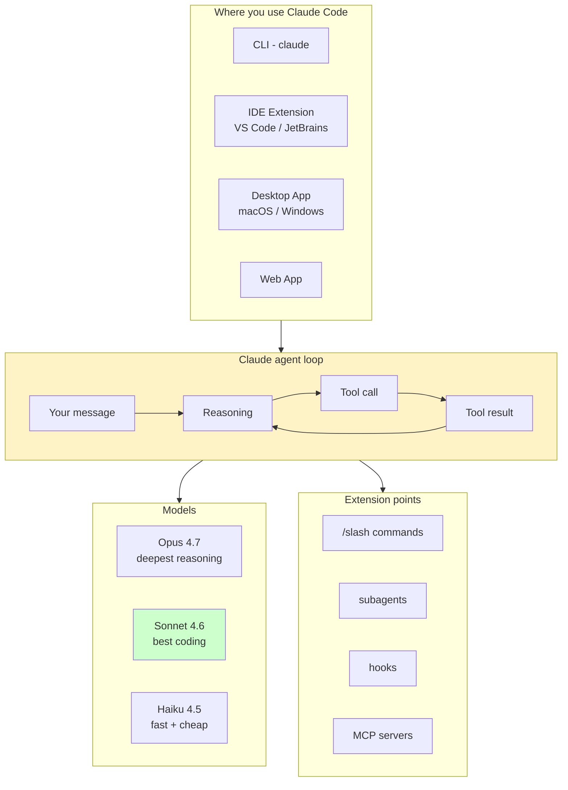

# Claude Code Overview

> **One-liner**: Claude Code is Anthropic's official AI coding agent — it reads your repo, edits files, runs commands, and collaborates on real engineering tasks across CLI, IDE, desktop, and web.

---

## Quick Reference

| Surface | Where it runs | Best for |
|---------|---------------|----------|
| **CLI** | Terminal (`claude`) | Day-to-day coding, scripts, headless use |
| **Desktop app** | macOS, Windows | UI-first sessions, multi-pane |
| **IDE extension** | VS Code, JetBrains | In-editor edits + file context |
| **Web app** | claude.ai/code | Quick tasks, no install |

| Model | Strengths | Use for |
|-------|-----------|---------|
| **Opus 4.7** | Deepest reasoning | Architecture, hard debugging, complex refactors |
| **Sonnet 4.6** | Best coding model | Default for most engineering work |
| **Haiku 4.5** | Fast + cheap (~3× savings vs Sonnet) | Frequent small tasks, sub-agents, automation |

| Term | Meaning |
|------|---------|
| **Tool** | Capability Claude can invoke — Read, Edit, Bash, Grep, etc. |
| **Slash command** | `/something` — built-in or user-defined macro |
| **Subagent** | A sub-conversation with its own tools, scope, model |
| **Hook** | Shell command that fires on tool events (PreToolUse, etc.) |
| **MCP server** | External tool plug-in via the Model Context Protocol |
| **CLAUDE.md** | Project memory — auto-loaded into every session |

---

## Core Concept

Claude Code is not a chatbot — it's an **agent** that takes actions. You give it a task; it reads code, edits files, runs commands, runs tests, and reports back. It pauses to ask permission before destructive actions.

The agent loop is roughly: read your message → think → call a tool → see the result → repeat. You see the tool calls and results; you approve permissions when prompted.

It works best when you give it **enough context** (a CLAUDE.md, a clear task, file paths) but **not too much** (don't dump unrelated history). It excels at well-scoped engineering tasks: bug fixes, feature additions, refactors, code review, debugging.

You extend it with **slash commands**, **subagents**, **hooks**, and **MCP servers** — covered in the intermediate and advanced sections.

---

## Diagram



---

## Syntax & API

### Launching a session

```bash
# Interactive — most common
claude

# One-shot prompt + exit (great for scripting)
claude -p "summarize the changes on this branch"

# Pin a model
claude --model claude-sonnet-4-6

# Skip permission prompts for trusted workflows (be careful)
claude --permission-mode acceptEdits
```

### First-session sanity check

```bash
# In your project root
claude
> /help          # see built-in slash commands
> /init          # generate a starter CLAUDE.md from your repo
> /agents        # browse available subagents
```

---

## Common Patterns

```bash
# Pattern: fast feedback loop in a terminal pane next to your editor
claude

# Pattern: ad-hoc query, no session
claude -p "explain what middleware does in src/server.ts"

# Pattern: in-CI usage
claude -p "review this PR" --output-format json > review.json
```

---

## Gotchas & Tips

- **Claude Code is *not* the same as the Claude API.** The CLI is an agent harness; the API is the underlying model service. See [[06 - Claude Agent SDK]] if you want to *build* an agent.
- **You don't pick a model per request** — it's per session. Use `/model` to switch mid-session, or `--model` at launch.
- **The agent loop ends when Claude has nothing more to do.** If it stops mid-task, that usually means it hit an unexpected error or a permission denial — read the last messages carefully.
- **Surfaces share settings**: `~/.claude/settings.json` is read everywhere, so a hook configured for the CLI also fires in the IDE extension.
- **Don't paste secrets** into the conversation. Use environment variables and reference them by name.

---

## See Also

- [[02 - Installation and Setup]]
- [[05 - Permissions and Safety]]
- [[03 - Slash Commands Basics]]
- [[15 - Model and Cost Optimization]]
