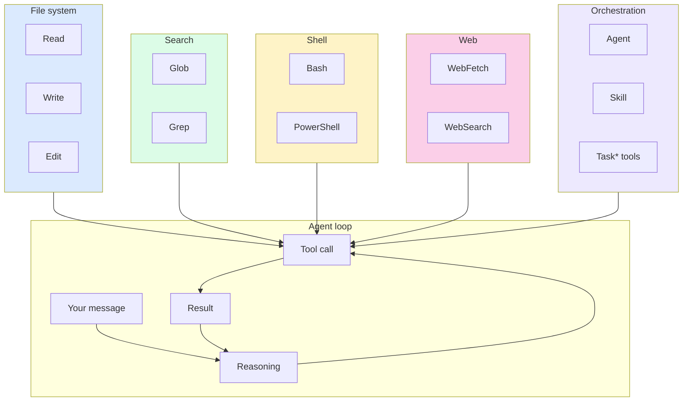

# Tools and Capabilities

> **One-liner**: Claude works by invoking **tools** — Read, Edit, Bash, Grep, etc. Knowing what tool fits which job lets you write tighter prompts and predict what Claude will do.

---

## Quick Reference

### File system
| Tool | Purpose | Notes |
|------|---------|-------|
| `Read` | Read a file by absolute path | Streams up to 2000 lines by default |
| `Write` | Create or overwrite a file | Must `Read` first if file exists |
| `Edit` | Exact-string replacement in a file | Preferred over `Write` for edits |
| `NotebookEdit` | Edit a Jupyter notebook cell | `.ipynb` only |

### Search
| Tool | Purpose | Notes |
|------|---------|-------|
| `Glob` | File-name pattern (`**/*.ts`) | Returns paths sorted by mtime |
| `Grep` | Content search (ripgrep-backed) | Use full regex; supports multiline |

### Shell and execution
| Tool | Purpose | Notes |
|------|---------|-------|
| `Bash` | Run a shell command | Permission-gated; persistent cwd |
| `PowerShell` | Run PowerShell on Windows | Same gating |
| `mcp__ide__executeCode` | Run code in IDE notebook kernel | Only when IDE bridge is up |

### Web
| Tool | Purpose | Notes |
|------|---------|-------|
| `WebFetch` | Fetch a URL and read its content | Best for known docs/links |
| `WebSearch` | Run a web search | Best for discovery |

### Orchestration
| Tool | Purpose | Notes |
|------|---------|-------|
| `Agent` | Spawn a subagent (or fork) | Inherits context if no `subagent_type` |
| `Task*` | Background long-running work | Notifications when it completes |
| `Skill` | Invoke a registered skill (`/<name>`) | Plugin-namespaced names supported |
| `ScheduleWakeup` | Self-pacing in `/loop` dynamic mode | Skill-internal |

---

## Core Concept

Each turn, Claude either replies with text or calls one or more **tools**. A tool call is a function with typed arguments; the result feeds back into Claude's next reasoning step. Some tools are **safe** (Read, Glob, Grep) and run without prompting; others are **gated** (Bash, Edit, Write) and may ask for permission.

Tools are organised by category — file system, search, shell, web, orchestration. Knowing which tool fits which job helps you predict what Claude will do *and* write better prompts. "Read X then change line N" is more efficient than "look at X and update it" because the former implies the exact tool sequence.

Some tools are **deferred**: their schemas aren't loaded until needed. Claude uses `ToolSearch` to load them on demand. As a user this is invisible — you just see the result.

---

## Diagram



---

## Syntax & API

You don't *call* tools directly — you write prompts that Claude turns into tool calls. The patterns below show the typical mapping from natural-language request to tool sequence.

### "Show me what's in src/server.ts"
→ `Read` on `src/server.ts`.

### "Find every TODO in this repo"
→ `Grep` for `TODO` (file pattern optional).

### "List all .test.ts files"
→ `Glob` for `**/*.test.ts`.

### "Add a console.log to the error handler"
→ `Read` the file, then `Edit` with old_string/new_string.

### "Run the tests"
→ `Bash` with `npm test` (or your test command). Permission-gated.

### "Look up the latest Express router API"
→ `WebSearch` (or `WebFetch` if you give a URL).

### "Refactor src/api/* in parallel"
→ `Agent` calls (forks), parallelised in one turn.

---

## Common Patterns

### Tighten the prompt to imply the tool

```text
# vague — Claude has to guess
> can you check the auth code?

# precise — implies Grep + Read
> grep src/ for "verifyJwt" and read each match
```

### Constrain Bash to safe operations

```json
// settings.json
{
  "permissions": {
    "allow": [
      "Bash(git status)",
      "Bash(git diff:*)",
      "Bash(npm test:*)"
    ]
  }
}
```

> Pattern syntax: `Bash(<exact command>)` matches verbatim, `Bash(<prefix>:*)` matches by prefix.

### Don't waste tools on what's already known

```text
# bad — forces redundant Read after a recent edit
> can you read users.ts and tell me what it does?

# good — Claude already has the file in context from a prior tool call
> what does the function we just edited do?
```

---

## Gotchas & Tips

- **Tool result text is *not* what the user sees** — it's only seen by Claude. If you want it surfaced to the user, ask Claude to summarise or print the relevant part.
- **`Edit` requires a prior `Read`** of the same file (a safety check). If Claude edits without reading, that's a bug — file an issue.
- **`Bash` defaults to a 2-minute timeout.** Long commands need an explicit longer timeout or `run_in_background`.
- **Background Bash** (`run_in_background: true`) returns immediately; you fetch output later. Useful for dev servers and long builds.
- **`Glob` returns paths, not contents** — always pair with `Read` if you want to see the file.
- **`WebFetch` may fail** on auth-walled or JS-heavy pages. For SPAs, paste the rendered text yourself.
- **Tools are NOT magic** — they execute on your machine with your permissions. Treat them like commands you typed.

---

## See Also

- [[05 - Permissions and Safety]]
- [[03 - settings.json]]
- [[04 - Hooks]]
- [[01 - Subagents]]
