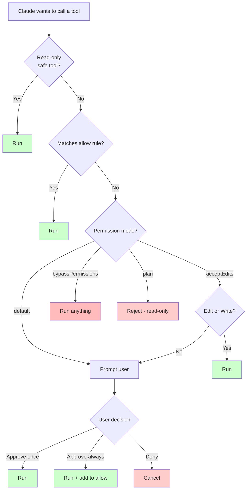

# Permissions and Safety

> **One-liner**: Claude asks before destructive tool calls — your job is to allow safe ones explicitly so you stop being prompted, while keeping the dangerous ones gated.

---

## Quick Reference

### Permission modes
| Mode | Behavior | Use for |
|------|----------|---------|
| `default` | Prompt for anything not explicitly allowed | Day-to-day |
| `acceptEdits` | Auto-allow file edits, still gate Bash | Trusted refactors |
| `bypassPermissions` | Allow everything (dangerous) | Sandbox / throwaway VM only |
| `plan` | Read-only — Claude plans, doesn't execute | Big-change pre-flight |

### Permission rule shapes
| Shape | Matches |
|-------|---------|
| `"Read"` | Any Read call |
| `"Bash"` | Any Bash command (broad — careful) |
| `"Bash(git status)"` | Exact command |
| `"Bash(git diff:*)"` | Prefix — `git diff`, `git diff HEAD`, etc. |
| `"Bash(npm:*)"` | Any `npm …` invocation |
| `"Edit(src/**)"` | Edits scoped to a path glob |
| `"WebFetch(domain:example.com)"` | Domain-scoped fetch |
| `"mcp__github__*"` | All tools from a given MCP server |

### Dangerous flags to never normalise
| Flag | Why it's dangerous |
|------|--------------------|
| `--dangerously-skip-permissions` | Disables all gating — only OK in throwaway sandboxes |
| `git --no-verify` | Skips pre-commit hooks |
| `git push --force` | Overwrites remote history |
| `rm -rf` (broad) | Permanent deletion |

---

## Core Concept

Claude Code separates tools into **safe** (read-only: Read, Glob, Grep) and **gated** (Bash, Edit, Write, WebFetch, MCP tools). Gated tools prompt the user *unless* a matching `allow` rule exists in settings.

The right mental model: you grant Claude the same access you'd grant a junior engineer pair-programming with you. Trust the safe stuff. Allowlist things you'd be fine running yourself anyway. Gate everything that touches shared state (push, deploy, drop, send).

The default mode is conservative on purpose. As you learn what your project does repeatedly, **promote** those into your allowlist — that's the long-term path to fewer prompts without losing safety.

---

## Diagram



---

## Syntax & API

### Allowing a command in `~/.claude/settings.json`

```json
{
  "permissions": {
    "allow": [
      "Bash(git status)",
      "Bash(git diff:*)",
      "Bash(git log:*)",
      "Bash(npm test:*)",
      "Bash(npm run lint:*)",
      "Read",
      "Glob",
      "Grep"
    ],
    "deny": [
      "Bash(rm -rf:*)",
      "Bash(git push --force:*)"
    ]
  }
}
```

### Pick a permission mode at launch

```bash
claude --permission-mode default
claude --permission-mode acceptEdits
claude --permission-mode plan
```

### Switch mode mid-session

```text
> /permissions
# pick a mode, or edit rules inline
```

### Approve a command "always"

When prompted, choose "Always allow" — Claude offers to write the rule into your settings for you. Choose **project-shared** (`<project>/.claude/settings.json`, committed) vs **project-local** (`.claude/settings.local.json`, gitignored) vs **user** (`~/.claude/settings.json`).

---

## Common Patterns

### Safe baseline allowlist (recommend for everyone)

```json
{
  "permissions": {
    "allow": [
      "Read", "Glob", "Grep",
      "Bash(git status)",
      "Bash(git diff:*)",
      "Bash(git log:*)",
      "Bash(git show:*)",
      "Bash(git branch:*)",
      "Bash(ls:*)", "Bash(pwd)", "Bash(cat:*)"
    ]
  }
}
```

### Project-specific test/lint allowlist

```json
{
  "permissions": {
    "allow": [
      "Bash(npm test:*)",
      "Bash(npm run lint:*)",
      "Bash(npm run build)",
      "Bash(npx tsc:*)"
    ]
  }
}
```

### Block the obviously dangerous

```json
{
  "permissions": {
    "deny": [
      "Bash(rm -rf:*)",
      "Bash(:(){ :|:& };:)",
      "Bash(curl:*) | Bash(sh)"
    ]
  }
}
```

---

## Gotchas & Tips

- **Don't blanket-allow `Bash`.** That's equivalent to handing over `sudo`. Use prefix patterns instead.
- **`bypassPermissions` is for sandboxes only** — a fresh VM, a worktree, a container. Never on a machine that has prod creds or your SSH keys.
- **Project-shared rules are committed.** Anything you put in `<project>/.claude/settings.json` will run on a teammate's machine when they use Claude here. Keep it minimal and uncontroversial.
- **`acceptEdits` does not allow Bash.** Editing files is reversible (you have git); shelling out is not.
- **Permission prompts are paused tool calls.** If you walk away, Claude waits. There is no timeout that auto-approves.
- **A denied tool may end the task** — Claude has no fallback. If you deny something it really needs, expect it to ask why or stop.
- **Hook scripts inherit the user's full permissions** — they run on your behalf, not gated by Claude's permission system. Treat hook scripts like cron jobs.

---

## See Also

- [[03 - settings.json]]
- [[04 - Tools and Capabilities]]
- [[09 - Security and Sandboxing]]
- [[04 - Hooks]]
