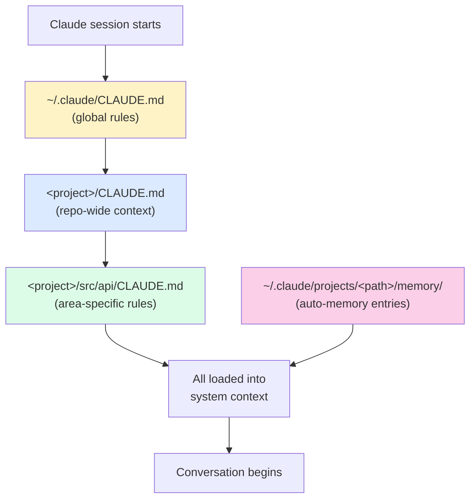

# CLAUDE.md Files

> **One-liner**: A `CLAUDE.md` is a file Claude auto-loads at the start of every session — pin the project's must-know facts here so you don't keep re-explaining them.

---

## Quick Reference

| Location | Scope | Loaded when |
|----------|-------|-------------|
| `<project>/CLAUDE.md` | Project root | Always, when launched in/under project |
| `<project>/<sub>/CLAUDE.md` | Sub-folder | When working in that subtree |
| `~/.claude/CLAUDE.md` | User-wide | Every session, every project |
| `~/.claude/rules/**/*.md` | User-wide rule fragments | Every session (composed in) |

| What to include | What to leave out |
|-----------------|-------------------|
| How to run / test / build | Recent commit history (use `git log`) |
| Domain glossary | Code Claude can read itself |
| Style rules and conventions | Long onboarding narrative |
| Architecture in one paragraph | Detailed API docs |
| Common gotchas of *this* repo | Generic best practices |
| Pointers to authoritative docs | Anything you're not sure about |

---

## Core Concept

`CLAUDE.md` is **persistent context**. Anything you put in it appears at the top of every Claude session in that project. Use it for the things you'd otherwise have to repeat: how to run tests, where the entry points live, what conventions apply, what Claude should *not* do.

Keep it short. The cost of `CLAUDE.md` is real — it consumes the same context window your conversation uses. A 5,000-word `CLAUDE.md` reduces the room for actual code. Most projects need 100–400 lines max.

`CLAUDE.md` files cascade. A user-level file in `~/.claude/CLAUDE.md` loads in every project; a project-root one loads on top; sub-folder ones load when work happens there. Lower-precedence content sets defaults; higher-precedence overrides.

Generate a starter with `/init`, then **edit it**. The auto-generated version is a guess; your hand-edited version is signal.

---

## Diagram



---

## Syntax & API

### Generate a starter

```text
> /init
```

This writes `<project>/CLAUDE.md` based on what Claude can infer from the repo (README, package.json, scripts, file tree). It's a draft — refine.

### A solid `CLAUDE.md` template

```markdown
# CLAUDE.md — <Project Name>

## What this is
<One paragraph: what does this codebase do, who uses it.>

## How to run
- `npm install` — install
- `npm run dev` — local dev server
- `npm test` — full test suite
- `npm run lint` — eslint + prettier

## Architecture (10-second overview)
- `src/api/` — HTTP layer (Fastify, route handlers)
- `src/domain/` — business logic, no I/O
- `src/infra/` — DB clients, message bus
- `tests/` — Jest, mirrors src/

## Conventions
- TypeScript strict, no `any`
- Error handling: throw `DomainError` from domain layer; map to HTTP in api
- Tests use `describe.each` for fixtures; never network in unit tests

## Don'ts
- Don't add new top-level folders without discussion
- Don't introduce a new ORM — we use Drizzle
- Don't `console.log` in committed code; use `logger`

## Useful pointers
- Production runbook: ./RUNBOOK.md
- ADRs: ./docs/adr/
```

### Where memory and CLAUDE.md fit together

`CLAUDE.md` is **manually authored**. **Auto-memory** (under `~/.claude/projects/<path>/memory/`) is what Claude writes about you and the project over time. They complement each other:

- `CLAUDE.md` = what you intentionally pin
- Memory = what Claude has noticed and stored

See [[06 - Memory System]] for memory.

---

## Common Patterns

### Pin "must-not-do" rules

```markdown
## Hard rules
- NEVER `git push --force` to `main`
- NEVER edit `infra/terraform/*.tfstate` — these are managed by CI
- ALWAYS run `npm run typecheck` before reporting a task complete
```

### Pin command shorthands

```markdown
## Commands
- `npm test -- --watch` — TDD loop
- `npm run db:reset` — wipe local DB
- `npm run gen:types` — regenerate OpenAPI types after schema change
```

### Sub-folder override for an area

```markdown
# CLAUDE.md (in src/legacy/)
This folder is in maintenance mode. Do not refactor or rewrite.
Bug fixes only, behaviour-preserving. New features go in src/v2/.
```

### Reference, don't duplicate

```markdown
## Style
See `./docs/STYLE.md` for the full conventions.

## API
See `./docs/api/openapi.yaml` for the canonical schema.
```

> Linking is cheaper than embedding — Claude can `Read` the file when it needs it.

---

## Gotchas & Tips

- **Bigger ≠ better.** A 2,000-line `CLAUDE.md` is usually a sign you're trying to teach Claude what the code already says. Trim.
- **Conventions go in, code does not.** "Use Drizzle, not Prisma" belongs here. The actual schema does not.
- **Update it when conventions change.** A stale `CLAUDE.md` is worse than none — it tells Claude wrong things confidently.
- **Watch for contradictions** with `~/.claude/CLAUDE.md`. Project-level wins, but if the conflict is subtle Claude may waver.
- **`/init` is a one-shot.** Re-running overwrites. Commit before regenerating.
- **`CLAUDE.md` lines past ~200 may be truncated** in some surfaces — keep the most important rules near the top.
- **Don't put secrets in `CLAUDE.md`.** It's just a file in your repo. Anything you wouldn't paste in a PR description doesn't go here.

---

## See Also

- [[02 - Installation and Setup]]
- [[06 - Memory System]]
- [[07 - Effective Prompting]]
- [[03 - settings.json]]
