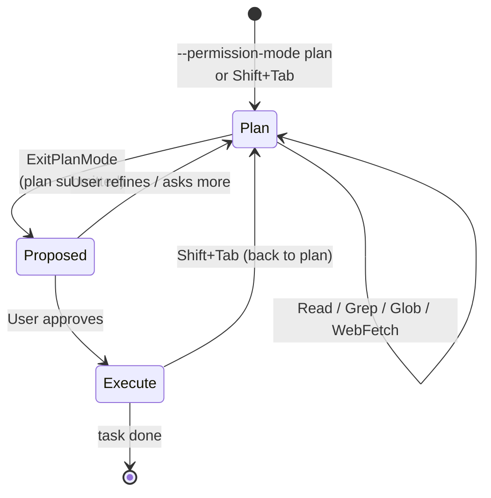

# Plan Mode

> **One-liner**: Plan Mode tells Claude "think first, don't change anything yet." Use it before risky or large changes — review the plan, then green-light execution.

---

## Quick Reference

| Command | What it does |
|---------|--------------|
| Launch with `--permission-mode plan` | Start session in plan mode |
| `Shift+Tab` (in CLI) | Toggle plan mode mid-session |
| `EnterPlanMode` (tool) | Claude switches itself into plan mode |
| `ExitPlanMode` (tool) | Claude proposes a plan and asks you to approve |

| State | Allowed |
|-------|---------|
| Plan mode | Read, Glob, Grep, WebFetch, WebSearch — **no Edit / Write / Bash** |
| Normal mode | All tools (subject to permissions) |

---

## Core Concept

In **Plan Mode**, Claude can read, search, and reason — but cannot edit files, run commands, or take any side-effect action. The output is a **plan**: what files will change, what shape the change takes, what tests will be added or run.

You review the plan and either approve it (Claude exits plan mode and executes) or push back (refine the plan, repeat). This is the "measure twice, cut once" loop for risky changes.

Use plan mode when:
- The change touches many files (large refactor)
- The change is hard to reverse (migrations, deletes, deploys)
- You're not sure Claude has the right model of the task
- You're operating in unfamiliar code

Skip plan mode for small, well-scoped changes. The overhead isn't worth it.

---

## Diagram



---

## Syntax & API

### Launch into plan mode

```bash
claude --permission-mode plan
```

### Toggle mid-session

```text
# Press Shift+Tab in the CLI to switch modes.
# Or instruct Claude:

> please switch to plan mode and propose how to approach this
```

### Plan-mode prompt

```text
We're about to rename `User` to `Account` across the codebase.
Don't change anything yet. Read enough to map:
  - which files reference `User`
  - which are tests, which are prod code
  - which references are public API surface

Then propose a plan in two phases (test changes, prod changes).
```

Claude reads/greps, builds the plan, then calls `ExitPlanMode` with the proposed plan. You see the plan and approve or push back.

---

## Common Patterns

### Big refactor

```text
# Step 1: enter plan mode
> /permissions      # switch to plan mode

# Step 2: ask for the plan
> Plan a migration from express to fastify. Don't change anything.
  Output: per-file checklist + test impact + risk areas.

# Step 3: review, refine
> The plan looks good but skip src/legacy/ — that folder is frozen.
  Update the plan accordingly.

# Step 4: approve
> approved, execute
```

### Risky migration

```text
> /permissions      # plan mode
> We need to drop the `legacy_users` table. Before any change, plan:
  - check for any code reading from it
  - check for any code writing to it
  - propose a migration path: rename → wait → drop
```

### Investigation only (no execution intended)

```text
> /permissions      # plan mode (treat as read-only)
> Audit auth flows. Just produce a report. I'll act on it later.
```

---

## Gotchas & Tips

- **Plan mode prevents `Bash`** — you can't run tests in plan mode. Approve or exit first.
- **A plan is a proposal, not a contract.** Claude may discover things mid-execution that change the plan. Expect adjustments.
- **`ExitPlanMode` requires user approval.** Approval happens in the UI; no plan executes silently.
- **Don't plan trivial changes.** A one-line bug fix doesn't need a plan; the overhead exceeds the savings.
- **A bad plan signals a bad prompt** — if the plan misses key files, your prompt didn't give enough scope. Refine the prompt, not the plan.
- **Sub-agents inherit mode**, but a fork's plan-mode is independent of the parent. Confirm before assuming.
- **Plan mode is also great for "review only" tasks.** Use it when you want analysis without any chance of accidental edits.

---

## See Also

- [[05 - Permissions and Safety]]
- [[07 - Effective Prompting]]
- [[14 - Multi-file Refactoring]]
- [[01 - Subagents]]
