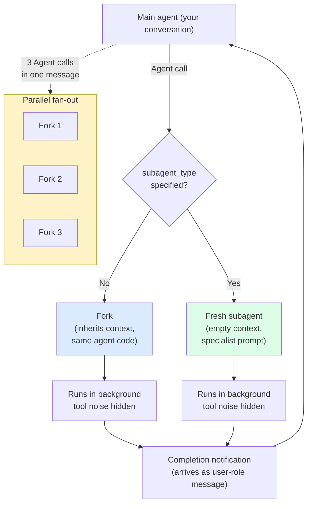

# Subagents

> **One-liner**: A subagent is a sub-conversation Claude spawns to do a focused task without filling your main thread with tool noise — fork for context-cheap delegation, `subagent_type` for fresh specialists.

---

## Quick Reference

| Form | Starts with | Best for |
|------|-------------|----------|
| **Fork** (no `subagent_type`) | Full inherited context | Open-ended research/refactor where main agent already has the picture |
| **Fresh subagent** (`subagent_type: <name>`) | Empty context + specialist prompt | Independent review, specific role (security, planner, reviewer) |
| **Parallel forks** | Multiple in one tool-call message | Independent surveys you'd run side-by-side |

| Concept | Meaning |
|---------|---------|
| Subagent definition | `.md` file in `.claude/agents/` or `~/.claude/agents/` |
| Subagent name | Frontmatter `name`, used as `subagent_type` |
| Subagent tools | Frontmatter `tools` list — restricts what the agent can call |
| Subagent model | Frontmatter `model` (sonnet/haiku/opus) — overrides default |
| Output file | Path returned by the runtime — do **not** read it mid-flight |
| Notification | Comes back as a user-role message in a later turn |

---

## Core Concept

A subagent is a **separate run of Claude** with its own context window, tool list, and (often) model. The main thread fires off the subagent with a prompt and *does not see* the subagent's tool calls — only the final summary. This keeps the main thread tidy and parallelisable.

Two forms:
- **Fork** — same agent code, but inherits the parent's context. Cheap (shares cache). Use when you'd rather not pollute main with tool noise but the task needs the picture you already have.
- **Fresh subagent** (`subagent_type: <name>`) — different agent definition, empty context. Use for independent perspectives (a code reviewer that hasn't been swayed by your reasoning) or specialised roles (security, planner).

You launch a subagent by calling the **Agent** tool. Multiple Agent calls in one message run in parallel — the cheapest way to fan-out independent work.

When the subagent finishes you see only its final reply (and a notification arrives as a user-role message). The intermediate work — files read, commands run — stays in the subagent's transcript.

---

## Diagram



---

## Syntax & API

### Subagent definition file

```markdown
---
name: code-reviewer
description: Code review focused on correctness, security, missing tests
tools: [Read, Glob, Grep, Bash]
model: sonnet
---

You are a senior code reviewer. Audit the diff for:
- correctness bugs
- security issues (OWASP categories)
- missing or weak tests
- mutation patterns that should be immutable

Be terse. List up to 5 issues per category, ranked by severity.
Don't suggest stylistic nits.
```

> Drop this in `~/.claude/agents/code-reviewer.md` (user) or `<project>/.claude/agents/code-reviewer.md` (team-shared).

### Calling a subagent (what the main agent does)

```text
# What you ask:
> have the code-reviewer agent review the auth module

# What Claude does internally — calls Agent with subagent_type: "code-reviewer"
# and a self-contained prompt about what to review.
```

### Forking (no subagent_type)

```text
# What you ask:
> fork an agent to audit error handling across src/ — keep the noise
  out of this thread

# Claude calls Agent without subagent_type. The fork inherits context.
```

### Parallel forks in one turn

```text
> launch three forks in parallel:
  1) audit src/api/ for unhandled errors
  2) audit src/db/ for missing transactions
  3) audit src/jobs/ for unbounded retries
  Each: under 200 words.
```

The main agent emits three Agent calls in a single tool-use block; they run concurrently.

---

## Common Patterns

### Pattern: independent code review

```text
> Use the code-reviewer agent to review the diff vs main.
  I want fresh eyes — don't share my reasoning, just the diff.
```

The fresh subagent has zero context — it judges the code on its own merits.

### Pattern: fork for context-heavy research

```text
> Fork an agent to read every file under src/billing/ and produce a
  one-page summary of how invoicing works. Don't change anything.
```

A fork is cheap because it shares the prompt cache; it inherits everything you've already accumulated.

### Pattern: split-role critique panel

```text
> Run four parallel forks, each with a different lens:
  1) "factual reviewer" — does the code do what it claims?
  2) "security reviewer" — are there obvious vulnerabilities?
  3) "consistency reviewer" — does it match the rest of the codebase?
  4) "redundancy reviewer" — is anything duplicated or dead?
```

(See [[03 - Multi-Agent Reviews]] for the formal pattern.)

### Pattern: don't peek

When you launch a fork, the runtime gives you a path to its transcript. **Do not read it mid-flight** — that pulls all the fork's tool noise into your context, defeating the point. Wait for the notification.

---

## Gotchas & Tips

- **Fresh subagents start cold.** They don't know what you discussed. The prompt must be self-contained — file paths, what you've ruled out, what "done" looks like.
- **Forks share cache; fresh subagents do not.** Forks are cheap, especially in succession. Fresh ones pay full cache miss.
- **The summary is what you get, not the work.** Subagent tool calls don't appear in your main transcript — by design.
- **Subagent model can differ from main.** A Haiku reviewer that's good enough beats an Opus reviewer that's overkill. Set `model:` in the agent definition.
- **`tools:` restricts capability.** A reviewer probably doesn't need `Bash` or `Edit`; restrict it to `Read, Glob, Grep`. Smaller tool surface = fewer accidents.
- **Parallel limits exist.** The harness caps concurrent agents (varies by version). Don't try to fan out 50.
- **Subagents that need the diff** must be told what to read or given the diff inline — they can't see your conversation.
- **Errors propagate as text.** A failing subagent returns a message describing the failure; it doesn't crash the parent.

---

## See Also

- [[01 - Building Custom Agents]] — full agent file format
- [[02 - Agent Orchestration]] — fork / parallel / sequential
- [[03 - Multi-Agent Reviews]] — split-role critique
- [[09 - Code Review with Claude]]
