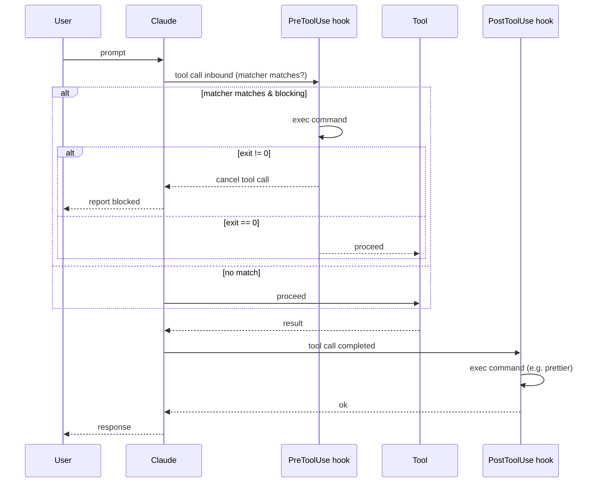

# Hooks

> **One-liner**: A hook is a shell command Claude runs at a defined event — before/after a tool call, on session stop — letting you auto-format, audit, block, or react without changing prompts.

---

## Quick Reference

### Events
| Event | Fires | Common use |
|-------|-------|------------|
| `PreToolUse` | Before a tool call | Validate, gate, block dangerous patterns |
| `PostToolUse` | After a tool call | Auto-format, lint, log |
| `Stop` | Session ends | Final checks, cleanup |
| `UserPromptSubmit` | User submits a prompt | Inject context, log questions |

### Hook fields
| Field | Purpose |
|-------|---------|
| `matcher` | Regex matched against tool name (`Edit\|Write`, `Bash`, `Edit`) |
| `command` | Shell command to run |
| `timeout` | Max seconds before kill (default 30) |
| `blocking` | If true, exit code != 0 cancels the tool call |

### Variables in `command`
| Var | Resolves to |
|-----|-------------|
| `${file}` | File path the tool acted on (Edit/Write/Read) |
| `${tool}` | Tool name (`Bash`, `Edit`, …) |
| `${args}` | JSON of tool arguments |
| `${cwd}` | Current working directory |

---

## Core Concept

Hooks let you **automate around the agent loop** without changing how Claude reasons. Want every edit auto-prettied? `PostToolUse` runs `prettier`. Want to block `git push --force`? `PreToolUse` exits non-zero on the matching command.

Hooks run as **shell commands** with the user's permissions — the same as if you'd typed them yourself. They're not gated by Claude's permission system; they fire automatically. Treat them like cron jobs you trust.

A `PreToolUse` hook with `blocking: true` and a non-zero exit code **cancels the tool call**. Use this for safety nets, never for routine logic — a hook that fires often and slows everything down is worse than no hook at all.

The natural home for hooks is `~/.claude/settings.json` (your habits) or `<project>/.claude/settings.json` (team-shared safety nets).

---

## Diagram



---

## Syntax & API

### Auto-format every edit

```json
{
  "hooks": {
    "PostToolUse": [
      {
        "matcher": "Edit|Write",
        "command": "npx prettier --write ${file} 2>/dev/null || true"
      }
    ]
  }
}
```

> The `|| true` keeps a prettier failure from cascading. PostToolUse hooks generally shouldn't block.

### Block dangerous bash patterns

```json
{
  "hooks": {
    "PreToolUse": [
      {
        "matcher": "Bash",
        "command": "./scripts/audit-bash.sh",
        "blocking": true
      }
    ]
  }
}
```

```bash
#!/usr/bin/env bash
# scripts/audit-bash.sh — exits 1 if the command looks dangerous
set -e
cmd=$(jq -r '.command' <<<"$ARGS_JSON")

case "$cmd" in
  *"rm -rf"*|*"git push --force"*|*"DROP DATABASE"*)
    echo "blocked: $cmd" >&2
    exit 1
    ;;
esac
exit 0
```

### Run typecheck after every edit (notify-only)

```json
{
  "hooks": {
    "PostToolUse": [
      {
        "matcher": "Edit",
        "command": "npx tsc --noEmit 2>&1 | head -20",
        "blocking": false
      }
    ]
  }
}
```

### End-of-session report

```json
{
  "hooks": {
    "Stop": [
      {
        "command": "git status && echo '— session over —'"
      }
    ]
  }
}
```

### Inject context on every user prompt

```json
{
  "hooks": {
    "UserPromptSubmit": [
      {
        "command": "./scripts/inject-context.sh"
      }
    ]
  }
}
```

> Output of the hook command becomes additional context Claude sees. Use sparingly — every prompt costs tokens.

---

## Common Patterns

### Pattern: format-on-edit (the classic)

```json
{
  "hooks": {
    "PostToolUse": [
      { "matcher": "Edit|Write", "command": "npx prettier --write ${file}" },
      { "matcher": "Edit|Write", "command": "npx eslint --fix ${file} 2>/dev/null || true" }
    ]
  }
}
```

### Pattern: block prod database

```bash
#!/usr/bin/env bash
# Block any command that mentions the prod DB URL
cmd=$(jq -r '.command' <<<"$ARGS_JSON")
if echo "$cmd" | grep -qiE 'prod|production'; then
  echo "blocked: $cmd contains 'prod'" >&2
  exit 1
fi
exit 0
```

### Pattern: log every Bash to a file

```json
{
  "hooks": {
    "PreToolUse": [
      {
        "matcher": "Bash",
        "command": "echo \"[$(date)] ${args}\" >> ~/.claude/bash.log",
        "blocking": false
      }
    ]
  }
}
```

### Pattern: refresh project context on demand

```json
{
  "hooks": {
    "UserPromptSubmit": [
      {
        "command": "git --no-pager log --oneline -5"
      }
    ]
  }
}
```

> Quick recent-commits ticker injected into every prompt. Useful for shared sessions where state changes externally.

---

## Gotchas & Tips

- **Hooks run with your full shell privileges.** They are NOT gated by Claude's permission system. Treat hook scripts like any cron / startup script — review them.
- **Blocking hooks delay every tool call.** Keep them under ~200ms or your sessions feel sluggish.
- **A hook that always blocks** turns into "Claude can't do anything." Ensure your matcher is specific.
- **Don't put secrets in hook commands** — they're stored in `settings.json` and may be committed.
- **Test hooks outside Claude first.** Run the script with the same args manually before wiring it.
- **Hook stdout / stderr is logged** — both are visible to Claude in some events. Avoid noisy hooks unless you want Claude reading them.
- **`UserPromptSubmit` hooks fire EVERY prompt** — even `/clear`. Make them cheap.
- **Errors in PostToolUse don't roll back** the tool call. The edit happened; the format failed. Decide if that's OK.
- **Hooks compose** — multiple entries with the same matcher fire in order.

---

## See Also

- [[03 - settings.json]]
- [[05 - Permissions and Safety]]
- [[04 - Building Custom Hooks]]
- [[09 - Security and Sandboxing]]
