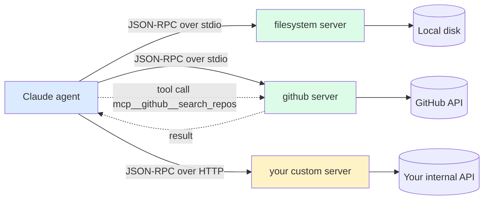

# MCP Servers — Using

> **One-liner**: An MCP server is a plug-in that gives Claude new tools — query a DB, browse a website, hit a custom API — by speaking the **Model Context Protocol** over stdio or HTTP.

---

## Quick Reference

| MCP server | What it adds |
|------------|--------------|
| `filesystem` | Read/write files outside the working dir |
| `github` | Search repos, issues, PRs; create issues/PRs |
| `git` | git operations across repos |
| `postgres` / `sqlite` | Query DB, get schema, run SQL |
| `puppeteer` / `browser` | Browse pages, screenshot, fill forms |
| `slack` | Read channels, post messages |
| `memory` | Persistent KV across sessions |
| `fetch` | HTTP requests to arbitrary endpoints |

| Slash command | Purpose |
|--------------|---------|
| `/mcp` | List configured MCP servers + connection state |

| Tool naming | Format |
|-------------|--------|
| MCP tool name | `mcp__<server>__<tool>` (e.g. `mcp__github__search_repos`) |
| Permission rule | `mcp__<server>__*` allows everything from a server |

---

## Core Concept

The **Model Context Protocol** (MCP) is a small JSON-RPC standard that lets Claude talk to external "servers" exposing tools, resources, and prompts. Anthropic ships a few; the community has many. You add a server by registering it in `settings.json`; it appears as new tools Claude can call.

Use MCP when Claude needs a capability **outside its built-ins**:
- Query *your* database directly
- Browse *your* internal docs
- Hit *your* internal APIs
- Read from a system without a CLI

You don't write code to use MCP — just config. You only write code if you're *building* an MCP server (see [[05 - Building MCP Servers]]).

Most servers run as a subprocess (`stdio` transport). Some are HTTP-based. The harness manages the connection.

---

## Diagram



---

## Syntax & API

### Register a server in `settings.json`

```json
{
  "mcpServers": {
    "filesystem": {
      "command": "npx",
      "args": ["-y", "@modelcontextprotocol/server-filesystem", "/Users/me/repos"]
    }
  }
}
```

> After saving, restart Claude (or `/mcp` reload). New tools appear under `mcp__filesystem__*`.

### Server with env vars (auth)

```json
{
  "mcpServers": {
    "github": {
      "command": "npx",
      "args": ["-y", "@modelcontextprotocol/server-github"],
      "env": { "GITHUB_TOKEN": "${env:GH_TOKEN}" }
    }
  }
}
```

> Reference shell env with `${env:NAME}` — never paste tokens inline.

### HTTP-transport server

```json
{
  "mcpServers": {
    "internal-api": {
      "url": "http://localhost:8080/mcp",
      "transport": "http",
      "headers": { "Authorization": "Bearer ${env:INTERNAL_TOKEN}" }
    }
  }
}
```

### Allow tools from a server

```json
{
  "permissions": {
    "allow": [
      "mcp__filesystem__*",
      "mcp__github__search_repos",
      "mcp__github__get_issue"
    ]
  }
}
```

> Wildcard the safe servers; explicitly list mutating tools.

### Inspect what's loaded

```text
> /mcp
# Lists servers, connection state, tool counts.
```

---

## Common Patterns

### Pattern: query the dev database

```json
{
  "mcpServers": {
    "dev-db": {
      "command": "npx",
      "args": ["-y", "@modelcontextprotocol/server-postgres",
               "postgresql://localhost/myapp_dev"]
    }
  }
}
```

```text
> Using the dev-db MCP server, list the tables and the row count of each.
```

### Pattern: GitHub triage

```json
{
  "mcpServers": {
    "github": { "command": "npx", "args": ["-y", "@modelcontextprotocol/server-github"], "env": { "GITHUB_TOKEN": "${env:GH_TOKEN}" } }
  }
}
```

```text
> Search github for issues labeled bug in our org assigned to me.
  List title + url + last activity.
```

### Pattern: scoped filesystem (security boundary)

```json
{
  "mcpServers": {
    "fs-readonly": {
      "command": "npx",
      "args": ["-y", "@modelcontextprotocol/server-filesystem",
               "--read-only", "/Users/me/safe-area"]
    }
  }
}
```

> Lock down what an MCP server can touch via its CLI args before relying on Claude's permission system.

### Pattern: chain MCP + built-in tools

```text
> 1) Use the github MCP server to fetch the issue body for #1234.
  2) Read the relevant source file (Read tool).
  3) Propose a fix.
```

---

## Gotchas & Tips

- **MCP tool names are long** — `mcp__<server>__<tool>`. Permissioning by exact name is verbose; use wildcards on trusted servers.
- **Server failures are not silent** — `/mcp` shows red on broken servers. Check it if a tool seems missing.
- **MCP servers run with your full shell privileges.** A malicious server can read your files. Only run servers you trust.
- **Tokens in `env`**: never inline. Always reference your shell env. If you must inline for a quick test, delete after.
- **Restart after editing `mcpServers`.** Some changes are picked up live; many require a fresh session.
- **Don't expose prod credentials** to MCP servers unless the agent task genuinely needs them. Prefer dev-tier creds.
- **A server's tool surface can be big.** A 50-tool MCP server inflates Claude's tool list (and decision space). Trim what you allow.
- **Project vs user**: `mcpServers` works at any level. Team-shared DB connection? Put it in `<project>/.claude/settings.json`. Personal GitHub token? User-level only.

---

## See Also

- [[03 - settings.json]]
- [[05 - Building MCP Servers]]
- [[09 - Security and Sandboxing]]
- [[04 - Tools and Capabilities]]
