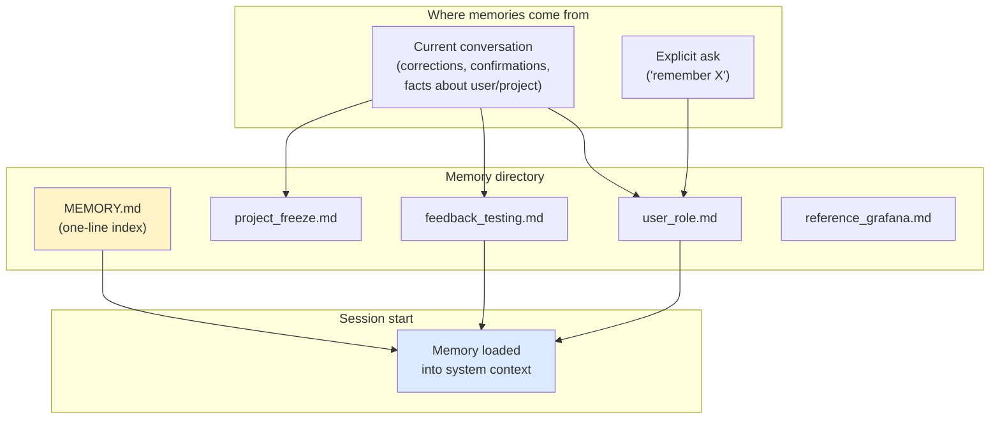

# Memory System

> **One-liner**: Memory is what Claude **remembers about you and the project across sessions** — distinct from `CLAUDE.md` (which you author) and live conversation (which expires).

---

## Quick Reference

### Three layers of context
| Layer | Authored by | Lifetime | Lives in |
|-------|-------------|----------|----------|
| Conversation | You + Claude | Current session | RAM |
| `CLAUDE.md` | You | Forever (committed) | repo |
| **Memory** | Claude (with your guidance) | Across sessions | `~/.claude/projects/<path>/memory/` |

### Memory types
| Type | Stores | Example |
|------|--------|---------|
| `user` | Who you are, role, preferences | "Senior Go engineer, new to React" |
| `feedback` | Rules / preferences from corrections OR confirmations | "User wants terse responses, no trailing summaries" |
| `project` | State / decisions / motivations | "Auth rewrite driven by compliance, not tech debt" |
| `reference` | Pointers to external systems | "Pipeline bugs tracked in Linear project INGEST" |

### Memory file shape
```markdown
---
name: <short title>
description: <one-line — used to judge relevance later>
type: user | feedback | project | reference
---

<the actual memory content>
```

### MEMORY.md (the index)
```markdown
- [Title](file.md) — one-line hook
- [Other Title](other.md) — one-line hook
```

---

## Core Concept

Memory is the layer between conversation (forgotten when the session ends) and `CLAUDE.md` (manually authored, committed). Claude writes memories about you and the project as it works; future sessions load them at startup so collaboration carries over.

The vast majority of memories fall into four types:
- **User** — your role, expertise, preferences (so explanations land at the right level)
- **Feedback** — corrections you made *or* confirmations you gave (so Claude doesn't repeat mistakes or drift away from validated approaches)
- **Project** — state, decisions, motivations (so suggestions reflect the real constraints)
- **Reference** — pointers to external systems (so Claude knows where to look)

What memory is **not** for: things that can be derived from the codebase (architecture, conventions, file paths) or from `git log` (history, who changed what). Don't duplicate. Don't store ephemeral state.

You can ask Claude to remember (`remember that I prefer X`) or to forget (`forget the rule about Y`). Otherwise it manages memory automatically.

---

## Diagram



---

## Syntax & API

### Tell Claude to remember

```text
> remember: I prefer terse responses, no trailing summaries.
```

Claude writes a `feedback` memory and adds an entry to `MEMORY.md`.

### Tell Claude to forget

```text
> forget the rule about not using Tailwind — we adopted it last week.
```

Claude removes the matching memory and updates the index.

### Inspect / edit memory

```text
> /memory
# opens the memory directory in your editor
```

Or just navigate to `~/.claude/projects/<encoded-project-path>/memory/`.

### Example memory files

`user_role.md`:
```markdown
---
name: User role
description: User is a senior Go engineer, new to React and the frontend codebase
type: user
---

User has 10 years of Go; first time touching React side of this repo.
Frame frontend explanations in terms of backend analogues. Default
to lower-level mechanics rather than React idioms.
```

`feedback_testing.md`:
```markdown
---
name: Integration tests use real DB
description: Integration tests must hit a real database, not mocks
type: feedback
---

Integration tests must use a real database, not mocks.

**Why:** prior incident where mock/prod divergence masked a broken migration.
**How to apply:** when adding integration tests, use the testcontainers helper
in `test/db.ts`; never reach for jest.mock for DB calls.
```

`project_freeze.md`:
```markdown
---
name: Mobile release merge freeze
description: Merge freeze for non-critical PRs starts 2026-03-05
type: project
---

Merge freeze begins 2026-03-05 for the mobile release cut.

**Why:** mobile team is cutting a release branch and any non-critical
churn risks destabilizing the cut.
**How to apply:** flag any non-critical PR work scheduled after 2026-03-05.
```

### MEMORY.md (the index)

```markdown
- [User role](user_role.md) — senior Go engineer, new to React
- [Integration tests use real DB](feedback_testing.md) — never mock the DB
- [Mobile release merge freeze](project_freeze.md) — freeze starts 2026-03-05
- [Grafana latency dashboard](reference_grafana.md) — oncall watches this for request-path changes
```

---

## Common Patterns

### Pattern: capture a correction the first time

```text
> stop summarizing what you just did at the end of every response,
  I can read the diff
```

Claude saves a `feedback` memory; future sessions skip the trailing summaries.

### Pattern: capture a *successful* judgment call

```text
> yeah the single bundled PR was the right call here, splitting this
  one would've just been churn
```

Without explicit save, this is a quiet confirmation — Claude should still capture it as a feedback memory ("for refactors in this area, user prefers one bundled PR over many small ones") so it doesn't drift back to splitting next time.

### Pattern: pin a near-term project state

```text
> remember: we're on a merge freeze until next Thursday because of
  the mobile release cut.
```

(With absolute date conversion: "until 2026-03-05".)

### Pattern: pointer to external truth

```text
> remember: pipeline bugs are tracked in Linear project INGEST,
  not in GitHub issues.
```

---

## Gotchas & Tips

- **Memory ≠ `CLAUDE.md`.** `CLAUDE.md` is project-shared, committed, manually authored. Memory is per-user, local, Claude-managed. Don't put team-wide rules in memory; put them in `CLAUDE.md`.
- **Don't store derivable facts.** Architecture, file paths, conventions — these are in the code. Memory is for *unwritten* things: user preferences, decision motivations, external pointers.
- **Memories decay.** A "we're freezing through Thursday" memory is stale by next Friday. Either dated explicitly or re-verified.
- **Verify before recommending from memory.** If a memory says "function `foo` lives at `bar.ts`," the file may have been renamed. Grep before quoting.
- **Memory file names are descriptive, not chronological** — organise by topic. `feedback_testing.md`, not `2026-04-29-1.md`.
- **`MEMORY.md` is an index, not a memory.** One line per entry. Entries past ~200 lines may truncate.
- **Memories from one project don't leak to another** — they're scoped to the working directory.
- **Asking Claude to "remember" is the simplest API.** No need to author files manually unless you want to.

---

## See Also

- [[06 - CLAUDE.md Files]]
- [[07 - Effective Prompting]]
- [[10 - Tips and Pitfalls]]
