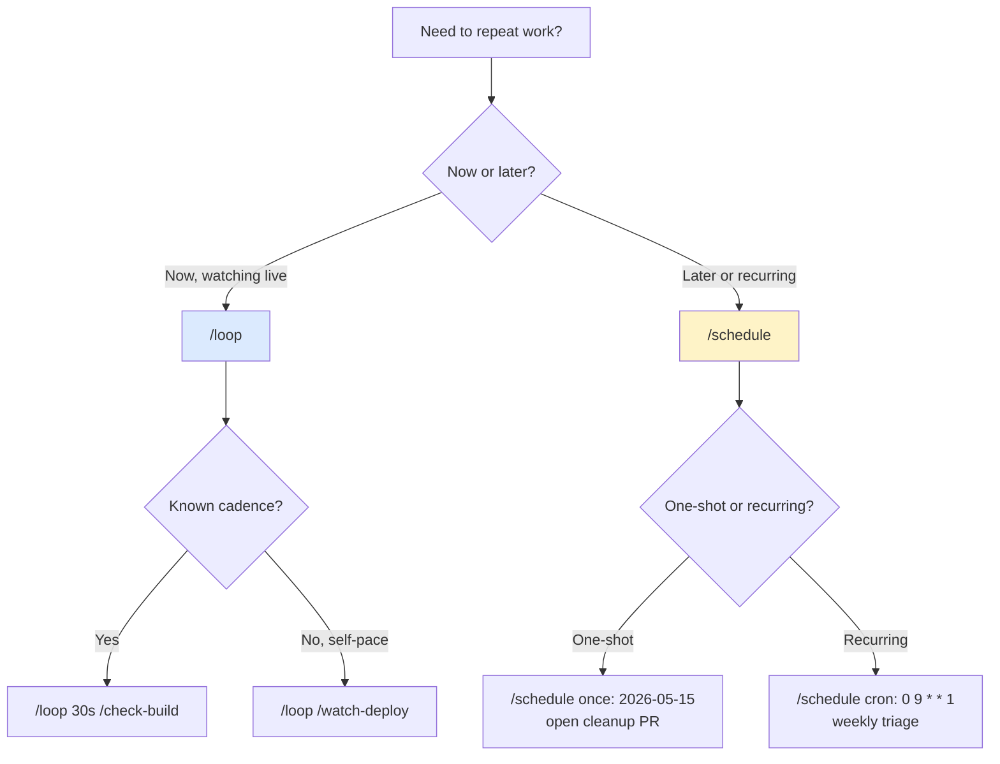

# Background Tasks

> **One-liner**: `/loop` runs a prompt on a recurring interval inside this session; `/schedule` fires a *remote* background agent on a cron schedule. Different surfaces, different jobs.

---

## Quick Reference

| Tool | Where it runs | Cadence | Best for |
|------|---------------|---------|----------|
| `/loop 5m <cmd>` | This session, fixed interval | Every N minutes | Active polling: build status, deploy, test runs |
| `/loop <cmd>` | This session, self-paced | Claude picks delay | Watching something with unknown ETA |
| `/schedule` | Remote agent, separate run | Cron / one-shot | Recurring routines: weekly cleanup, "in 2 weeks open a PR" |

| Decision | Use |
|----------|-----|
| Need answer in this session | `/loop` |
| Need answer next week / next sprint | `/schedule` |
| Polling something live (build, queue) | `/loop 30s` |
| Idle wait for a flag-removal date | `/schedule` (one-shot) |
| Recurring triage / sweep | `/schedule` (cron) |

---

## Core Concept

Two distinct mechanisms answer "do this later":

**`/loop`** keeps running *in your terminal*. Claude re-fires the prompt every N minutes (or self-paces if you don't pass an interval). Good for things you want to watch *now*: a long build, a flaky test, a queue draining. Stops when you Ctrl-C or close the session.

**`/schedule`** registers a *routine* — a remote agent that wakes up on a cron expression (or once at a future time) and runs autonomously. Survives your session ending. Good for recurring work ("every Monday, triage the alert queue") or one-shot future work ("in 2 weeks, open the cleanup PR for this feature flag").

Both can call any slash command or freeform prompt as their payload.

---

## Diagram



---

## Syntax & API

### `/loop` — fixed interval

```text
> /loop 5m /check-build
# every 5 minutes, run the /check-build slash command
```

```text
> /loop 30s claude is the smoke test passing yet? Run `pnpm test:smoke`.
# every 30 seconds, freeform prompt
```

Claude runs the payload, reports, and waits the interval. Continues until you stop it (Ctrl-C, `/loop stop`, or close the session).

### `/loop` — self-paced (no interval)

```text
> /loop
  watch the deploy. When status is "live" or "failed", report and stop.
```

Claude picks a sensible delay each iteration based on what it sees (cache windows: 60–270 s, or 1200–1800 s for idle).

### `/schedule` — register a routine

The `/schedule` skill prompts you for:
- **payload**: the prompt or slash command to run
- **cadence**: cron (`0 9 * * 1`) or one-shot date
- **scope**: typically the current repo

```text
> /schedule
  Run weekly Mondays 9am: /triage-alerts
```

```text
> /schedule
  In 2 weeks (2026-05-13): open a PR removing the `LEGACY_AUTH` feature flag.
  Verify rollout is at 100% first; abort if not.
```

### Inspect / cancel routines

```text
> /schedule list      # show registered routines
> /schedule delete <id>
```

---

## Common Patterns

### Pattern: poll a long build

```text
> /loop 60s
  run `gh run list --branch=$(git branch --show-current) --limit 1`.
  If status == "completed", report conclusion and stop the loop.
```

### Pattern: watch tests until green

```text
> /loop 90s
  pnpm test --bail. If green, stop. If red, summarise the first failure
  but keep looping (I'm pushing fixes).
```

### Pattern: scheduled feature-flag cleanup

After shipping a flag-gated feature:

```text
> /schedule
  Date: 2026-05-15 (3 weeks from now).
  Task: check rollout dashboard. If at 100% for 7+ days, open a PR
  removing all references to flag `NEW_CHECKOUT`. If not, message me.
```

### Pattern: weekly dependency audit

```text
> /schedule
  Cron: 0 8 * * 1   # Mondays 8am
  Task: run `pnpm outdated` and `pnpm audit`. Open issues for
  CRITICAL/HIGH advisories. Group minor bumps into one PR.
```

### Pattern: dynamic-pace `/loop` for unknown ETA

```text
> /loop
  Watch the data backfill job. Status query: `psql -c "select count(*) from backfill_progress"`.
  Pick your own cadence — fast at first, slower as it stabilises.
  Stop when count reaches 1_000_000.
```

---

## Gotchas & Tips

- **`/loop` dies with the session.** Closing your terminal stops it. For persistent work, `/schedule`.
- **Don't use `/loop 5m`** if you can pick 270 s or 1200 s — 5-minute polling sits exactly on the prompt-cache TTL boundary and pays the cache-miss cost without amortising it. Stay under 5 min for active work, jump to 20+ min for idle waits.
- **`/schedule` runs as a *remote* agent** in its own context. It doesn't see your current conversation. Phrase the payload as a self-contained brief.
- **Authorise the schedule before promising it.** Don't say "I'll schedule X" then not follow through. Either run `/schedule` immediately or describe what *you'd* schedule and let the user trigger.
- **Don't `/schedule` something destructive without guards.** The agent runs unattended. Tell it explicit abort conditions ("if rollout < 100%, message me; do not proceed").
- **Cron cadence pitfalls**: timezones default to UTC unless configured. Confirm the time zone for your routine.
- **`/loop` and `/schedule` aren't substitutes for CI.** If the action is "run on every PR," use a GitHub Action — see [[07 - CI-CD Integration]].
- **Offer `/schedule` proactively** when shipping a feature flag, monitor, or anything with a "remove once X" condition. Skip the offer for ordinary fixes.
- **`/loop stop`** halts the loop without ending the session.

---

## See Also

- [[02 - Custom Slash Commands]]
- [[01 - Subagents]]
- [[07 - CI-CD Integration]]
- [[08 - Git and PR Workflow]]
