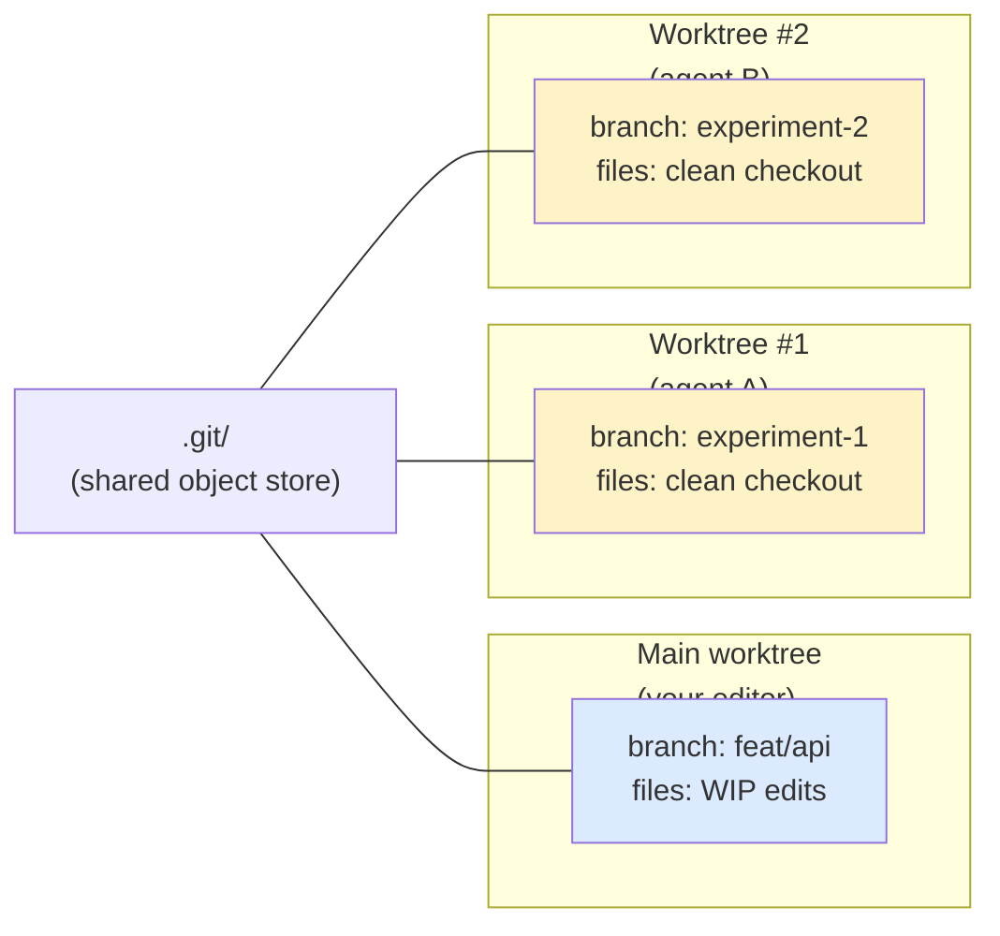

# Worktrees and Parallel Work

> **One-liner**: Git worktrees give you a second checked-out copy of the repo on a different branch — perfect for running an isolated agent that won't touch your active edits.

---

## Quick Reference

| Need | Tool |
|------|------|
| Run an experiment without dirtying main checkout | `git worktree add` |
| Spawn an agent that may make destructive changes | Subagent with `isolation: "worktree"` |
| Compare two branches side-by-side in editors | Two worktrees, two windows |
| Parallel forks reading shared state | Forks (no isolation needed) |

| Concept | One-liner |
|---------|-----------|
| Worktree | A second checkout of the same repo, on a different branch |
| Isolation flag | Tells the subagent to operate inside a fresh worktree |
| Cleanup | If agent makes no changes, worktree auto-removed |

---

## Core Concept

A **git worktree** is a second working directory connected to the same `.git` repo but checked out to a different branch. Edits in one worktree don't affect the other. They share commits, but each has its own working tree, index, and HEAD.

Why this matters with Claude:
- You're mid-feature on `feat/api`. You ask Claude to try a refactor — but you don't want it editing your in-progress files. **Spawn a subagent in a worktree** on a clean branch; if its work is good, merge.
- You want to run *two* agents in parallel without them stomping each other (e.g. one refactoring backend, one updating frontend). Two worktrees, two agents.
- An automation needs to leave the main branch untouched (CI checking out a PR while you keep working).

You don't need worktrees for **forks** that only *read* (research, search, audit) — those can share your working tree. Worktrees are for *write* isolation.

---

## Diagram



---

## Syntax & API

### Manual git worktree

```bash
# Create a worktree on a new branch, sibling directory
git worktree add ../myrepo-experiment -b experiment/refactor-cache

# Or check out an existing remote branch
git worktree add ../myrepo-pr-1234 origin/pr/1234

# List
git worktree list

# Remove (after the branch is merged or you no longer need it)
git worktree remove ../myrepo-experiment
git worktree prune   # cleans up dangling refs
```

### Subagent with worktree isolation

When spawning a subagent, pass `isolation: "worktree"`:

```text
> Spawn a subagent (with worktree isolation) to refactor the cache module.
  It should:
  - work on a fresh branch off main
  - run tests after each change
  - leave the worktree behind only if it actually made changes
  - report the path + branch on completion
```

The runtime auto-creates a worktree, runs the agent inside it, and (on completion) returns the path and branch if changes were made. If the agent made no changes, the worktree is auto-removed.

### Inspect what an agent did

```bash
# After agent reports back with branch name
git -C ../myrepo-cache-refactor diff main...

# Or open the worktree in a second editor window
code ../myrepo-cache-refactor
```

---

## Common Patterns

### Pattern: try a refactor without disturbing in-progress work

```text
> I'm mid-feature on this branch. Spawn a worktree-isolated agent to
  try refactoring `services/auth.ts` into smaller modules. If the
  result looks good I'll cherry-pick; if not, throw the worktree away.
```

### Pattern: run two parallel agents

```text
> Two agents in parallel, each in its own worktree:
  1) backend-agent: migrate API responses to envelope format
  2) frontend-agent: update consumers to read envelope.data

  Both branch off main. When done, report both paths.
```

> Run them in **one message with two Agent calls** so they're truly parallel. Agents writing to the same paths from the same worktree would race.

### Pattern: review a PR locally without checking it out

```bash
# Adds the PR's head as a worktree, leaves your branch alone
git worktree add ../pr-1234 origin/pr/1234
cd ../pr-1234
# Now run Claude here for an independent review
```

### Pattern: clean up after exploration

```bash
# Tossed the experiment, want it gone:
git worktree remove ../myrepo-experiment --force
git branch -D experiment/refactor-cache
git worktree prune
```

### Pattern: long-running agent on a separate worktree

For an agent task that may run while you keep coding (e.g., bulk codegen across 200 files):

```text
> Spawn a worktree-isolated agent to regenerate all *.proto-derived types.
  I'll keep working on the API on the main checkout. When it's done,
  I'll review the diff in the worktree.
```

---

## Gotchas & Tips

- **Worktrees share the object store but not the working tree.** A commit in one is visible to the other immediately; an *unstaged* edit is not.
- **You can't check out the same branch in two worktrees.** Git refuses. Use detached HEAD or different branches.
- **Hooks run in the worktree's directory.** A pre-commit hook reading `./node_modules` may need the worktree to have its own deps installed — symlink or pnpm hoist may be needed.
- **`git worktree prune`** cleans up administrative state when a worktree directory was deleted manually. Run it after any rm-rf.
- **The `isolation: "worktree"` flag is for subagent spawns**, not forks. Forks share your working tree by design (they share your context).
- **Two agents on the same files in the same worktree will race.** Either give each its own worktree, or make sure their changes don't overlap.
- **Worktree-isolated agents that make no changes are cleaned up automatically.** No clutter. If you see a leftover worktree, the agent did make changes — review them.
- **CI runners often use worktrees** under the hood; be aware that paths in error messages may not match your main checkout.
- **Don't put worktrees inside the main checkout** (e.g. `./worktrees/x`) — Git, watchers, and search tools may double-index. Use a sibling directory.
- **A worktree on a deleted remote branch** still works locally — but `git fetch --prune` may drop the upstream ref. Re-push if you want it back.

---

## See Also

- [[01 - Subagents]]
- [[02 - Agent Orchestration]]
- [[08 - Git and PR Workflow]]
- [[14 - Multi-file Refactoring]]
