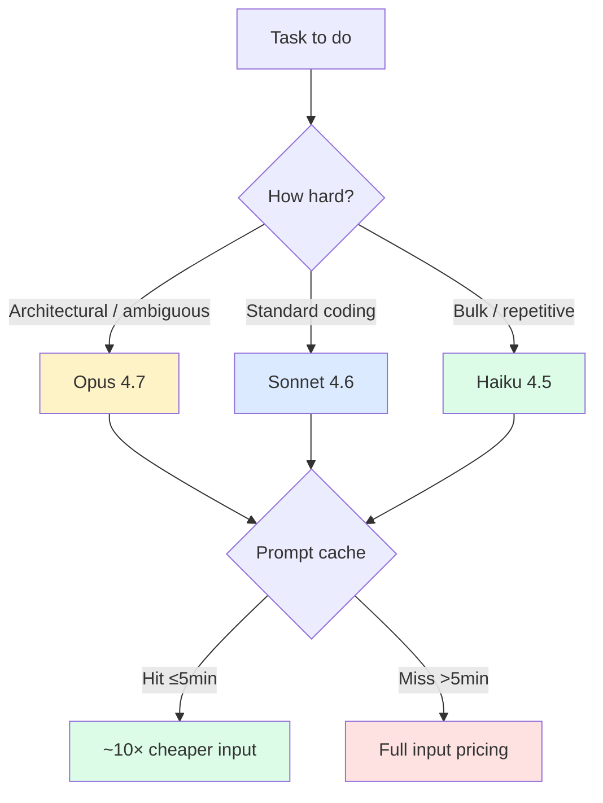

# Model and Cost Optimization

> **One-liner**: Pick the smallest model that does the job, keep your prompt cache warm, and don't fill the context window with tool noise — those three habits drive 90% of the savings.

---

## Quick Reference

### Model lineup (Claude 4.x family)

| Model | Strength | Cost | Use for |
|-------|----------|------|---------|
| **Opus 4.7** | Deepest reasoning | High | Architecture, hard debugging, multi-file plans |
| **Sonnet 4.6** | Best coding | Medium | Default day-to-day; orchestration |
| **Haiku 4.5** | Fast & cheap | Low | High-frequency agents, codegen, light edits |

### Three savings levers

| Lever | Effect |
|-------|--------|
| Pick a smaller model where it suffices | Linear cost reduction |
| Keep the prompt cache warm (≤5 min between turns) | Up to 10× cheaper on cached tokens |
| Don't bloat context with tool dumps | Fewer input tokens per turn |

### Cache TTL = 5 minutes

| Gap between turns | Cache state |
|--------------------|-------------|
| < 5 min | Hot — cheap reads |
| 5–60 min | Cold — full re-read |
| > 60 min | Cold + likely re-summarised |

---

## Core Concept

Cost in Claude Code is dominated by **input tokens**. Output tokens matter, but they're a fraction of the total. Most spend goes to the system prompt, conversation history, and tool results — all of which Claude re-reads on every turn.

The **prompt cache** is the single biggest lever. Anthropic caches your prompt prefix for 5 minutes. If you turn within 5 minutes, the cached portion is ~10× cheaper. If you wait 6 minutes, you pay full price for that prefix again. So: tight loops are cheap, long pauses are expensive.

The **model lever** is straightforward but underused. Opus is the right tool for the *hard* parts — architecture, ambiguous debugging, plan creation. Sonnet handles the bulk of coding. Haiku is dramatically cheaper and good enough for codegen, light edits, and high-frequency worker agents in multi-agent setups.

The **context-bloat lever** is about not pulling massive tool outputs into your conversation. A `cat huge_file.json` adds the whole file to every subsequent turn. Use Read with offsets, Grep for targeted lookups, and *forks* for noisy research that you don't need to keep.

---

## Diagram



---

## Syntax & API

### Set the model

Per-session:

```bash
claude --model claude-opus-4-7
claude --model claude-sonnet-4-6
claude --model claude-haiku-4-5-20251001
```

In `settings.json` (project or user scope):

```json
{
  "model": "claude-sonnet-4-6"
}
```

Mid-session:

```text
> /model claude-haiku-4-5-20251001
```

### Per-agent model override

In an agent file (`.claude/agents/codegen.md`):

```markdown
---
name: codegen
description: Generate boilerplate from templates
model: haiku
tools: [Read, Write, Glob]
---

You generate boilerplate code from templates...
```

The orchestrator can run on Sonnet/Opus while worker agents run on Haiku.

### Check usage

```text
> /cost
# shows current session token usage and approximate cost
```

```text
> /usage
# shows recent usage rolled up
```

### Keep cache warm with `ScheduleWakeup`

When a long wait is needed, the runtime exposes wake delays that respect the 5-minute boundary:

- 60–270 s: stays in cache
- 1200 s+: amortises the cache miss
- *Avoid* 300 s — worst-of-both

---

## Common Patterns

### Pattern: orchestrator-worker model split

```markdown
# Main session: Sonnet (default)
# Worker agents: Haiku for codegen, Sonnet for review, Opus for architecture
```

You drive the conversation on Sonnet; spawn Haiku-backed agents for grunt work. Massive cost saving when running 10s of parallel codegen tasks.

### Pattern: Opus for plan, Sonnet for execute

```text
> /model claude-opus-4-7
> Plan the refactor of the payments module. Output a numbered playbook.

# After approving the plan:
> /model claude-sonnet-4-6
> Execute step 1 of the plan.
```

You buy Opus's reasoning for the planning step (where mistakes are expensive) and switch back to Sonnet for the mechanical execution.

### Pattern: fork to keep main context lean

Instead of running a research query in your main thread:

```text
> Fork an agent: find every place we use `setTimeout` with a literal
  number. Report grouped by file. Under 200 words.
```

The fork's tool noise stays out of your context. You get the summary; your prompt cache stays clean.

### Pattern: read with offsets, not whole files

```text
> Read src/large.ts lines 200–280 — the function I'm asking about.
  Don't read the whole file unless you need to.
```

A 5,000-line file pulled wholesale into context is paying for those 5,000 lines on every subsequent turn.

### Pattern: budget cap for Opus

```bash
export MAX_THINKING_TOKENS=10000
```

Caps extended thinking. Useful when you want Opus's reasoning *strength* but not its $$ tendency to spend 30k tokens deliberating.

### Pattern: keep turns close together

When iterating, fire follow-ups within 5 minutes. If you need to step away, do it *between tasks*, not between turns of the same task. Cache stays warm; cost stays low.

---

## Gotchas & Tips

- **Haiku 4.5 is ~90% of Sonnet for coding tasks at a fraction of the cost.** Don't reflexively reach for Sonnet for codegen, formatting fixes, or boilerplate.
- **Opus for hard problems only.** Using it as a default burns budget for marginal benefit.
- **Cache warmth beats model choice for cost.** A Sonnet session with hot cache often costs less than a Haiku session with cold cache.
- **`/cost` is per-session, not all-time.** For long-term spend, check your Anthropic dashboard.
- **The system prompt is large.** It's part of every turn's input. Don't sprinkle large CLAUDE.md additions casually — they multiply by every turn.
- **Tool outputs persist.** A `Bash: cat foo.json` of a 1MB file is now in your context for every turn. Use `head`-equivalents or filtered reads.
- **Forks share your cache** — they're cheap. Subagents with `subagent_type` start fresh and re-read their own system prompt — they're not.
- **Don't switch models mid-task** unless you've thought about it. Switching invalidates the cache.
- **Plan mode is cheap** — no edits, just reasoning. Use it liberally for hard problems on Opus.
- **Watch for runaway loops.** A `/loop 30s` calling Opus on every iteration adds up fast. Use Haiku for poll loops.
- **Extended thinking has a budget.** Default 31999 tokens; cap with `MAX_THINKING_TOKENS` if costs surprise you.
- **The 5-minute rule trumps minutes-of-thinking.** If you walk away for coffee mid-task, your next turn starts cold. Plan around it.

---

## See Also

- [[01 - Subagents]]
- [[03 - settings.json]]
- [[01 - Claude Code Overview]]
- [[10 - Tips and Pitfalls]]
