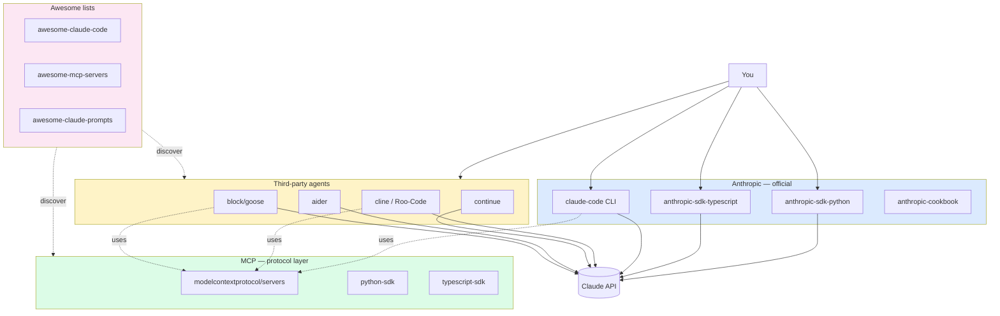

# Popular Claude GitHub Repos — Cheat Sheet

> **One-liner**: A curated map of the most useful Claude-powered open-source projects — official SDKs, coding agents, MCP servers, and awesome-lists — with the minimum command you need to try each.

---

## Quick Reference

| Category | Repo | What it gives you |
|----------|------|-------------------|
| **Official** | `anthropics/anthropic-cookbook` | Runnable recipes (RAG, tool-use, eval) |
| **Official** | `anthropics/courses` | Anthropic's free courses (prompt eng, tool use, RAG) |
| **Official** | `anthropics/prompt-eng-interactive-tutorial` | Hands-on prompting notebook |
| **Official SDK** | `anthropics/anthropic-sdk-python` | `pip install anthropic` |
| **Official SDK** | `anthropics/anthropic-sdk-typescript` | `npm i @anthropic-ai/sdk` |
| **CLI/agent** | `anthropics/claude-code` | The CLI you're reading this in |
| **MCP** | `modelcontextprotocol/servers` | Reference MCP servers (fs, git, github, sqlite…) |
| **MCP SDK** | `modelcontextprotocol/python-sdk` | Build MCP servers in Python |
| **MCP SDK** | `modelcontextprotocol/typescript-sdk` | Build MCP servers in TS |
| **IDE agent** | `cline/cline` | VS Code coding agent (was claude-dev) |
| **IDE agent** | `RooCodeInc/Roo-Code` | Cline fork with more agent modes |
| **IDE agent** | `continuedev/continue` | VS Code & JetBrains autocomplete + chat |
| **Terminal agent** | `Aider-AI/aider` | git-aware AI pair programmer |
| **Terminal agent** | `block/goose` | Block's local AI engineering agent |
| **Terminal agent** | `OpenInterpreter/open-interpreter` | Local code-exec assistant |
| **Multi-step agent** | `plandex-ai/plandex` | Long-running agent w/ sandboxed changes |
| **Multi-step agent** | `Pythagora-io/gpt-pilot` | App scaffolder |
| **Awesome list** | `hesreallyhim/awesome-claude-code` | Curated Claude Code resources |
| **Awesome list** | `langgptai/awesome-claude-prompts` | Curated prompts |
| **Awesome list** | `punkpeye/awesome-mcp-servers` | Curated MCP servers |

| Quick verb | Command shape |
|-----------|---------------|
| Install Claude Code | `npm i -g @anthropic-ai/claude-code` |
| Install Anthropic SDK (Py) | `pip install anthropic` |
| Install Anthropic SDK (TS) | `npm i @anthropic-ai/sdk` |
| Try an MCP server | `npx -y @modelcontextprotocol/server-<name>` |
| Set API key | `export ANTHROPIC_API_KEY=sk-ant-…` |

---

## Core Concept

The Claude ecosystem on GitHub falls into four buckets:

1. **Official Anthropic repos** — the canonical SDKs, cookbook, and Claude Code itself. Start here when you want code that's guaranteed to track the latest model and API surface.
2. **MCP (Model Context Protocol)** — the standard for plugging external tools into any MCP-compatible client (Claude Code, Cline, Goose…). One server, many clients.
3. **Coding agents** — IDE extensions and terminal tools that wrap the Claude API into a developer workflow. Most are model-agnostic but ship with Claude as the default or recommended backend.
4. **Awesome-lists** — curated link directories. Use them to discover community MCP servers, prompts, and skills you wouldn't find by searching.

A useful rule: prefer **official** when learning the API, **MCP** when extending Claude's reach, **IDE/terminal agents** when you want a different ergonomics than the CLI, and **awesome-lists** when you suspect a community tool already exists for your problem.

---

## Diagram



---

## Syntax & API

Each section below is a **minimum-to-try** snippet. Substitute your own paths, repo names, and tokens.

### Official Anthropic SDKs

```bash
# Python
pip install anthropic
export ANTHROPIC_API_KEY=sk-ant-...
```

```python
from anthropic import Anthropic
client = Anthropic()
msg = client.messages.create(
    model="claude-haiku-4-5",
    max_tokens=512,
    messages=[{"role": "user", "content": "Summarize REST in one paragraph."}],
)
print(msg.content[0].text)
```

```bash
# TypeScript
npm i @anthropic-ai/sdk
export ANTHROPIC_API_KEY=sk-ant-...
```

```typescript
import Anthropic from "@anthropic-ai/sdk";
const client = new Anthropic();
const msg = await client.messages.create({
  model: "claude-haiku-4-5",
  max_tokens: 512,
  messages: [{ role: "user", content: "Summarize REST in one paragraph." }],
});
console.log(msg.content);
```

> Both SDKs cover messages, tool use, streaming, prompt caching, batches, files, and citations. See [[06 - Claude Agent SDK]] for the higher-level agent loop.

---

### anthropic-cookbook — runnable recipes

```bash
git clone https://github.com/anthropics/anthropic-cookbook
cd anthropic-cookbook
# Notebooks are organized by skill: tool_use/, retrieval_augmented_generation/, evals/
jupyter lab
```

Pick a folder and run the notebook. Most cells work after setting `ANTHROPIC_API_KEY`.

---

### Claude Code CLI (this tool)

```bash
npm i -g @anthropic-ai/claude-code
claude                      # start a session in current dir
claude -p "explain this repo"   # one-shot prompt
claude --resume             # resume last session
```

See [[02 - Installation and Setup]] for fuller setup.

---

### MCP — official servers

```bash
# Try any reference server without installing — just run via npx
npx -y @modelcontextprotocol/server-filesystem ~/projects
npx -y @modelcontextprotocol/server-github
npx -y @modelcontextprotocol/server-sqlite ./mydb.sqlite
```

Wire one into Claude Code (`settings.json`):

```json
{
  "mcpServers": {
    "fs": {
      "command": "npx",
      "args": ["-y", "@modelcontextprotocol/server-filesystem", "/Users/me/repos"]
    }
  }
}
```

See [[05 - MCP Servers Using]] for the full pattern.

---

### Cline — VS Code coding agent

```text
# Install from VS Code marketplace: search "Cline"
# Set provider = Anthropic, paste API key
# Open command palette → "Cline: New Task"
```

Cline reads your repo, plans, then asks before each edit. Great when you want **diff-by-diff approval** rather than Claude Code's looser autonomy.

> Roo-Code (`RooCodeInc/Roo-Code`) is a fork with custom modes (code / architect / ask / debug) — try it when you want role-switching.

---

### continue — autocomplete + chat in IDE

```text
# VS Code or JetBrains marketplace → "Continue"
# config.json:
```

```json
{
  "models": [
    {
      "title": "Claude Sonnet 4.6",
      "provider": "anthropic",
      "model": "claude-sonnet-4-6",
      "apiKey": "sk-ant-..."
    }
  ]
}
```

Continue's strength is **inline autocomplete** + chat side-panel. Lighter than Cline; closer to Copilot ergonomics.

---

### aider — git-aware terminal pair programmer

```bash
pip install aider-chat
export ANTHROPIC_API_KEY=sk-ant-...
cd your-repo
aider --model claude-sonnet-4-6
```

```text
> /add src/auth.py
> add a JWT refresh endpoint, tests first
```

Aider auto-commits each change — every edit is a git diff you can revert. Best for **TDD-style iteration** on a focused area.

---

### block/goose — local AI engineering agent

```bash
# macOS
brew install pivotal/tap/goose-cli
# or download from releases page
goose configure   # pick Anthropic provider, paste key
goose session
```

Goose has a rich MCP-based "extensions" system and a desktop UI. Good when you want an agent that runs **as a daemon** and you talk to via terminal or chat window.

---

### OpenInterpreter — local code execution

```bash
pip install open-interpreter
interpreter --model claude-sonnet-4-6
```

```text
> plot a histogram of the file sizes in ~/Downloads
```

Interpreter generates code and runs it on your machine after asking for confirmation. Strong for **data-analysis one-shots**; weaker for multi-file edits.

---

### plandex — long-running coding agent

```bash
# install via release binary or:
curl -sL https://plandex.ai/install.sh | bash
plandex new
plandex tell "scaffold a Fastify + Postgres CRUD API"
```

Plandex stages all changes in a **sandbox branch** and lets you cherry-pick what to apply. Built for tasks that span many files and hours.

---

### Awesome-lists — discovery only

```bash
# Just browse the README. No install.
# github.com/hesreallyhim/awesome-claude-code
# github.com/punkpeye/awesome-mcp-servers
# github.com/langgptai/awesome-claude-prompts
```

Star them and skim every couple of months — community MCP servers and skills land fast.

---

## Common Patterns

### Pattern: pick the right tool by ergonomic need

```text
Need …                                       → Reach for
─────────────────────────────────────────────────────────────
fast one-shot in terminal                    → claude -p "…"
diff-by-diff approval in IDE                 → Cline / Roo-Code
inline autocomplete                          → continue
TDD with auto-commits                        → aider
run on a server / headless                   → claude --print, goose
analyze data + plot                          → open-interpreter
build a custom agent in code                 → claude-agent-sdk-python
extend Claude's tool surface                 → modelcontextprotocol/servers
```

### Pattern: share one MCP server across many clients

Configure once, use everywhere. The same `npx @modelcontextprotocol/server-github` works in Claude Code, Cline, Goose, and any MCP-compatible host — they all speak the same JSON-RPC.

### Pattern: try-before-install

For any MCP server, run via `npx -y …` first. No global install, no commitment. Once you're sure, pin it in `settings.json` with a version.

### Pattern: cookbook → SDK → agent

If you're new: start in `anthropic-cookbook`, copy the recipe into a script using `anthropic-sdk-*`, then graduate to the **Claude Agent SDK** ([[06 - Claude Agent SDK]]) when you need a tool loop. Don't skip steps.

---

## Gotchas & Tips

- **Repo names change.** `cline/cline` was `clinebot/cline` was `saoudrizwan/claude-dev`. GitHub redirects old URLs, but bookmarks and CI configs may rot. Re-check periodically.
- **"Awesome-X" quality varies.** A high star count doesn't equal quality — many tools were Claude 2-era and unmaintained. Check the **last commit date** before trusting.
- **Model IDs drift.** Cookbook examples often hard-code older model IDs (`claude-3-5-sonnet-…`). Update to the current model from [[15 - Model and Cost Optimization]] before running.
- **Tokens leak through clones.** Don't paste your API key into a `.env` that lives inside a sample repo. Use shell env (`export`) or a dedicated `.env` outside the clone.
- **Don't trust random MCP servers.** A community server runs with your shell privileges and can read every file you can. Vet code before adding to `mcpServers`. See [[09 - Security and Sandboxing]].
- **Some agents share state with Claude Code.** Cline and Claude Code can both read your project; running both at once on the same repo will sometimes step on each other (lockfiles, partial edits). Pick one per task.
- **`anthropic-cookbook` ≠ Claude Code documentation.** The cookbook is for API users; Claude Code docs live separately. Don't conflate them.
- **Stars are lagging.** A fresh, small repo can be far better than a 30k-star repo that hasn't tracked the API since last year. Prefer recent commit activity over absolute star count.
- **License before adoption.** Most are MIT/Apache — but check before vendoring code into a closed product.

---

## See Also

- [[01 - Claude Code Overview]]
- [[02 - Installation and Setup]]
- [[05 - MCP Servers Using]]
- [[06 - Claude Agent SDK]]
- [[05 - Building MCP Servers]]
- [[15 - Model and Cost Optimization]]
- [[09 - Security and Sandboxing]]
