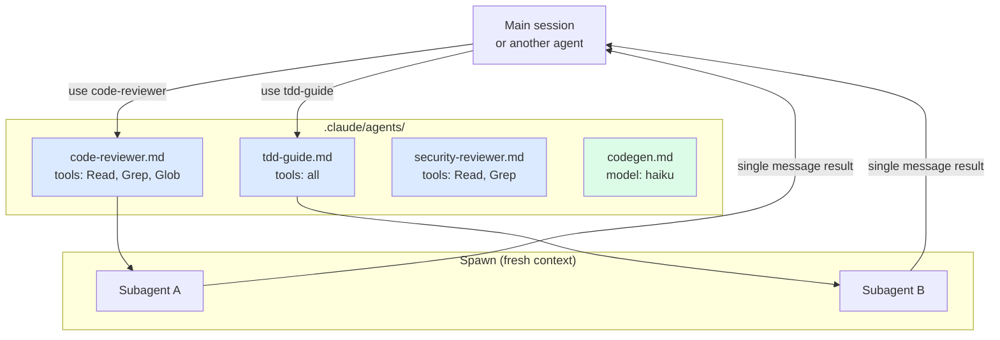

# Building Custom Agents

> **One-liner**: A custom agent is a markdown file in `.claude/agents/` that defines a specialised persona — its tools, model, and system prompt — invokable by name from any session.

---

## Quick Reference

| Field | Required | Purpose |
|-------|----------|---------|
| `name` | yes | Identifier (kebab-case) |
| `description` | yes | When to use it — Claude reads this to decide |
| `tools` | no | Allowlist; defaults to all if omitted |
| `model` | no | `opus` / `sonnet` / `haiku` (or full ID) |
| `body` | yes | The system prompt — instructions for the agent |

| Scope | Location | Visible to |
|-------|----------|-----------|
| User | `~/.claude/agents/` | Every project on your machine |
| Project | `<repo>/.claude/agents/` | Anyone with the repo |

| When to build one | Why |
|-------------------|-----|
| Repeated specialised task (e.g. code review) | Codify the playbook |
| Need fresh context every time | Subagent, not fork |
| Stable persona (security reviewer, TDD guide) | Reuse across sessions / projects |
| Cheap repetitive work | Pin to Haiku |

---

## Core Concept

A custom agent is a *named, reusable subagent definition*. When you say "use the code-reviewer agent," Claude finds `.claude/agents/code-reviewer.md`, spawns a fresh subagent with that file's instructions and toolset, runs it on the task, and returns its single-message result.

What you put in the file is what defines its personality:
- **Tools** — restrict to what it actually needs (a reviewer doesn't need Write).
- **Model** — let cheap agents be cheap (Haiku for codegen workers).
- **System prompt** — the persona, the playbook, the output format.

Think of agents as the equivalent of named pipelines or scripts in a Unix shell. Build the ones you reach for repeatedly.

---

## Diagram



---

## Syntax & API

### Minimal agent file

`.claude/agents/code-reviewer.md`:

```markdown
---
name: code-reviewer
description: Reviews a diff for correctness, maintainability, and security. Use after writing code, before commits, or on PRs.
tools: [Read, Grep, Glob, Bash]
model: sonnet
---

You are a senior code reviewer.

When invoked:
1. Run `git diff main...HEAD` to see the changes.
2. Group issues by severity: CRITICAL / HIGH / MEDIUM / LOW.
3. For each issue, give file:line and a one-line fix sketch.
4. Skip style nits if a linter would catch them.

Output format:

## Summary
<one paragraph>

## CRITICAL
- file:line — issue — fix

## HIGH
- ...

(omit empty sections)

Be terse. Don't restate the diff.
```

### Tool allowlists

Restrict tools to what the agent needs:

```markdown
---
name: research
description: Read-only investigation of code and docs
tools: [Read, Grep, Glob, WebFetch, WebSearch]
---
```

A research agent that can't `Write` or `Bash` is structurally safer.

### Model override per agent

```markdown
---
name: codegen
description: Generate boilerplate from a template
model: haiku
tools: [Read, Write, Glob]
---
```

Pinning to Haiku turns a high-frequency worker into a cheap one. See [[15 - Model and Cost Optimization]].

### Invoking an agent

From a session:

```text
> use the code-reviewer agent on the diff against main
```

From another agent (delegation):

```text
> spawn the security-reviewer subagent. Brief it on the auth changes.
```

### Inspect installed agents

```text
> /agents
# Lists agents from both user (~/.claude/agents) and project (.claude/agents)
```

---

## Common Patterns

### Pattern: enforced output format

```markdown
---
name: tdd-guide
description: Enforces RED → GREEN → REFACTOR cadence on new features
tools: [Read, Edit, Write, Bash, Grep, Glob]
---

You enforce strict TDD.

For every behaviour:
1. RED: write a failing test first. Run it. Confirm it fails.
2. GREEN: smallest implementation. Run all tests. Confirm green.
3. REFACTOR: only if green. Re-run tests after.

After each phase: commit. Three commits per behaviour.

REJECT requests that try to skip RED. Push back politely:
"Let's write the failing test first."
```

### Pattern: split-role review (multi-agent)

Build several reviewers, each with one lens:

```markdown
---
name: security-reviewer
description: OWASP-focused review — auth, injection, secrets
tools: [Read, Grep, Glob]
---

You are a security reviewer. Focus exclusively on:
- Authentication / authorization bypass
- Injection (SQL, command, prompt)
- Secret leakage (logs, error messages, hardcoded)
- OWASP top 10

Skip: style, performance, design taste.

Output: severity-grouped issues with file:line and exploit sketch.
```

```markdown
---
name: consistency-reviewer
description: Checks for divergence from project conventions
tools: [Read, Grep, Glob]
---

You compare new code to existing patterns in this repo.

Step 1: read CLAUDE.md and any nearby code.
Step 2: identify where the new code drifts from established conventions.
Step 3: report drift with a one-line "match the pattern at <file:line>".

Skip net-new code that has no precedent.
```

Run them in parallel from the main session and aggregate. See [[03 - Multi-Agent Reviews]].

### Pattern: agent that delegates to other agents

```markdown
---
name: pr-prep
description: End-to-end PR preparation: review, security, tests, draft
tools: [Read, Grep, Glob, Bash, Task]
---

You are an orchestrator.

1. Spawn `code-reviewer` on the diff.
2. Spawn `security-reviewer` on the diff (in parallel).
3. Run the test suite.
4. Aggregate findings; categorise blockers vs nits.
5. Draft a PR summary + test plan.

Don't fix issues — that's a separate decision. Just report.
```

### Pattern: project-specific agent

A `.claude/agents/migrate-checkpoint.md` in *one* repo can encode that repo's quirky migration playbook. Other projects don't see it; the team that needs it does.

### Pattern: minimal-tools sandbox

```markdown
---
name: doc-writer
description: Writes / updates markdown docs only
tools: [Read, Write, Glob]
---

You only edit *.md files. If asked to change code, refuse.
```

Removing `Bash` and `Edit` (for non-md) makes accidental code edits structurally impossible.

---

## Gotchas & Tips

- **The `description` field matters for invocation.** When a user says "review this," Claude scans descriptions to pick an agent. Vague descriptions get skipped.
- **Subagents start fresh.** They don't see your conversation. Brief them in the invocation prompt.
- **Forks vs subagents** — a fork inherits your context (cheap, contextual); a subagent is fresh (independent, unbiased). Reviews want subagents.
- **Don't allow `Write` to read-only agents.** A reviewer that can edit is a footgun.
- **Pin model deliberately.** A Haiku-pinned agent is fast and cheap, but it can't do the same depth as Sonnet/Opus. Match model to job.
- **One agent, one job.** A `swiss-army-knife` agent with five responsibilities will hedge across all of them. Split them.
- **Project agents override user agents** with the same name. Useful for repo-specific playbooks.
- **Agents can't call themselves recursively.** They get one shot then return.
- **Test the agent in isolation.** Run it on a known diff and confirm output shape matches expectation.
- **Version-control project agents** — they're code. User agents (`~/.claude/agents/`) are personal config; don't expect teammates to have them.
- **Update agent files freely.** No restart needed; next invocation reads the latest.
- **Don't over-engineer the system prompt.** A focused 30-line agent beats a 300-line one — the latter dilutes the persona.

---

## See Also

- [[01 - Subagents]]
- [[02 - Agent Orchestration]]
- [[03 - Multi-Agent Reviews]]
- [[15 - Model and Cost Optimization]]
