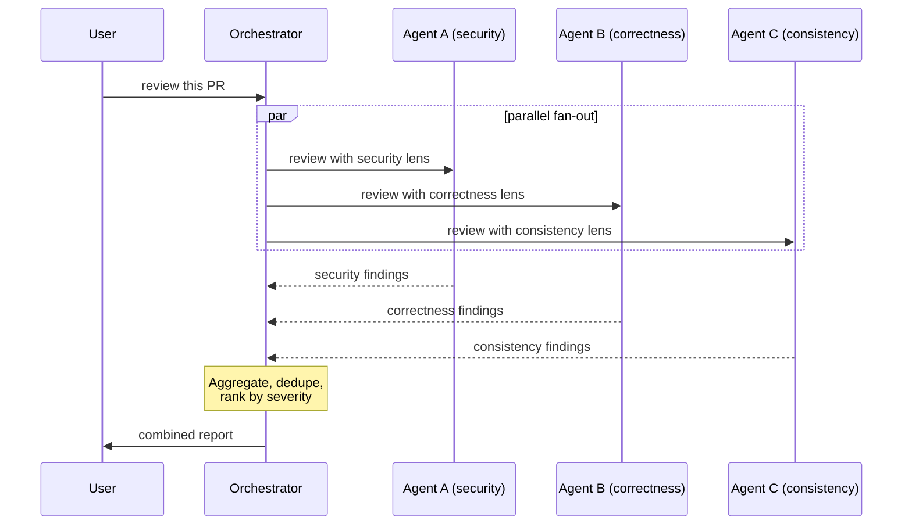

# Agent Orchestration

> **One-liner**: Orchestration means picking *which* spawn pattern (fork / subagent / parallel set) for *what* job — and ensuring the orchestrator does the synthesis, not the workers.

---

## Quick Reference

| Pattern | Use when | Cost |
|---------|----------|------|
| **Fork** (no `subagent_type`) | Output isn't worth keeping; needs your context | Cheap (shared cache) |
| **Subagent** (`subagent_type: foo`) | Need fresh, unbiased read | Full re-read |
| **Parallel set** | Independent questions, want all in one round | Per-agent, but concurrent |
| **Sequential** | One agent's output feeds the next | Cumulative |
| **Multi-perspective review** | High-stakes review, want diverse lenses | N parallel subagents |

| Anti-pattern | Why it bites |
|--------------|--------------|
| Delegate the *synthesis* ("based on the findings, decide…") | Worker has no authority; orchestrator should decide |
| Sequential when parallel is possible | Wastes wall-clock time |
| Running same agent twice for "verification" | Same biases; use a different lens |
| Letting forks stack | Each one delays the synthesis |

---

## Core Concept

An orchestrator's job is **divide → dispatch → synthesise**. The agents do the work in isolation; the orchestrator decides what to do with the results.

The decision tree:

1. **Do I need the raw output later?** No → fork. Yes → keep it inline.
2. **Do I want this judged independently of my reasoning?** Yes → subagent (fresh). No → fork (shared context).
3. **Are the questions independent?** Yes → parallel (one message, multiple Agent calls). No → sequential.
4. **Is the question multi-faceted (security + correctness + style)?** → Multi-perspective: spawn N subagents with different system prompts, aggregate.

The most common mistake is letting workers do synthesis. "Based on what you find, decide how to fix" pushes the *decision* onto an agent that doesn't have your full picture. Workers report; orchestrator decides.

---

## Diagram



---

## Syntax & API

### Fork (no `subagent_type`) — keeps tool noise out of context

```text
> Fork an agent. Audit every place we use `setTimeout` with a literal
  > 1000. Report grouped by file. Under 200 words.
```

The fork inherits your context, runs in the background, returns a single message. Its tool output never lands in your conversation.

### Named subagent — fresh context, defined persona

```text
> Use the security-reviewer subagent. Audit the diff vs main.
```

Spawns a fresh agent loaded from `.claude/agents/security-reviewer.md`. See [[01 - Building Custom Agents]].

### Parallel fan-out

In a single message:

```text
> Three subagents in parallel:
  1) security-reviewer — OWASP focus
  2) consistency-reviewer — convention drift
  3) test-coverage-reviewer — missing tests for new behaviour
  All three on `git diff main...HEAD`. Independent.
```

The orchestrator dispatches all three, awaits, aggregates.

### Sequential pipeline

```text
> Step 1: spawn `research-agent` to find the broken call site.
  Wait for its report. Then:
  Step 2: spawn `bug-fixer` agent. Brief it with the report from step 1.
  Step 3: spawn `code-reviewer` to verify the fix.
```

Use sequential only when later steps *truly* depend on earlier outputs.

### Aggregation pattern

After parallel fan-out:

```text
> All three reviewers reported. Aggregate:
  - Dedupe overlapping findings
  - Group by severity (CRITICAL / HIGH / MEDIUM / LOW)
  - For conflicts (one flags, another approves), surface the conflict
  - Output a single ranked list
```

---

## Common Patterns

### Pattern: parallel multi-perspective review

```text
> Review this 800-line PR with 4 fresh subagents in parallel:
  - factual-reviewer: does the code do what the PR description says?
  - senior-engineer: design / structural concerns
  - security-reviewer: OWASP, secrets, auth bypass
  - redundancy-reviewer: dead code, dupe logic, unused exports

  Each: terse output, file:line for each issue.
  After all return: aggregate, dedupe, rank.
```

See [[03 - Multi-Agent Reviews]] for the full playbook.

### Pattern: research → plan → execute (sequential)

```text
> Sequential pipeline:
  1) Fork: audit how `User.email` is used (file count, layer breakdown).
     Report under 300 words.
  2) After report: enter Plan mode. Plan the rename `email` → `emailAddress`.
  3) After plan approved: execute step 1 of plan.
```

### Pattern: orchestrator does the deciding

```text
> Spawn `code-reviewer` to find issues.
  Report only — DON'T fix.
  I'll decide which to address in the next turn.
```

vs. the antipattern:

```text
> Spawn `code-reviewer`, and based on what it finds, fix the issues.
```

The latter delegates judgment to an agent that doesn't have project context.

### Pattern: don't peek at running forks

When you've launched a fork:
- The completion notification arrives as a *user-role message* in a later turn.
- Until then, you don't know its findings. Don't predict, don't summarise, don't fabricate.
- If the user asks mid-wait, give status, not a guess.

### Pattern: cancel and re-route

If a parallel fan-out reveals one lens is irrelevant (security agent says "no security-sensitive code in diff"):

```text
> The security-reviewer reported nothing meaningful — drop it from rotation.
  Spawn a `performance-reviewer` instead with the same diff.
```

### Pattern: per-agent budget

```text
> Spawn 3 reviewers in parallel. Cap each at 200 words.
  Brief output from many beats verbose output from one.
```

---

## Gotchas & Tips

- **Forks vs subagents — different cost models.** Forks share your prompt cache (cheap). Subagents start fresh (full system prompt re-read). Use forks for noisy work tied to current context; subagents for fresh-eyes review.
- **Parallel = single message with multiple Agent calls.** Two messages = sequential. Get this right.
- **Don't peek at fork output mid-flight.** Reading the output file pulls the fork's tool noise into your context — defeats the point.
- **Synthesise, don't sub-delegate.** "Based on findings, fix it" is worker-driven. You decide; the worker reports.
- **Avoid same-agent re-runs for verification.** Spawn a different persona — same agent has the same blind spots.
- **Label clearly when briefing parallel agents** ("Agent A: …; Agent B: …") so each knows its role.
- **Watch for prompt-cache invalidation in long sequential chains.** A 5-step pipeline with delays hits cold cache repeatedly.
- **Aggregation is not optional.** N agents producing N reports leaves the user to merge. The orchestrator's job is the merged report.
- **One-shot vs streaming**: subagents return a single final message. They don't stream intermediate reasoning to you. Plan around that.
- **Recursive orchestration is allowed but rarely needed.** An orchestrator spawning an orchestrator that spawns workers tends to lose intent. Flat fan-out is usually better.
- **Audit which agent caused which finding.** When you aggregate, attribute findings: "[security] secret in logs at api.ts:120". Helps when one reviewer is consistently wrong.
- **For large diffs, scope the agents.** "Reviewer A: backend changes; Reviewer B: frontend changes." Splitting by area beats splitting by lens for very large PRs.

---

## See Also

- [[01 - Subagents]]
- [[01 - Building Custom Agents]]
- [[03 - Multi-Agent Reviews]]
- [[09 - Code Review with Claude]]
