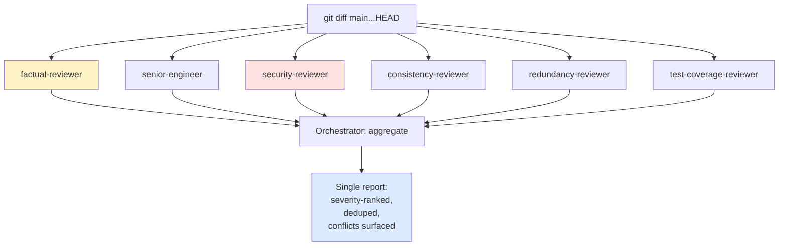

# Multi-Agent Reviews

> **One-liner**: Run several specialised reviewer subagents in parallel, each with a single lens, then aggregate. Diverse blind spots → fewer escapes.

---

## Quick Reference

### A typical review panel

| Agent | Lens | Looks for |
|-------|------|-----------|
| `factual-reviewer` | Truth-in-advertising | Does code do what PR description says? |
| `senior-engineer` | Design / structure | Cohesion, coupling, layering, abstraction quality |
| `security-reviewer` | OWASP | Auth bypass, injection, secret leakage |
| `consistency-reviewer` | Convention drift | Where new code diverges from project patterns |
| `redundancy-reviewer` | Dead / duplicate code | Unused exports, near-duplicates, accidental forks |
| `test-coverage-reviewer` | Missing tests | New behaviour without a corresponding test |

| Severity bucket | Action |
|-----------------|--------|
| CRITICAL | Block merge — security or data loss |
| HIGH | Should fix — correctness bug |
| MEDIUM | Consider — maintainability |
| LOW | Optional — style / nit |

---

## Core Concept

A single reviewer (human or agent) has predictable blind spots: the security one will under-weight design; the design one will under-weight injection. Multi-agent review parallelises **distinct lenses** and aggregates.

The win is *coverage*, not depth. Each lens does one thing. The orchestrator's job is to dedupe, rank, and surface conflicts (where two lenses disagree on the same code).

This is overkill for routine PRs. Reserve for high-stakes changes: auth, payments, public APIs, large refactors, security-sensitive features.

---

## Diagram



---

## Syntax & API

### Define the panel (one-time)

In `.claude/agents/`:

```markdown
---
name: factual-reviewer
description: Verifies the code does what the PR description claims
tools: [Read, Grep, Glob, Bash]
model: sonnet
---

You verify accuracy of the PR description against the diff.

1. Read the PR description (provided in the prompt).
2. Read `git diff main...HEAD`.
3. For each claim in the description, mark: VERIFIED / PARTIAL / MISSING / CONTRADICTED.
4. Output: claim → status → file:line evidence.

Skip everything else (style, design, security). Stay in your lane.
```

```markdown
---
name: senior-engineer
description: Reviews structural / design quality of the diff
tools: [Read, Grep, Glob]
---

You are a principal engineer. Read the diff and judge:
- Cohesion (one thing per module)
- Coupling (unnecessary cross-module dependencies)
- Abstraction quality (premature? leaky?)
- Naming and readability

Output: HIGH / MEDIUM / LOW issues. file:line for each.
Don't comment on style, security, or correctness — that's other agents' jobs.
```

```markdown
---
name: redundancy-reviewer
description: Finds dead code, duplication, and accidental forks
tools: [Read, Grep, Glob]
---

You hunt redundancy.

For each new function/symbol in the diff:
1. Grep for similar names in the existing codebase.
2. Read candidate matches; flag near-duplicates.
3. Look for new exports that have no callers.
4. Look for branches/options whose conditions can never differ.

Output: report grouped by category (DUPLICATE / DEAD / UNREACHED).
```

(Build out `consistency-reviewer`, `test-coverage-reviewer`, `security-reviewer` similarly. See [[01 - Building Custom Agents]].)

### Run the panel

In one message — **parallel**:

```text
> Review this PR with 6 fresh subagents in parallel:
  factual-reviewer, senior-engineer, security-reviewer,
  consistency-reviewer, redundancy-reviewer, test-coverage-reviewer.

  Each: under 200 words, severity-grouped findings with file:line.
  Brief them with: PR title, PR description, diff command (`git diff main...HEAD`).
```

### Aggregate

After all six return:

```text
> All six reviewers reported. Produce a single combined report:
  - One section per severity (CRITICAL / HIGH / MEDIUM / LOW).
  - Within each section, one bullet per issue.
  - Attribute the lens that flagged it: "[security] ..."
  - Dedupe: if two lenses flagged the same line, merge into one bullet.
  - Surface conflicts: if one approved and another flagged the same code, note both.

  Then a "decision" line: BLOCK / WARN / APPROVE based on highest severity.
```

---

## Common Patterns

### Pattern: tailored panel per change type

For an auth change:

```text
> Panel: factual + security + senior-engineer + test-coverage. Skip the rest.
```

For a UI feature:

```text
> Panel: factual + senior-engineer + a11y-reviewer + consistency.
```

The panel composition is a deliberate choice; not every diff needs every lens.

### Pattern: handle conflicts explicitly

If `senior-engineer` says "extract this helper" and `redundancy-reviewer` says "don't, similar helper exists at X":

```text
> Two reviewers conflict on src/utils/helpers.ts:50:
  - senior-engineer wants extraction
  - redundancy-reviewer found a near-duplicate at src/string/format.ts:12

  Surface this in the report; recommend reusing the existing helper.
```

The orchestrator resolves; don't ask a worker to.

### Pattern: scoped panel for very large diffs

```text
> 1500-line diff. Split panel by area:
  Backend reviewer subagents: review src/api/, src/services/, src/db/
  Frontend reviewer subagents: review src/ui/, src/components/
  Each area gets its own factual + senior-engineer + security review.
```

### Pattern: repeat the panel post-fix

After addressing review:

```text
> Re-run the same panel on the updated diff. Confirm:
  - Each previous CRITICAL / HIGH is now resolved.
  - No new issues introduced by the fixes.
```

### Pattern: aggregate-only fork

```text
> Fork an aggregator agent. Feed it the 6 individual reports.
  Output: deduped, severity-ranked, with attribution. Under 400 words.
```

Keeps the aggregation work in a fork so its scratch reasoning doesn't bloat your main context.

---

## Gotchas & Tips

- **Single-lens prompts beat omnibus prompts.** A reviewer told to "find anything wrong" produces a soup. Telling each one *exactly* what to look for produces sharp findings.
- **Six agents on a 50-line diff is wasteful.** Match panel size to risk.
- **Reviewers should stay in lane.** A security reviewer drifting into style nits dilutes its signal. The system prompt should explicitly forbid out-of-scope comments.
- **Parallel = one message, multiple Agent calls.** Sequential reviewing of 6 agents is 6× the wall-clock time and they can't see each other anyway.
- **Aggregate even if one fails.** If `redundancy-reviewer` errors, report 5 of 6 results and note the gap. Don't block on one failure.
- **Read each agent's verbatim report at least once.** The aggregator can drop nuance. For high-stakes diffs, the unaggregated reports are worth scanning.
- **Don't rely on the same model for every lens** — pinning `redundancy-reviewer` to Haiku saves cost; keeping `security-reviewer` on Sonnet preserves rigor.
- **Conflicts are signal, not noise.** If two lenses disagree on the same code, that's where the design debate is. Don't suppress.
- **Keep the panel codified in `.claude/agents/`** so the team uses the same playbook.
- **`/ultrareview` is a hosted, billed multi-agent review** — invoked by the user, not Claude. Build your own panel for free local equivalents.

---

## See Also

- [[01 - Building Custom Agents]]
- [[02 - Agent Orchestration]]
- [[09 - Code Review with Claude]]
- [[09 - Security and Sandboxing]]
