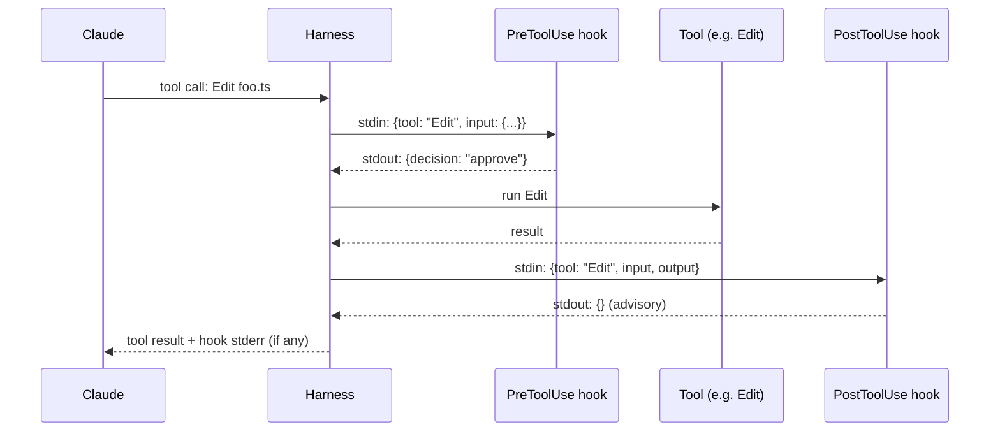

# Building Custom Hooks

> **One-liner**: A hook is a shell command Claude runs around tool calls — JSON in on stdin, JSON out on stdout. Use them to enforce, observe, or auto-fix.

---

## Quick Reference

### Hook events

| Event | Fires | Use for |
|-------|-------|---------|
| `PreToolUse` | Before a tool call runs | Validate / block / mutate parameters |
| `PostToolUse` | After a tool call returns | Auto-format, log, follow-up checks |
| `Stop` | Session ending | Final verification, cleanup |
| `UserPromptSubmit` | User just sent a prompt | Inject context, sanity-check |

### I/O contract

| Direction | Format | Channel |
|-----------|--------|---------|
| Input | JSON describing the event | stdin |
| Output | JSON: allow / deny / modify / message | stdout |
| Side channel | Text logging | stderr (visible to user) |

### Decision shape

| Output `decision` | Effect |
|-------------------|--------|
| `"approve"` (or omit) | Allow |
| `"block"` | Refuse the tool call (with `reason`) |
| `"modify"` (PreToolUse) | Replace tool inputs with `modifiedToolInput` |

---

## Core Concept

Hooks are **the harness's extension point for Claude**. They run as separate processes — not inside the agent. That makes them:
- **Deterministic** — a hook always behaves the same way; the agent doesn't reason about it.
- **Auditable** — they're shell scripts you can read.
- **Powerful** — they can block tool calls outright, or rewrite them.

The flow:
1. Claude proposes a tool call.
2. The harness fires matching `PreToolUse` hooks.
3. If a hook outputs `decision: "block"`, the call doesn't happen and Claude sees the reason.
4. Otherwise the tool runs.
5. After it returns, matching `PostToolUse` hooks fire — useful for auto-format, lint, follow-up assertions.

Treat hooks as policy. Memory and `CLAUDE.md` are *advisory* — Claude may follow them. Hooks are *enforced* — the harness runs them regardless.

---

## Diagram



---

## Syntax & API

### Configure in `settings.json`

```json
{
  "hooks": {
    "PreToolUse": [
      {
        "matcher": "Edit|Write",
        "hooks": [
          { "type": "command", "command": ".claude/hooks/no-edit-locked.sh" }
        ]
      }
    ],
    "PostToolUse": [
      {
        "matcher": "Edit|Write",
        "hooks": [
          { "type": "command", "command": ".claude/hooks/format.sh" }
        ]
      }
    ],
    "Stop": [
      { "hooks": [
        { "type": "command", "command": ".claude/hooks/typecheck.sh" }
      ]}
    ]
  }
}
```

`matcher` is a regex against the tool name. Omit to fire for every tool.

### A blocking PreToolUse hook

`.claude/hooks/no-edit-locked.sh`:

```bash
#!/usr/bin/env bash
set -euo pipefail
input=$(cat)
file=$(echo "$input" | jq -r '.tool_input.file_path // empty')

if [[ -z "$file" ]]; then
  echo '{}'   # no decision — allow
  exit 0
fi

if grep -q "^$file$" .claude/locked-files.txt 2>/dev/null; then
  jq -n --arg f "$file" \
    '{decision: "block", reason: ("file is locked: " + $f + ". Ask the owner before editing.")}'
else
  echo '{}'
fi
```

> Make it executable: `chmod +x .claude/hooks/no-edit-locked.sh`

### A PostToolUse auto-format hook

`.claude/hooks/format.sh`:

```bash
#!/usr/bin/env bash
set -euo pipefail
input=$(cat)
file=$(echo "$input" | jq -r '.tool_input.file_path // empty')

case "$file" in
  *.ts|*.tsx|*.js|*.jsx) pnpm prettier --write "$file" >&2 ;;
  *.py)                  ruff format "$file" >&2 ;;
  *.go)                  gofmt -w "$file" >&2 ;;
esac
echo '{}'
```

(stderr text is shown to the user; stdout is the JSON contract.)

### A modifying PreToolUse hook (rare, powerful)

```bash
#!/usr/bin/env bash
set -euo pipefail
input=$(cat)
cmd=$(echo "$input" | jq -r '.tool_input.command // empty')

# Force `--force-with-lease` instead of `--force` on git push
if [[ "$cmd" == *"git push --force "* && "$cmd" != *"--force-with-lease"* ]]; then
  new_cmd=${cmd//--force /--force-with-lease }
  jq -n --arg c "$new_cmd" \
    '{decision: "modify", modifiedToolInput: {command: $c}, reason: "rewrote to --force-with-lease"}'
else
  echo '{}'
fi
```

### Stop hook — final gate

```bash
#!/usr/bin/env bash
# .claude/hooks/typecheck.sh — run before session ends
set -euo pipefail
if ! pnpm typecheck >&2; then
  jq -n '{decision: "block", reason: "typecheck failed — fix before stopping"}'
else
  echo '{}'
fi
```

---

## Common Patterns

### Pattern: deny destructive shell commands

```bash
input=$(cat)
cmd=$(echo "$input" | jq -r '.tool_input.command // empty')

if echo "$cmd" | grep -qE 'rm -rf /|git push --force origin main|drop database'; then
  jq -n --arg c "$cmd" \
    '{decision: "block", reason: ("dangerous command refused: " + $c)}'
else
  echo '{}'
fi
```

### Pattern: enforce "test edit before src edit"

```bash
input=$(cat)
file=$(echo "$input" | jq -r '.tool_input.file_path // empty')

if [[ "$file" == src/* ]] && [[ "$file" != *.test.* && "$file" != *.spec.* ]]; then
  recent_test=$(git log --since="10 minutes ago" --name-only --pretty=format: | grep -E '\.test\.|\.spec\.' | head -1)
  if [[ -z "$recent_test" ]]; then
    jq -n '{decision: "block", reason: "TDD: write a failing test first"}'
    exit 0
  fi
fi
echo '{}'
```

(Strict; relax to a *warning* by emitting to stderr but returning `{}`.)

### Pattern: log every tool call

```bash
input=$(cat)
echo "$input" | jq -c >> .claude/tool-log.jsonl
echo '{}'
```

Useful for auditing what an agent did during a session.

### Pattern: inject context on `UserPromptSubmit`

```bash
input=$(cat)
prompt=$(echo "$input" | jq -r '.prompt')

if [[ "$prompt" == *"deploy"* ]]; then
  jq -n '{additionalContext: "Reminder: deploys must go through the staging gate first. See ops/runbooks/deploy.md."}'
else
  echo '{}'
fi
```

### Pattern: per-project hook scope

Project hooks live in `.claude/settings.json` and are committed. User hooks live in `~/.claude/settings.json`. Both fire — project rules layer over user rules.

---

## Gotchas & Tips

- **Hooks must be deterministic and fast.** They run on every matching tool call. A 5-second hook makes every Edit feel slow.
- **stdout is JSON; stderr is logging.** Mix them up and the harness errors. Use `>&2` for human-readable messages.
- **Set `set -euo pipefail`** at the top of every bash hook. A silent hook failure is worse than no hook.
- **`matcher` is a regex on tool name** — `"Edit|Write"`, not glob. Omit for "every tool."
- **Modify with care.** `decision: "modify"` rewrites Claude's tool input. If your transformation is wrong, you've broken Claude's intent. Test thoroughly.
- **Hooks see all tool calls including from subagents.** A blocking hook applies recursively.
- **Don't put secrets in hook scripts.** They live in `.claude/` and are easy to commit accidentally. Read from env vars or a secret manager.
- **Hooks are not a sandbox.** They can run anything in your shell. Audit project hooks before running unfamiliar repos.
- **A blocked tool call goes back to Claude** with the `reason` text. Make `reason` actionable: "file locked, ask owner" not "denied."
- **Stop hooks can refuse session end.** Useful for "must pass typecheck before exit" — but also annoying when you want out. Have an override.
- **Test hooks standalone**: `echo '{"tool":"Edit","tool_input":{"file_path":"foo.ts"}}' | .claude/hooks/myhook.sh`.
- **Order matters when multiple hooks match.** First block wins. Read the schema doc for tie-breaking.
- **Cross-platform pain**: a bash hook won't run on a Windows-only collaborator's machine. Use `node` / `python` for portability, or scope to OS in `settings.json`.

---

## See Also

- [[04 - Hooks]]
- [[03 - settings.json]]
- [[09 - Security and Sandboxing]]
- [[01 - Building Custom Agents]]
