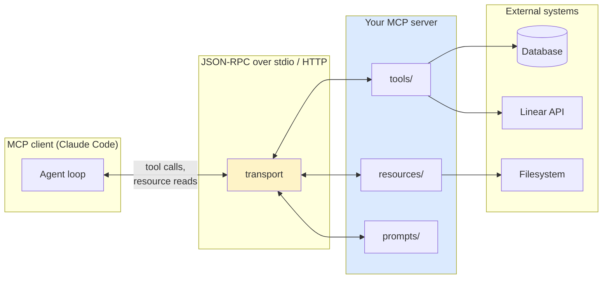

# Building MCP Servers

> **One-liner**: An MCP server is a small process that exposes **tools, resources, and prompts** to any MCP client (Claude Code, Claude Desktop, …) via a typed JSON-RPC contract.

---

## Quick Reference

### What an MCP server provides

| Capability | What it is | Example |
|------------|-----------|---------|
| **Tool** | A callable function with typed input/output | `query_db(sql)` |
| **Resource** | A readable URI-addressable blob | `file:///docs/spec.md` |
| **Prompt** | A reusable templated prompt | `summarise_pr(pr_num)` |

### Transports

| Transport | Use for |
|-----------|---------|
| **stdio** | Local — Claude spawns the process and pipes JSON over stdin/stdout |
| **HTTP / SSE** | Remote — long-running server, multiple clients |
| **WebSocket** | Bidirectional, less common |

### SDKs (official)

| Language | Package |
|----------|---------|
| TypeScript | `@modelcontextprotocol/sdk` |
| Python | `mcp` |
| Others | community SDKs (Go, Rust, …) |

---

## Core Concept

MCP (Model Context Protocol) is a **standard for letting LLMs talk to external systems**. Claude doesn't have direct access to your database, your Linear, or your filesystem outside the project — but an MCP server can broker that access via typed tools the model can call.

A server defines:
- **tools** — actions Claude can take (`createIssue`, `runQuery`, `searchDocs`).
- **resources** — read-only data Claude can fetch (a URL, a file, a record).
- **prompts** — reusable prompt templates the user can invoke.

Once the server is registered (in `mcp.json` or `settings.json`), Claude treats its tools just like built-ins. The boundary is the protocol; everything else is your code.

Build your own when:
- An off-the-shelf MCP server doesn't fit (custom internal tooling).
- You want a hardened wrapper around a sensitive system (e.g. read-only DB access).
- You want to share a capability across multiple agents/clients.

---

## Diagram



---

## Syntax & API

### Minimal server — TypeScript SDK

```typescript
// server.ts
import { Server } from "@modelcontextprotocol/sdk/server/index.js";
import { StdioServerTransport } from "@modelcontextprotocol/sdk/server/stdio.js";
import {
  CallToolRequestSchema,
  ListToolsRequestSchema,
} from "@modelcontextprotocol/sdk/types.js";

const server = new Server(
  { name: "example-server", version: "0.1.0" },
  { capabilities: { tools: {} } }
);

server.setRequestHandler(ListToolsRequestSchema, async () => ({
  tools: [
    {
      name: "echo",
      description: "Echoes back the input string",
      inputSchema: {
        type: "object",
        properties: { text: { type: "string" } },
        required: ["text"],
      },
    },
  ],
}));

server.setRequestHandler(CallToolRequestSchema, async (req) => {
  if (req.params.name === "echo") {
    const text = req.params.arguments?.text ?? "";
    return { content: [{ type: "text", text: `you said: ${text}` }] };
  }
  throw new Error(`unknown tool: ${req.params.name}`);
});

await server.connect(new StdioServerTransport());
```

```bash
# Run it
node server.js
```

### Minimal server — Python SDK

```python
# server.py
from mcp.server import Server
from mcp.server.stdio import stdio_server
from mcp.types import Tool, TextContent

server = Server("example-server")

@server.list_tools()
async def list_tools() -> list[Tool]:
    return [
        Tool(
            name="echo",
            description="Echoes back the input string",
            inputSchema={
                "type": "object",
                "properties": {"text": {"type": "string"}},
                "required": ["text"],
            },
        )
    ]

@server.call_tool()
async def call_tool(name: str, args: dict) -> list[TextContent]:
    if name == "echo":
        return [TextContent(type="text", text=f"you said: {args['text']}")]
    raise ValueError(f"unknown tool: {name}")

if __name__ == "__main__":
    import asyncio
    async def main():
        async with stdio_server() as (read, write):
            await server.run(read, write, server.create_initialization_options())
    asyncio.run(main())
```

### Register with Claude Code

```bash
claude mcp add example-server -- node /path/to/server.js
# or stdio with a Python entrypoint:
claude mcp add example-server -- python /path/to/server.py
```

Or in `~/.claude.json` / `mcp.json`:

```json
{
  "mcpServers": {
    "example-server": {
      "command": "node",
      "args": ["/path/to/server.js"]
    }
  }
}
```

### Add a resource

```typescript
import { ListResourcesRequestSchema, ReadResourceRequestSchema } from "@modelcontextprotocol/sdk/types.js";

server.setRequestHandler(ListResourcesRequestSchema, async () => ({
  resources: [
    { uri: "doc://spec", name: "Spec", mimeType: "text/markdown" },
  ],
}));

server.setRequestHandler(ReadResourceRequestSchema, async (req) => {
  if (req.params.uri === "doc://spec") {
    return { contents: [{ uri: req.params.uri, mimeType: "text/markdown", text: "# Spec\n…" }] };
  }
  throw new Error("not found");
});
```

### Add a prompt template

```typescript
server.setRequestHandler(ListPromptsRequestSchema, async () => ({
  prompts: [
    {
      name: "summarise_pr",
      description: "Summarise a GitHub PR",
      arguments: [{ name: "pr_number", required: true }],
    },
  ],
}));

server.setRequestHandler(GetPromptRequestSchema, async (req) => ({
  messages: [
    {
      role: "user",
      content: { type: "text", text: `Summarise GitHub PR #${req.params.arguments?.pr_number}` },
    },
  ],
}));
```

---

## Common Patterns

### Pattern: read-only DB access

```typescript
// tools/queryDb.ts
const tool = {
  name: "query_db",
  description: "Run a SELECT query against the read replica. SELECTs only.",
  inputSchema: {
    type: "object",
    properties: { sql: { type: "string" } },
    required: ["sql"],
  },
};

async function handle(args: { sql: string }) {
  if (!/^\s*SELECT\b/i.test(args.sql)) {
    throw new Error("only SELECT statements allowed");
  }
  const rows = await pool.query(args.sql);
  return { content: [{ type: "text", text: JSON.stringify(rows.rows) }] };
}
```

The hard guard ("only SELECT") lives in the server — Claude can't talk it out of refusing.

### Pattern: typed inputs with rich JSON schema

```json
{
  "type": "object",
  "properties": {
    "owner": { "type": "string", "description": "GitHub org or user" },
    "repo":  { "type": "string", "description": "Repository name" },
    "pr_number": { "type": "integer", "minimum": 1 }
  },
  "required": ["owner", "repo", "pr_number"]
}
```

The schema is part of the tool's documentation; Claude reads it to know how to call.

### Pattern: tool errors that teach

```typescript
if (args.pr_number > 99999) {
  throw new Error(
    "PR number suspiciously large; double-check. Use `gh pr list` to find PRs."
  );
}
```

Error messages become Claude's next-turn input. Make them actionable.

### Pattern: testing with MCP Inspector

```bash
npx @modelcontextprotocol/inspector node /path/to/server.js
```

Opens a UI to call your tools manually before plugging into Claude.

### Pattern: HTTP transport for shared servers

For team-wide servers, use HTTP/SSE so multiple Claude instances connect to one process:

```typescript
import { SseServerTransport } from "@modelcontextprotocol/sdk/server/sse.js";
import http from "node:http";

const transport = new SseServerTransport("/sse", res);
await server.connect(transport);
```

(Pair with auth — anyone reaching the URL can call your tools.)

### Pattern: lifecycle / shutdown

```typescript
process.on("SIGINT", async () => {
  await server.close();
  process.exit(0);
});
```

---

## Gotchas & Tips

- **stdio servers must not write to stdout outside the protocol.** A stray `console.log` corrupts the JSON-RPC stream. Log to stderr.
- **Tool descriptions are part of the prompt.** A vague description ("does stuff") leaves Claude guessing. Be specific.
- **Validate every input on the server** — Claude can call your tool with garbage if its reasoning misfires. Schema validation is necessary but not sufficient.
- **Don't expose write-tools without need.** A read-only server with `query_db`, `read_doc`, `search_logs` is structurally safer than one that also writes.
- **HTTP servers need authentication.** Without auth, any reachable client can call your tools.
- **Long-running tool calls block the agent.** Stream progress via SSE or split into a "kick off" tool and a "poll" tool.
- **Schemas should be tight.** `{ "type": "string" }` for SQL is a footgun; constrain to expected shapes where possible.
- **MCP Inspector is the fastest debugger.** Use it before integrating with Claude Code.
- **Test errors as much as success paths.** Tools that crash unhelpfully ruin agent reliability.
- **Versioning matters.** When you change a tool's schema, bump server `version` so clients can detect.
- **Don't make tools too coarse.** A `do_thing(plan)` tool that runs arbitrary commands defeats the point of structured tooling. Prefer small, composable tools.
- **Don't make tools too fine, either.** A separate tool for `add_one` and `subtract_one` adds noise. Match grain to user intent.
- **Resource reads should be cheap.** Claude may re-read on each turn. Cache server-side if upstream is slow.

---

## See Also

- [[05 - MCP Servers Using]]
- [[01 - Building Custom Agents]]
- [[06 - Claude Agent SDK]]
- [[09 - Security and Sandboxing]]
