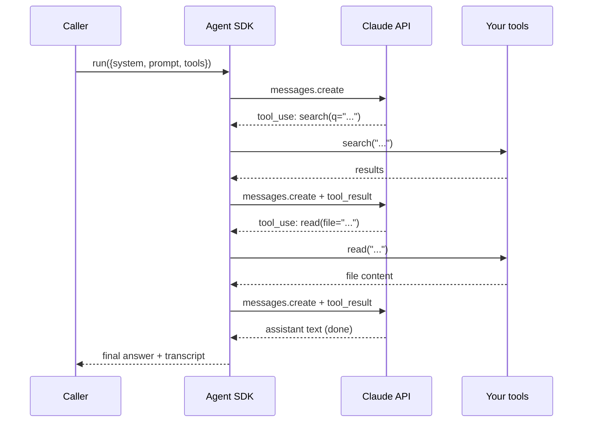

# Claude Agent SDK

> **One-liner**: The Agent SDK lets you build *your own* coding agent — same primitives Claude Code uses (tool loop, context, hooks) — programmatically, in TypeScript or Python.

---

## Quick Reference

| Concept | What it is |
|---------|-----------|
| **Tools** | Functions Claude can call (you define, you execute) |
| **Tool loop** | SDK loops: model → tool calls → tool results → model |
| **Messages** | Conversation history (user, assistant, tool_use, tool_result) |
| **System prompt** | The agent's persona + rules |
| **Stop conditions** | When the loop exits (assistant text, tool error, max steps) |

| Languages | Package |
|-----------|---------|
| TypeScript | `@anthropic-ai/sdk` + Agent SDK helpers |
| Python | `anthropic` SDK |

| Use this for | Not this for |
|--------------|--------------|
| CLIs / scripts that need an agent | One-off prompts (use the API directly) |
| Embedding agentic behaviour into a service | UIs (use Claude Code's surfaces) |
| Custom agents Claude Code can't express | What Claude Code already does |

---

## Core Concept

Claude Code is itself an agent built on the Agent SDK. When you can't shape Claude Code into what you need — say, an agent embedded in a CI job, or a domain-specific assistant with custom tools — you build it yourself.

The agent loop is small:

1. Send messages (system + user) plus a list of tool definitions to the API.
2. Get back either text (done) or one-or-more `tool_use` blocks.
3. Execute the requested tools, append `tool_result` messages.
4. Loop.

The SDK handles message threading, tool-call parsing, prompt caching, and retries. You provide the tool implementations and decide when to stop.

Use **prompt caching** on the system prompt and stable context — agentic loops re-send the prefix every turn, and caching is a 10× cost lever.

---

## Diagram



---

## Syntax & API

### TypeScript — minimal agent loop

```typescript
import Anthropic from "@anthropic-ai/sdk";

const client = new Anthropic();

const tools = [
  {
    name: "read_file",
    description: "Reads a UTF-8 file from disk",
    input_schema: {
      type: "object" as const,
      properties: { path: { type: "string" } },
      required: ["path"],
    },
  },
];

async function readFile(path: string): Promise<string> {
  const fs = await import("node:fs/promises");
  return fs.readFile(path, "utf8");
}

async function runAgent(userPrompt: string): Promise<string> {
  const messages: Anthropic.MessageParam[] = [
    { role: "user", content: userPrompt },
  ];

  while (true) {
    const res = await client.messages.create({
      model: "claude-sonnet-4-6",
      max_tokens: 4096,
      system: [
        {
          type: "text",
          text: "You are a code search agent. Use read_file to investigate.",
          cache_control: { type: "ephemeral" }, // cache the system prompt
        },
      ],
      tools,
      messages,
    });

    messages.push({ role: "assistant", content: res.content });

    if (res.stop_reason === "end_turn") {
      const text = res.content
        .filter((b): b is Anthropic.TextBlock => b.type === "text")
        .map((b) => b.text)
        .join("\n");
      return text;
    }

    // Execute every tool_use block and append tool_results
    const toolResults: Anthropic.ToolResultBlockParam[] = [];
    for (const block of res.content) {
      if (block.type !== "tool_use") continue;
      try {
        if (block.name === "read_file") {
          const text = await readFile((block.input as { path: string }).path);
          toolResults.push({
            type: "tool_result",
            tool_use_id: block.id,
            content: [{ type: "text", text }],
          });
        }
      } catch (err) {
        toolResults.push({
          type: "tool_result",
          tool_use_id: block.id,
          content: [{ type: "text", text: `error: ${(err as Error).message}` }],
          is_error: true,
        });
      }
    }
    messages.push({ role: "user", content: toolResults });
  }
}
```

### Python — same shape

```python
import anthropic

client = anthropic.Anthropic()

tools = [{
    "name": "read_file",
    "description": "Reads a UTF-8 file from disk",
    "input_schema": {
        "type": "object",
        "properties": {"path": {"type": "string"}},
        "required": ["path"],
    },
}]

def read_file(path: str) -> str:
    with open(path, encoding="utf-8") as f:
        return f.read()

def run_agent(user_prompt: str) -> str:
    messages = [{"role": "user", "content": user_prompt}]

    while True:
        res = client.messages.create(
            model="claude-sonnet-4-6",
            max_tokens=4096,
            system=[{
                "type": "text",
                "text": "You are a code search agent. Use read_file to investigate.",
                "cache_control": {"type": "ephemeral"},
            }],
            tools=tools,
            messages=messages,
        )
        messages.append({"role": "assistant", "content": res.content})

        if res.stop_reason == "end_turn":
            return "\n".join(
                b.text for b in res.content if b.type == "text"
            )

        tool_results = []
        for block in res.content:
            if block.type != "tool_use":
                continue
            try:
                if block.name == "read_file":
                    text = read_file(block.input["path"])
                    tool_results.append({
                        "type": "tool_result",
                        "tool_use_id": block.id,
                        "content": [{"type": "text", "text": text}],
                    })
            except Exception as e:
                tool_results.append({
                    "type": "tool_result",
                    "tool_use_id": block.id,
                    "content": [{"type": "text", "text": f"error: {e}"}],
                    "is_error": True,
                })
        messages.append({"role": "user", "content": tool_results})
```

### Streaming

```typescript
const stream = client.messages.stream({
  model: "claude-sonnet-4-6",
  max_tokens: 4096,
  system: "...",
  tools,
  messages,
});
for await (const event of stream) {
  if (event.type === "content_block_delta" && event.delta.type === "text_delta") {
    process.stdout.write(event.delta.text);
  }
}
const final = await stream.finalMessage();
```

---

## Common Patterns

### Pattern: prompt-cache the stable prefix

```typescript
system: [
  // 1. static persona — cached
  { type: "text", text: STATIC_SYSTEM_PROMPT, cache_control: { type: "ephemeral" } },
  // 2. dynamic per-request slice — not cached
  { type: "text", text: `User: ${user}; Repo: ${repo}` },
],
```

The static block stays in cache between turns. The dynamic block doesn't. See [[15 - Model and Cost Optimization]].

### Pattern: max-step guard

```typescript
let steps = 0;
const MAX = 25;
while (steps++ < MAX) {
  // ...
}
if (steps >= MAX) throw new Error("agent exceeded step budget");
```

Always cap the loop; a runaway agent burns tokens.

### Pattern: tool input validation

```typescript
import { z } from "zod";
const ReadFileInput = z.object({ path: z.string().min(1).max(500) });

if (block.name === "read_file") {
  const args = ReadFileInput.parse(block.input);
  // safe to use args.path
}
```

Don't trust `block.input` blindly; validate shape and bounds.

### Pattern: tool-side guardrails

```typescript
async function readFile(path: string) {
  const resolved = path.startsWith("/") ? path : `${process.cwd()}/${path}`;
  if (!resolved.startsWith(process.cwd())) {
    throw new Error("path escapes working directory");
  }
  // ...
}
```

The model can ask for `../../../etc/passwd`. Defend in the tool.

### Pattern: stop on assistant text

The default stop condition: model returned text without tool calls. Some agents want different stop conditions (e.g. stop when a specific tool is called, like `submit_answer`). Check `stop_reason` and the content blocks.

### Pattern: persist transcripts for debugging

```typescript
import fs from "node:fs/promises";
await fs.writeFile(
  `transcripts/${Date.now()}.json`,
  JSON.stringify(messages, null, 2)
);
```

When an agent misbehaves, the transcript is the bug report.

### Pattern: stream-then-execute for UX

For interactive agents, stream the assistant's text to the user, *then* execute pending tool calls. The user sees progress immediately.

---

## Gotchas & Tips

- **The agent loop is yours.** No framework runs it for you in the SDK — you build the while-loop. Don't forget to break.
- **Cache control needs `cache_control: { type: "ephemeral" }`** on the relevant content block. Without it, no caching.
- **Cache TTL is 5 minutes.** Repeated calls within that window hit cache; longer gaps don't.
- **Tool execution is your job.** The API returns `tool_use`; nothing happens until you run the tool and append `tool_result`.
- **Errors go in `tool_result` with `is_error: true`** — don't throw on the model's behalf. Let the model see and recover.
- **Don't mix `cache_control` and constantly changing system text.** Each variation is a fresh cache entry; you'll thrash.
- **Model IDs aren't stable forever.** Old models retire; pin a current one (`claude-sonnet-4-6`) and update intentionally.
- **`max_tokens` is per turn, not per session.** A turn that needs > `max_tokens` gets truncated — model stops mid-thought.
- **Streaming returns deltas, not whole messages.** You re-build the message at the end with `finalMessage()` (TS) or accumulating events (Python).
- **Multiple `tool_use` blocks in one assistant turn**: execute *all* of them and return results in one `tool_result`-list message.
- **Prompt injection is real.** Tool outputs become input to the next turn. Don't trust file contents or web fetches as instructions.
- **Don't reinvent Claude Code.** If you're rebuilding "an agent that edits files in my repo," use Claude Code with custom agents instead.

---

## See Also

- [[01 - Building Custom Agents]]
- [[05 - Building MCP Servers]]
- [[15 - Model and Cost Optimization]]
- [[09 - Security and Sandboxing]]
