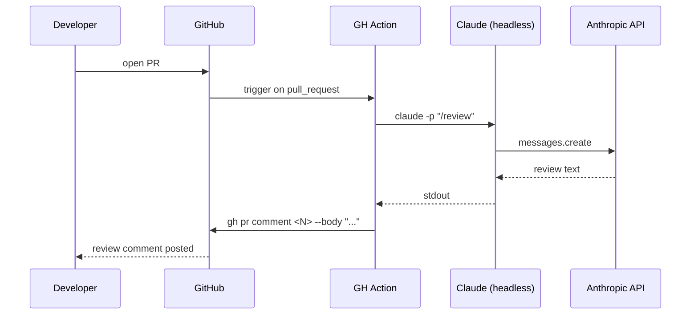

# CI-CD Integration

> **One-liner**: Run Claude on PRs from GitHub Actions to leave automated review comments, generate release notes, or gate merges — same agent, headless and non-interactive.

---

## Quick Reference

### Common CI integrations

| Job | What Claude does |
|-----|------------------|
| Auto-review on PR | Reads diff, posts review comments |
| Release notes | Summarises commits since last tag |
| Issue triage | Labels, classifies, suggests next step |
| Smoke-test failure triage | Reads failing test output, hypothesises cause |
| Stale-PR sweep (cron) | Pings PRs idle > N days |

### Headless invocation

| Flag | Purpose |
|------|---------|
| `claude -p "<prompt>"` | One-shot, non-interactive |
| `--output-format json` | Structured output for downstream parsing |
| `--allowedTools <list>` | Restrict tool surface |
| `--no-permission-prompt` | Don't pause for prompts (CI must be able to proceed) |

### Secrets you need

| Secret | For |
|--------|-----|
| `ANTHROPIC_API_KEY` | Auth Claude itself |
| `GITHUB_TOKEN` (auto) | gh CLI calls within the action |

---

## Core Concept

CI integration is just running `claude -p` non-interactively from a workflow file. The same patterns that work locally — slash commands, custom agents, hooks — work in CI. Two adjustments matter:

1. **No human-in-loop.** Permission prompts must be pre-resolved via `allowedTools` / settings; otherwise the job hangs.
2. **Output is parsed downstream.** Use `--output-format json` and structure the prompt so the response is consumable.

The most common pattern is a **GitHub Action that runs on `pull_request` and posts a review comment**. From there you can layer: gate merges on Claude's verdict, tag PRs by complexity, summarise weekly activity, etc.

Be deliberate about cost: a CI job that runs Claude on every push to every branch is expensive. Restrict to PRs, or to specific labels.

---

## Diagram



---

## Syntax & API

### Minimal GitHub Action — auto-review

`.github/workflows/claude-review.yml`:

```yaml
name: Claude Review

on:
  pull_request:
    types: [opened, synchronize]

permissions:
  pull-requests: write
  contents: read

jobs:
  review:
    runs-on: ubuntu-latest
    steps:
      - uses: actions/checkout@v4
        with:
          fetch-depth: 0   # need full history for git diff

      - name: Install Claude Code
        run: npm install -g @anthropic-ai/claude-code

      - name: Run review
        env:
          ANTHROPIC_API_KEY: ${{ secrets.ANTHROPIC_API_KEY }}
        run: |
          claude -p "/review" \
            --allowedTools "Read,Grep,Glob,Bash(git diff:*),Bash(git log:*)" \
            --output-format text \
            > review.txt

      - name: Post review comment
        env:
          GH_TOKEN: ${{ secrets.GITHUB_TOKEN }}
        run: |
          gh pr comment ${{ github.event.pull_request.number }} \
            --body-file review.txt
```

### JSON output for parsing

```yaml
- name: Run review (JSON)
  env:
    ANTHROPIC_API_KEY: ${{ secrets.ANTHROPIC_API_KEY }}
  run: |
    claude -p 'Review the diff. Output JSON: {"verdict":"APPROVE|WARN|BLOCK","issues":[{"severity":"...","file":"...","line":N,"message":"..."}]}' \
      --output-format json > review.json

- name: Block on CRITICAL
  run: |
    if jq -e '.issues[] | select(.severity == "CRITICAL")' review.json > /dev/null; then
      echo "::error::Critical issues found — see review.json"
      exit 1
    fi
```

### Restrict tool surface in CI

CI runs unattended; the agent should not have unrestricted shell access.

```yaml
--allowedTools "Read,Grep,Glob,Bash(git diff:*),Bash(git log:*)"
```

Or in a project `settings.json` consumed by the runner:

```json
{
  "permissions": {
    "allow": ["Read", "Grep", "Glob", "Bash(git diff:*)", "Bash(git log:*)"],
    "deny":  ["Bash(rm:*)", "Bash(curl:*)"]
  }
}
```

### Run a specific subagent in CI

```yaml
- run: |
    claude -p "use the security-reviewer agent on the diff against main" \
      --output-format text > security.txt

- run: gh pr comment ${{ github.event.pull_request.number }} --body-file security.txt
```

The agent file lives in the repo (`.claude/agents/security-reviewer.md`); the workflow checks out the repo, so it's available.

### Scheduled job — weekly stale-PR sweep

`.github/workflows/claude-stale-prs.yml`:

```yaml
on:
  schedule:
    - cron: "0 9 * * 1"   # Mondays 9am UTC

jobs:
  sweep:
    runs-on: ubuntu-latest
    steps:
      - uses: actions/checkout@v4
      - run: npm install -g @anthropic-ai/claude-code
      - env:
          ANTHROPIC_API_KEY: ${{ secrets.ANTHROPIC_API_KEY }}
          GH_TOKEN: ${{ secrets.GITHUB_TOKEN }}
        run: |
          claude -p "/triage-stale-prs"
```

(`/triage-stale-prs` is a custom slash command in `.claude/commands/`. See [[02 - Custom Slash Commands]].)

---

## Common Patterns

### Pattern: gate merges on Claude verdict

```yaml
- name: Run review
  run: |
    claude -p "..." --output-format json > review.json
- name: Decide
  run: |
    verdict=$(jq -r '.verdict' review.json)
    case "$verdict" in
      APPROVE) echo "approved" ;;
      WARN)    echo "::warning::Claude flagged HIGH issues" ;;
      BLOCK)   echo "::error::Claude blocked the merge"; exit 1 ;;
    esac
```

(Treat as advisory until you trust the agent — false positives wedge merges.)

### Pattern: react to a specific label

```yaml
on:
  pull_request:
    types: [labeled]

jobs:
  review:
    if: github.event.label.name == 'claude-review'
    runs-on: ubuntu-latest
    # ...
```

Selective triggering keeps cost in check — review only when asked.

### Pattern: summarise commits for release notes

```yaml
on:
  push:
    tags: ['v*']

jobs:
  notes:
    runs-on: ubuntu-latest
    steps:
      - uses: actions/checkout@v4
        with: { fetch-depth: 0 }
      - run: npm install -g @anthropic-ai/claude-code
      - run: |
          PREV=$(git describe --tags --abbrev=0 HEAD^)
          claude -p "Summarise commits between $PREV and HEAD for a release note. \
                     Group by feat/fix/refactor. User-facing language." \
            > NOTES.md
      - run: gh release create ${{ github.ref_name }} --notes-file NOTES.md
```

### Pattern: comment-then-edit

For long reviews, post once on first run, edit on subsequent runs:

```bash
existing=$(gh pr view "$PR" --json comments \
  --jq '.comments | map(select(.author.login == "github-actions[bot]")) | .[0].id')

if [[ -n "$existing" ]]; then
  gh api graphql -f query="mutation { updateIssueComment(input: { id: \"$existing\", body: \"$NEW\" }) { ... } }"
else
  gh pr comment "$PR" --body "$NEW"
fi
```

Avoids comment spam on every push.

### Pattern: triage failing CI runs

A separate workflow on `workflow_run.completed` with `conclusion == failure`:

```yaml
- run: |
    gh run view ${{ github.event.workflow_run.id }} --log-failed > failure.log
    claude -p "Read failure.log. What's the most likely root cause? \
               Reply with: hypothesis, evidence, suggested fix." > triage.md
- run: gh pr comment $PR --body-file triage.md
```

---

## Gotchas & Tips

- **Don't run on every push.** Restrict to `pull_request` events or label triggers — push-based runs are wasteful.
- **`fetch-depth: 0`** matters: a shallow clone hides history, so `git diff main...HEAD` and `git log` mislead.
- **`ANTHROPIC_API_KEY` must be a repo secret**, not committed. Rotate if exposed.
- **`allowedTools` on the command line is a real safety net** — CI agents have no human override.
- **Don't enable unrestricted `Bash`** in CI. A prompt-injection attack via PR title can otherwise run anything.
- **Watch for prompt injection in PR text.** A malicious PR title might instruct Claude. Sanitize or treat as untrusted.
- **Cost guardrails**: cap with `MAX_THINKING_TOKENS` env, restrict to label trigger, or use Haiku for high-frequency jobs.
- **Output sizes**: `--output-format json` may be large for big diffs. Truncate or split before posting.
- **Comment editing > comment spam.** One updated comment beats 30 push-event comments.
- **Self-hosted runners need network access to `api.anthropic.com`.** Firewall errors look like timeouts.
- **`--no-permission-prompt`**: enable for CI; never default for local.
- **Logs leak.** Don't print API keys; mask via `::add-mask::` if a secret could appear.
- **Treat Claude's CI output as advisory until proven.** Build trust before gating merges on it.
- **GitHub Actions is one option.** GitLab CI, CircleCI, Buildkite all work the same way: install Claude, set the API key, run `claude -p`.

---

## See Also

- [[02 - Custom Slash Commands]]
- [[09 - Code Review with Claude]]
- [[09 - Security and Sandboxing]]
- [[11 - Background Tasks]]
