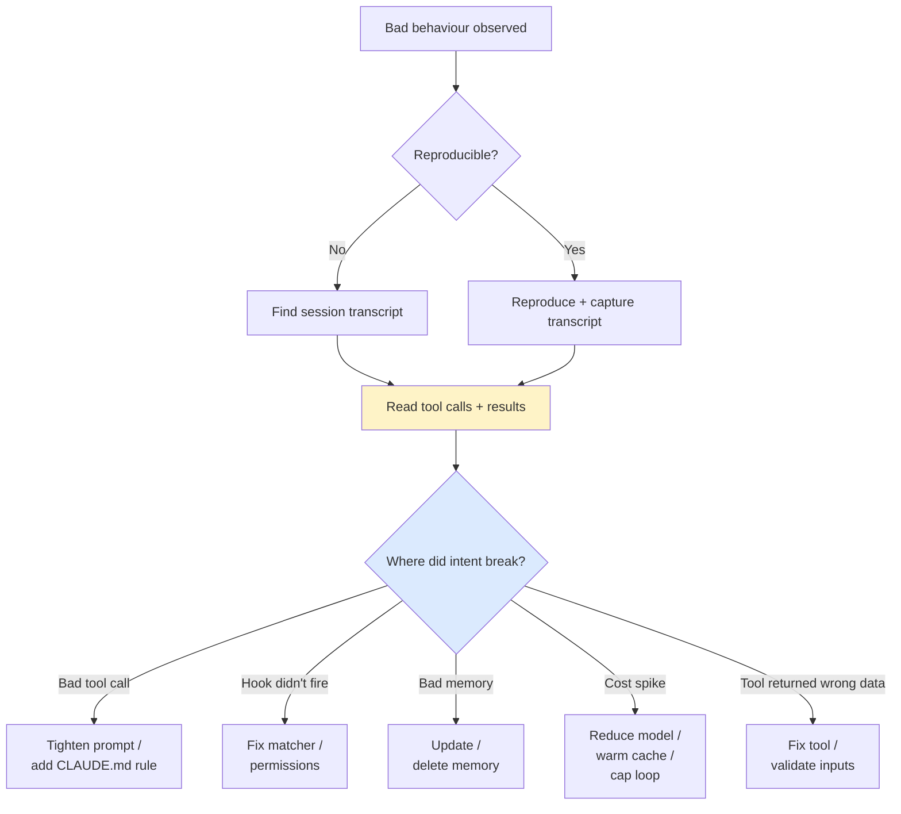

# Debugging and Observability

> **One-liner**: When Claude misbehaves, the answer is in the **transcript** — every tool call, every model response, every hook decision. Find it; reproduce; fix the root cause.

---

## Quick Reference

### Where to look

| Source | Contains |
|--------|----------|
| `~/.claude/projects/<encoded-path>/sessions/` | Per-session transcripts |
| `~/.claude/projects/<encoded-path>/memory/` | Memory files (per-project) |
| `--verbose` / `Ctrl+O` | Live extended-thinking output |
| `claude --help` | Current flags + output formats |
| Hook stderr | Per-tool-call logs you wrote |

### Common symptoms → first checks

| Symptom | First thing to check |
|---------|----------------------|
| "Claude ignored my CLAUDE.md rule" | Is the rule in the right CLAUDE.md? Was it loaded? |
| "Hook didn't fire" | `matcher` regex; permissions; stderr |
| "Tool ran but result was wrong" | Tool input in transcript vs expected |
| "Cost spiked" | `/cost`; check for cold-cache loops or runaway tools |
| "Agent stuck in a loop" | Transcript: same tool-use repeating? Add a guard |
| "Prompt cache miss" | Gap > 5 min? System prompt mutated? |

### Debug flags

| Flag | Purpose |
|------|---------|
| `--verbose` | Show extended thinking in stdout |
| `--output-format json` | Machine-readable transcript |
| `claude /memory` | Open memory dir for inspection |
| `claude /cost` | Token / cost summary |
| `claude /usage` | Recent usage rollup |

---

## Core Concept

Most "Claude did the wrong thing" debugging follows the same recipe:

1. **Reproduce.** A one-shot bug is hard; a reproducible one is solvable.
2. **Get the transcript.** Find the offending session log.
3. **Diff intent vs reality.** Where did the model's plan diverge from your expectation? Was it a bad tool call, a misread file, a missed instruction?
4. **Fix the root cause.** Not the symptom. Bad CLAUDE.md → fix CLAUDE.md. Hook didn't match → fix the matcher. Prompt was ambiguous → tighten it.

Treat agents like distributed systems: lots of small interactions, occasional surprising failures, observability is non-negotiable. Build the habit of reading transcripts; it's where the truth lives.

For long-running or production agents (CI, scheduled runs, Agent SDK apps), persist transcripts deliberately — when something breaks weeks later, you'll need them.

---

## Diagram



---

## Syntax & API

### Verbose mode (live)

```bash
# Toggle in-session: Ctrl+O
# Or set in settings.json:
```

```json
{
  "verbose": true
}
```

Streams extended-thinking output as Claude reasons. Useful when "why did it do that?" — you can see the chain of thought.

### Inspect a session transcript

Sessions live in `~/.claude/projects/<encoded-path>/sessions/`. Filenames are timestamps. Each is a JSON file with the message log.

```bash
ls -lt ~/.claude/projects/-Users-me-myrepo/sessions/ | head
cat ~/.claude/projects/-Users-me-myrepo/sessions/2026-04-30T10-22-…json | jq '.[].role'
```

What to grep for:
- `"tool_use"` — every tool the agent called
- `"is_error": true` — tool failures
- `"stop_reason"` — why each turn ended
- `"cache_control"` — what was cached

### Headless transcript

```bash
claude -p "..." --output-format json | jq '.messages'
```

Captures the same transcript for batch / CI use. Persist to a file for later forensics.

### Hook-side logging

In a custom hook, log to stderr (visible in session) or to a file:

```bash
echo "[$(date -Is)] tool=$tool input=$(echo "$input" | jq -c .tool_input)" \
  >> .claude/logs/hooks.jsonl
echo '{}'
```

Keeps a per-tool-call audit trail without bloating the agent's context.

### `/cost` and `/usage`

```text
> /cost
Session: 142,300 input / 4,800 output tokens
Cached read: 98,200 (69%)  ← cache hit ratio
Estimated cost: $0.45
```

```text
> /usage
Last 7 days: $12.40 across 18 sessions
```

A high *uncached* input fraction signals cold-cache thrash.

---

## Common Patterns

### Pattern: "Claude did X but I told it not to"

1. Open the latest session transcript.
2. Find the assistant turn where X happened.
3. Look back: was your instruction in the system prompt? In CLAUDE.md? In a memory? Or just earlier in conversation?
4. If only in conversation, it can drop out under context pressure — promote to CLAUDE.md or memory.
5. If in CLAUDE.md, check the file is loaded (project root + correct path).

### Pattern: "the hook didn't fire"

```bash
# Run the hook manually with a synthetic event
echo '{"tool":"Edit","tool_input":{"file_path":"foo.ts"}}' | .claude/hooks/myhook.sh
echo "exit=$?"
```

Then check the matcher regex against the actual tool name, and `settings.json` for typos. Look at the session for "tool blocked by hook" lines.

### Pattern: agent stuck in loop

In the transcript, look for the same `tool_use` block recurring. Common causes:
- Tool returns the same uninformative output every time → fix the tool or its error message.
- Model misreads the result and retries → the result format is ambiguous; structure it.
- Plan loop with no terminal condition → add a "give up after N tries" rule in the system prompt.

### Pattern: cost surprise

```text
> /cost
```

Then:
- High input, low cache-hit %: turns spaced > 5 min apart, or system prompt is mutating.
- Many tool calls per turn: agent is over-investigating; tighten scope.
- Big tool outputs: Read calls returning whole large files; use offsets.

### Pattern: post-mortem from a failed CI run

```bash
# CI artifact: review.json (or transcript.json)
jq '.messages[] | select(.role == "assistant") | .content[] | select(.type == "tool_use") | {name,input}' transcript.json
```

You can replay the agent's intent against the same prompt locally to reproduce.

### Pattern: telemetry for production agents

For Agent SDK apps:

```typescript
const t0 = Date.now();
const res = await client.messages.create({ /* ... */ });
metrics.histogram("agent.turn.ms", Date.now() - t0);
metrics.counter("agent.tool_calls", res.content.filter(b => b.type === "tool_use").length);
metrics.counter("agent.tokens.input", res.usage.input_tokens);
metrics.counter("agent.tokens.cache_read", res.usage.cache_read_input_tokens ?? 0);
```

Track tool-call count, tokens, latency per turn, cache hit ratio. Anomalies show up before users complain.

### Pattern: redact transcripts before sharing

A transcript may contain secrets, internal URLs, customer data. Redact before posting to a bug tracker.

```bash
jq 'walk(if type == "string" then sub("api_key=\\w+"; "api_key=REDACTED") else . end)' transcript.json
```

---

## Gotchas & Tips

- **Verbose mode adds tokens.** You're paying for the streamed thinking. Use it for debugging, not as default.
- **Transcripts can be large.** A 1-hour session is megabytes. Filter with `jq` early.
- **Memory files are local-only.** They don't sync across machines. If you switch machines, your memory is gone.
- **Hook stderr appears in the session UI** but stdout must be valid JSON. Mix them up and the harness errors silently.
- **`/cost` is per-session.** All-time spend is on the Anthropic dashboard.
- **A `tool_use` with an `is_error` `tool_result` is informative** — Claude saw the error and decided how to recover (or didn't). That's the loop you debug.
- **Cache hit ratio < 60% is suspicious** for a long session. Look for system-prompt mutation or long pauses.
- **The "wrong" tool call is often the right tool with wrong inputs.** Check the input shape carefully.
- **Don't fix the symptom in CLAUDE.md.** A specific instruction ("don't do X on file Y") is brittle. Fix the underlying ambiguity.
- **Reproduce in a fresh session.** Conversation context contaminates; a fresh `claude` instance with the same prompt isolates the bug.
- **Save transcripts for production agents.** When something happens at 3am, you'll want them.
- **For Agent SDK debugging**, log every `tool_use` and `tool_result` block plus token usage. That's the minimum.
- **`/usage` is cumulative across sessions** — useful for "is this project burning budget?" questions.

---

## See Also

- [[06 - Memory System]]
- [[04 - Hooks]]
- [[15 - Model and Cost Optimization]]
- [[06 - Claude Agent SDK]]
