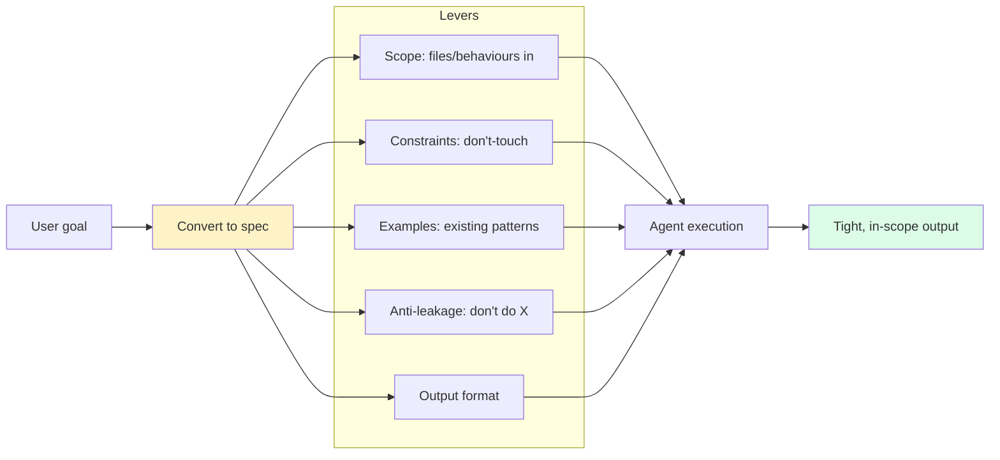

# Prompt Engineering for Code

> **One-liner**: Good code prompts are **scoped, constrained, and exemplified**. They define the surface, the boundaries, and the shape of acceptable output — not just what to do.

---

## Quick Reference

### The five levers

| Lever | What it controls |
|-------|------------------|
| **Scope** | Files, modules, behaviours in/out of the change |
| **Constraints** | Don't-touch rules, signature preservation, perf budgets |
| **Examples** | Existing patterns to match; shape of expected output |
| **Anti-leakage** | Stop the agent from wandering into unrelated cleanup |
| **Output format** | Diff vs files vs prose vs JSON; size limit |

### Prompt anatomy (for code tasks)

```
1. Goal     — what success looks like
2. Context  — files, prior work, constraints
3. Steps    — break into checkpoints if multi-step
4. Forbid   — what NOT to do
5. Format   — how to deliver the result
```

### Anti-patterns

| Anti-pattern | Why it bites |
|--------------|--------------|
| "Improve this" | "Improve" is undefined — agent invents standards |
| "Refactor as needed" | Open scope → unrelated changes |
| "Add tests" | What kind? Which behaviours? Coverage target? |
| Multi-task one-liner | Three vague sub-tasks become three weak outputs |
| Letting agent decide success | The agent may "succeed" by sidestepping the hard part |

---

## Core Concept

A coding prompt is a **specification**. The clearer the spec, the more deterministic the output. Vagueness leaks: ask for "improve the auth module" and you get a stylistic refactor, a renamed variable, and three new abstractions you didn't ask for.

The discipline is the same for prompting agents as for writing tickets:

- **Goal as testable behaviour.** "Pagination on `/users` returning page-size of 20 by default, max 100, with `meta.total`." Not "add pagination."
- **Boundaries.** "Don't change the response shape; don't introduce new dependencies; don't touch the OpenAPI spec yet."
- **Examples.** Existing patterns the agent should match, or counter-examples ("don't do it like X — see Y instead").
- **Output shape.** A diff? A list of files? A plan to approve before executing?

For long-running interactions, **anti-leakage** is the most underrated lever: explicit "don't do X" rules prevent the agent from wandering during a task. They're not redundant; they're the railing.

---

## Diagram



---

## Syntax & API

### Pattern: scoped task spec

```text
> Add pagination to GET /users.

  IN SCOPE:
  - src/api/users.ts (handler)
  - src/api/users.test.ts (tests)

  BEHAVIOUR:
  - Query params: page (default 1, min 1), limit (default 20, min 1, max 100).
  - Response: { data: [...], meta: { page, limit, total } }.
  - Return 400 on invalid params.

  CONSTRAINTS:
  - Don't change existing response shape; add a new envelope.
  - Don't change DB schema.
  - Don't touch OpenAPI yaml — separate task.

  OUTPUT:
  - Edits to the two files above.
  - One commit, conventional-commits message.
```

### Pattern: example-driven

```text
> Convert `src/services/orders.ts` to the same pattern as `src/services/users.ts`:
  - same dependency-injection style
  - same error envelope
  - same test layout

  Match the patterns there exactly. If unsure, read users.ts first.
```

Beats describing the pattern — point to the canonical example.

### Pattern: counter-example

```text
> Refactor `parseDate` for clarity. DON'T:
  - introduce a date library (the codebase doesn't use one)
  - change the function signature
  - add new exports

  DO: prefer early returns; extract helpers within the same file.
```

### Pattern: plan-then-execute

```text
> Plan-mode first.

  Plan the migration of `User.email` → `User.emailAddress`. Output:
  1. List of layers affected
  2. Order of changes
  3. Back-compat strategy
  4. Rollback plan

  Don't make any edits. I'll approve the plan, then we execute step by step.
```

### Pattern: structured output for downstream parsing

```text
> Audit unused exports in src/.

  Output JSON exactly:
  {
    "unused": [{"file": "...", "symbol": "...", "exported_at_line": N}],
    "uncertain": [{"file": "...", "symbol": "...", "reason": "..."}]
  }

  Don't add prose outside the JSON.
```

### Pattern: token-budgeted research

```text
> Fork an agent. Audit how `Logger` is used in src/.
  Hard limit: 200 words. Tables only — no prose.
```

A budget forces sharpness.

---

## Common Patterns

### Pattern: don't peek (for forks)

When forking research:

```text
> Fork an agent to audit X. Self-contained brief.
  I won't see intermediate output — you'll get the result via notification.
  Don't ask me follow-up questions; act on best judgment with the brief.
```

The fork must operate without your guidance during execution. Brief it like a colleague.

### Pattern: success criteria up front

```text
> Done when:
  - all tests pass (pnpm test)
  - typecheck clean (pnpm typecheck)
  - the new endpoint returns 200 with the right shape on the smoke test
  - no new dependencies in package.json
```

The agent self-checks against criteria; you can verify the same way.

### Pattern: hard "stop and ask"

```text
> If you can't satisfy <constraint X>, STOP and ask. Don't invent a workaround.
```

The default is "agent improvises." Override when consequences are big.

### Pattern: don't-touch list

```text
> Working on src/api/users.ts.
  DO NOT modify:
  - src/api/users.legacy.ts (deprecated, separate effort)
  - any *.generated.ts files
  - .github/ workflows
  - any file outside src/api/
```

Especially useful in large refactors where blast radius is wide.

### Pattern: the "why" line

```text
> Add a 5-second timeout to the HTTP client.

  Why: oncall paged twice this week on hangs reading from external API.

  Implication: failures should be logged and retryable; don't crash the request.
```

The "why" lets the agent make the right call on edge cases instead of guessing.

### Pattern: rephrase ambiguous tasks

If you're tempted to write "make this better," rephrase as a *measurable* goal:

| Vague | Sharper |
|-------|---------|
| "Make this faster" | "Bring p99 of `searchUsers` under 100ms; benchmark with `bench/searchUsers.ts`" |
| "Make this cleaner" | "Reduce `processOrder` from 200 to under 80 lines by extracting validation and persistence" |
| "Add tests" | "Add unit tests for the three branches of `processOrder` (happy, validation-fail, persist-fail), aim for 90% coverage on the file" |

### Pattern: progressive disclosure

For a tricky task, lead with the goal, then layer constraints:

```text
> Goal: deduplicate orders in the report endpoint.

  Constraints (read after goal):
  1. Match by (customer_id, sku, ordered_at_minute) — minute-grain.
  2. Keep the *latest* by created_at.
  3. Preserve source row order in output.
  4. Don't change the report's column list.

  Existing pattern: see `dedupeShipments` in src/reports/util.ts.
```

---

## Gotchas & Tips

- **"Just refactor it" is not a prompt.** It's a hope.
- **"And X" is a smell.** A prompt with three "and" clauses is three prompts. Split.
- **Forbid lists are gold.** They prevent the agent's natural tendency to "improve" beyond scope.
- **Examples beat descriptions.** Pointing to existing code is faster than explaining the pattern.
- **Specify the failure mode**, not just the success path. "If X, return 400 with error code USER_NOT_FOUND" is testable.
- **Don't bury constraints in prose.** Bullets are scanned; paragraphs are skimmed.
- **Long prompts ≠ better prompts.** Tight is better than thorough but rambling.
- **For agentic loops, prompts are reread each turn.** Cache them with `cache_control` (see [[06 - Claude Agent SDK]]).
- **Avoid load-bearing politeness.** "If it's not too much trouble, maybe..." dilutes the spec.
- **Output-format demands work.** "Output JSON, no prose" is followed reliably; "be concise" is interpretive.
- **Test prompts on a fresh session** — your current session's context biases the output. A prompt that works for you may fail for a teammate.
- **A prompt that needs three clarifying turns is broken.** Improve the spec, not the conversation.
- **Anti-leakage scales with model strength.** Smarter models are more willing to "improve" things you didn't ask for. Tighter rails for stronger models.

---

## See Also

- [[07 - Effective Prompting]]
- [[08 - Plan Mode]]
- [[02 - Agent Orchestration]]
- [[14 - Multi-file Refactoring]]
