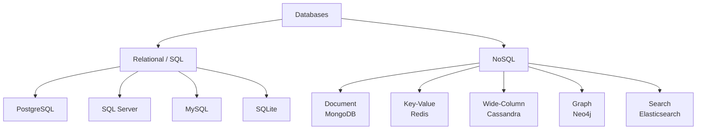

# Database Overview

> **One-liner**: A database is an organized data store with a query language and integrity guarantees; this note maps the engines you choose between and the categories that distinguish them.

---

## Quick Reference

| Concept | Meaning |
|---------|---------|
| **RDBMS** | Relational DB — tables, rows, SQL, schemas, ACID |
| **NoSQL** | Non-relational — document, key-value, column, graph |
| **ACID** | Atomicity, Consistency, Isolation, Durability |
| **BASE** | Basically Available, Soft state, Eventual consistency |
| **OLTP** | Online Transaction Processing — many small writes |
| **OLAP** | Online Analytical Processing — large reads, aggregates |
| **Schema** | Structure: tables, columns, types, constraints |
| **DDL** | Data Definition Language — `CREATE`, `ALTER`, `DROP` |
| **DML** | Data Manipulation Language — `SELECT`, `INSERT`, `UPDATE`, `DELETE` |
| **DCL** | Data Control Language — `GRANT`, `REVOKE` |
| **TCL** | Transaction Control — `BEGIN`, `COMMIT`, `ROLLBACK` |

---

## Core Concept

A **database** stores related data and lets you query it consistently. The **DBMS** (Database Management System) is the program that manages the data, enforces integrity, and runs queries.

Two big families:

- **Relational (RDBMS)** — data in tables with fixed columns; relationships via foreign keys; queried with SQL. Strong consistency by default. Examples: **PostgreSQL**, MySQL, SQL Server, SQLite, Oracle.
- **NoSQL** — schemas vary; chosen for scale, flexibility, or shape:
  - *Document* (MongoDB, Couchbase) — JSON-like records
  - *Key-value* (Redis, DynamoDB) — fast lookups by key
  - *Wide-column* (Cassandra, ScyllaDB) — large-scale time-series-ish data
  - *Graph* (Neo4j) — node/edge traversals
  - *Search* (Elasticsearch, OpenSearch) — full-text and analytics

Two big workload types:

- **OLTP** — many short transactions (a banking app inserting payments). Optimized for write throughput and consistency.
- **OLAP** — fewer, much larger queries scanning millions of rows (revenue by region last quarter). Uses columnar storage and pre-aggregated cubes.

This vault focuses on **PostgreSQL** as the primary engine — it covers OLTP excellently, has strong NoSQL features (JSONB, full-text), and is free, open-source, and widely deployed.

---

## Diagram



---

## Syntax & API

### Connect to PostgreSQL via psql
```bash
# Install (macOS / Ubuntu / Windows via Docker)
docker run --name pg -e POSTGRES_PASSWORD=secret -p 5432:5432 -d postgres:16

# Connect
psql -h localhost -U postgres
# password: secret

# Inside psql
\l           -- list databases
\c shop      -- connect to db "shop"
\dt          -- list tables
\d users     -- describe table "users"
\q           -- quit
```

### A first end-to-end query
```sql
CREATE DATABASE shop;
\c shop

CREATE TABLE users (
    id          SERIAL PRIMARY KEY,
    email       TEXT NOT NULL UNIQUE,
    created_at  TIMESTAMPTZ NOT NULL DEFAULT now()
);

INSERT INTO users (email) VALUES ('alice@example.com'), ('bob@example.com');

SELECT id, email, created_at FROM users ORDER BY id;
```

### ACID in one transaction
```sql
BEGIN;
    UPDATE accounts SET balance = balance - 100 WHERE id = 1;
    UPDATE accounts SET balance = balance + 100 WHERE id = 2;
COMMIT;
-- Either both updates persist (atomic) or neither (on ROLLBACK)
```

---

## Common Patterns

```text
Pick by workload:

- Web app / SaaS / line-of-business → PostgreSQL (this vault's default)
- Cache / session store / rate-limit → Redis
- Document-shaped data, schema flux → MongoDB or Postgres JSONB
- Heavy analytics / BI / dashboards → ClickHouse, BigQuery, Snowflake (OLAP)
- Time-series / metrics            → TimescaleDB, InfluxDB
- Search / log analytics           → Elasticsearch / OpenSearch
- Social graph / recommendation    → Neo4j
```

---

## Gotchas & Tips

- **"NoSQL" doesn't mean "no SQL"** — many NoSQL stores have SQL-like layers (Cassandra's CQL, Mongo's aggregation pipeline). It originally meant "not only SQL".
- **NoSQL is not always faster** — it trades consistency or features for scalability. A correctly-indexed PostgreSQL handles millions of rows on a laptop.
- **ACID and BASE aren't binary** — many systems offer tunable consistency (Cassandra, Cosmos DB).
- **Don't pick by hype** — pick by access patterns: how do you read, how do you write, what consistency do you need.
- **Postgres is a "Swiss-army knife"** — relational core, JSONB for documents, full-text search, geospatial (PostGIS), pub/sub (LISTEN/NOTIFY). It often replaces three specialized stores.
- **OLTP ≠ OLAP** — running heavy analytics on your transactional DB will lock up writes. Replicate to a separate OLAP store.

---

## See Also

- [[02 - SQL Fundamentals]]
- [[02 - Transactions and ACID]]
- [[20 - NoSQL Fundamentals]]
- [[12 - Data Warehousing]]
