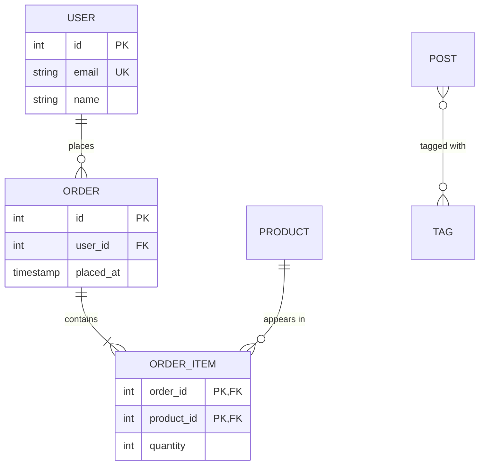

# Keys and Relationships

> **One-liner**: Primary keys identify a row; foreign keys link rows across tables. Together they encode the relationships in your data.

---

## Quick Reference

| Concept | Meaning | Example |
|---------|---------|---------|
| Primary key (PK) | Uniquely identifies a row in a table | `id INT PRIMARY KEY` |
| Surrogate key | System-generated, meaningless ID | `IDENTITY`, `UUID` |
| Natural key | Real-world identifier | `email`, `sku`, `isbn` |
| Composite PK | PK across multiple columns | `PRIMARY KEY (post_id, tag_id)` |
| Foreign key (FK) | Points to a PK in another table | `user_id INT REFERENCES users(id)` |
| Cardinality | How many rows on each side relate | 1:1, 1:N, N:N |
| Junction / link table | Bridges N:N | `posts_tags(post_id, tag_id)` |
| `ON DELETE CASCADE` | Delete child when parent deleted | see below |
| `ON DELETE RESTRICT` | Prevent deleting parent with children | (default) |
| `ON DELETE SET NULL` | Null the FK when parent deleted | for optional links |

---

## Core Concept

A **primary key** is the row's identity. It must be:
- Unique (no two rows share it)
- Non-null (every row has one)
- Stable (it doesn't change)

You typically use a **surrogate key** — a synthetic `id` column (`IDENTITY` or `UUID`) — because real-world identifiers (email, phone) can change. Add `UNIQUE` constraints on natural keys to enforce them, but don't use them as the PK.

A **foreign key** is a column whose values must exist in another table's PK column. It enforces *referential integrity*: you can't insert an order with `user_id = 999` if no user 999 exists. The DB rejects orphans.

**Cardinality** describes how many rows on each side relate:

- **1:1** — one user has one profile (rare; often combined into one table)
- **1:N** — one user has many orders (most common)
- **N:N** — posts have many tags, tags appear on many posts (needs a junction table)

---

## Diagram



---

## Syntax & API

### Primary key + IDENTITY
```sql
CREATE TABLE users (
    id     INT GENERATED ALWAYS AS IDENTITY PRIMARY KEY,
    email  TEXT NOT NULL UNIQUE,
    name   TEXT NOT NULL
);
```

### One-to-many
```sql
CREATE TABLE orders (
    id        INT GENERATED ALWAYS AS IDENTITY PRIMARY KEY,
    user_id   INT NOT NULL REFERENCES users(id) ON DELETE CASCADE,
    total     NUMERIC(10, 2) NOT NULL,
    placed_at TIMESTAMPTZ NOT NULL DEFAULT now()
);

-- Each user has 0..N orders. Each order belongs to exactly 1 user.
```

### Many-to-many with composite PK
```sql
CREATE TABLE posts (
    id    INT GENERATED ALWAYS AS IDENTITY PRIMARY KEY,
    title TEXT NOT NULL
);

CREATE TABLE tags (
    id   INT GENERATED ALWAYS AS IDENTITY PRIMARY KEY,
    name TEXT NOT NULL UNIQUE
);

CREATE TABLE posts_tags (
    post_id INT NOT NULL REFERENCES posts(id) ON DELETE CASCADE,
    tag_id  INT NOT NULL REFERENCES tags(id)  ON DELETE CASCADE,
    PRIMARY KEY (post_id, tag_id)
);
```

### One-to-one
```sql
CREATE TABLE user_profiles (
    user_id INT PRIMARY KEY REFERENCES users(id) ON DELETE CASCADE,
    bio     TEXT,
    avatar  TEXT
);
-- PK on the FK column → at most one profile per user
```

### Self-reference (tree / hierarchy)
```sql
CREATE TABLE categories (
    id        INT GENERATED ALWAYS AS IDENTITY PRIMARY KEY,
    name      TEXT NOT NULL,
    parent_id INT REFERENCES categories(id) ON DELETE SET NULL
);
```

### ON DELETE / ON UPDATE actions
```sql
-- Cascade: delete user → orders go too
ALTER TABLE orders
    ADD CONSTRAINT fk_orders_user
    FOREIGN KEY (user_id) REFERENCES users(id)
    ON DELETE CASCADE
    ON UPDATE CASCADE;

-- Restrict (default): can't delete user if they have orders
-- SET NULL: orders.user_id becomes NULL on user delete
-- SET DEFAULT: orders.user_id becomes the column's default
-- NO ACTION: like RESTRICT but checked at end of statement
```

---

## Common Patterns

```sql
-- Pattern: junction table with extra columns
CREATE TABLE order_items (
    order_id    INT NOT NULL REFERENCES orders(id)   ON DELETE CASCADE,
    product_id  INT NOT NULL REFERENCES products(id) ON DELETE RESTRICT,
    quantity    INT NOT NULL CHECK (quantity > 0),
    unit_price  NUMERIC(10, 2) NOT NULL,             -- snapshot at order time
    PRIMARY KEY (order_id, product_id)
);
```

```sql
-- Pattern: UUID PK for distributed/external use
CREATE EXTENSION IF NOT EXISTS pgcrypto;

CREATE TABLE api_keys (
    id           UUID PRIMARY KEY DEFAULT gen_random_uuid(),
    user_id      INT NOT NULL REFERENCES users(id) ON DELETE CASCADE,
    secret_hash  TEXT NOT NULL
);
```

---

## Gotchas & Tips

- **Always index foreign keys** — Postgres does **not** auto-index the FK column. Lookups by `WHERE user_id = ?` and `ON DELETE CASCADE` perf both depend on it.
- **`ON DELETE CASCADE` is convenient and dangerous** — a single delete can ripple through many tables. Use sparingly; for important data prefer `RESTRICT` + explicit cleanup.
- **Composite keys aren't bad** — junction tables benefit from them. They prevent duplicate rows naturally.
- **UUID vs INTEGER** — UUIDs are 16 bytes vs INT's 4. They make randomized PKs (good for sharding, public-facing IDs) but inflate index size. Use `UUIDv7` (time-ordered) if available to keep B-tree locality.
- **`SERIAL` ≠ `IDENTITY`** — both auto-increment, but `IDENTITY` is the SQL standard, properly owns the sequence, and is preferred since Postgres 10.
- **Don't use real-world data as PK** — emails change, phone numbers change, usernames get re-issued. Use a surrogate.
- **A FK without an index on the parent's PK is impossible** — PKs are auto-indexed. But the FK side needs explicit indexing.
- **Self-reference cycles** — careful with `ON DELETE CASCADE` on self-referencing columns; you can crash on cycles.

---

## See Also

- [[04 - Schema Design Basics]]
- [[09 - Constraints]]
- [[06 - Joins]]
- [[01 - Normalization]]
