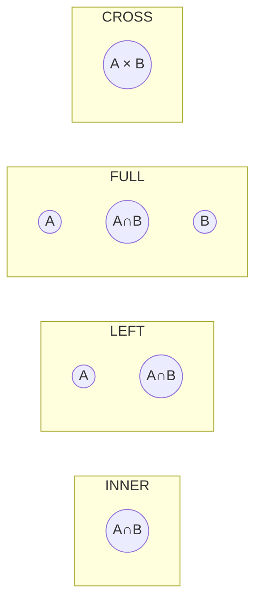

# Joins

> **One-liner**: A `JOIN` combines rows from two tables based on a matching condition — it's how relationships across tables become a single result set.

---

## Quick Reference

| Type | Returns | Mental model |
|------|---------|--------------|
| `INNER JOIN` | Rows that match in **both** tables | intersection |
| `LEFT [OUTER] JOIN` | All rows from **left**, matched rows from right (NULLs if no match) | left + match |
| `RIGHT [OUTER] JOIN` | All rows from **right**, matched rows from left | right + match |
| `FULL [OUTER] JOIN` | All rows from both, NULLs where no match | union |
| `CROSS JOIN` | Cartesian product (every left row × every right row) | every combination |
| `SELF JOIN` | Table joined to itself with aliases | hierarchy / pairs |
| `LATERAL JOIN` | Right side can reference left-side columns (Postgres) | "for each left row…" |

---

## Core Concept

A relational schema splits data across tables to avoid duplication. **Joins reassemble** that data on the fly using a matching condition (the `ON` clause), typically a foreign-key match.

The four mainstream joins differ in **which side keeps unmatched rows**:

- `INNER` — only matched rows on both sides
- `LEFT` — left side always present; right is NULL when unmatched
- `RIGHT` — symmetric to LEFT (rare in practice; rewrite as LEFT)
- `FULL OUTER` — both sides always present; NULLs fill gaps

`CROSS JOIN` produces every combination — handy with `generate_series`, dangerous if you forget an `ON` clause and end up with millions of rows by accident.

A `SELF JOIN` is just joining a table to itself with two aliases — useful for hierarchies (employee/manager) or finding pairs.

---

## Diagram



---

## Syntax & API

### Setup
```sql
CREATE TABLE users (
    id INT PRIMARY KEY,
    name TEXT
);
INSERT INTO users VALUES (1,'Alice'), (2,'Bob'), (3,'Carol');

CREATE TABLE orders (
    id INT PRIMARY KEY,
    user_id INT REFERENCES users(id),
    total NUMERIC(10,2)
);
INSERT INTO orders VALUES (101,1,50), (102,1,30), (103,2,80);
-- Carol has no orders. There's no order for an unknown user.
```

### INNER JOIN — only matched rows
```sql
SELECT u.name, o.id, o.total
FROM users u
INNER JOIN orders o ON o.user_id = u.id;
-- Alice/101, Alice/102, Bob/103 (Carol excluded)
```

### LEFT JOIN — keep all users, even with no orders
```sql
SELECT u.name, o.id AS order_id
FROM users u
LEFT JOIN orders o ON o.user_id = u.id;
-- Alice/101, Alice/102, Bob/103, Carol/NULL
```

### FULL OUTER JOIN
```sql
SELECT u.name, o.id AS order_id
FROM users u
FULL OUTER JOIN orders o ON o.user_id = u.id;
-- All users + all orders, NULLs where no match
```

### CROSS JOIN
```sql
-- Every (user, day) pair for a calendar
SELECT u.name, d::DATE AS day
FROM users u
CROSS JOIN generate_series(
    DATE '2026-01-01',
    DATE '2026-01-07',
    INTERVAL '1 day'
) AS g(d);
```

### SELF JOIN — employee/manager
```sql
CREATE TABLE employees (
    id   INT PRIMARY KEY,
    name TEXT,
    manager_id INT REFERENCES employees(id)
);

SELECT e.name AS employee, m.name AS manager
FROM employees e
LEFT JOIN employees m ON m.id = e.manager_id;
```

### Multi-table join
```sql
SELECT u.name, p.name AS product, oi.quantity
FROM users u
JOIN orders o      ON o.user_id = u.id
JOIN order_items oi ON oi.order_id = o.id
JOIN products p    ON p.id = oi.product_id
WHERE u.id = 1;
```

### LATERAL — "for each left row, run this query"
```sql
-- Top 3 most recent orders per user
SELECT u.name, o.*
FROM users u
JOIN LATERAL (
    SELECT id, total
    FROM orders
    WHERE user_id = u.id      -- can reference u
    ORDER BY id DESC
    LIMIT 3
) o ON TRUE;
```

---

## Common Patterns

```sql
-- Pattern: find rows in A that have NO match in B (anti-join)
SELECT u.*
FROM users u
LEFT JOIN orders o ON o.user_id = u.id
WHERE o.id IS NULL;        -- users with zero orders

-- Equivalent (often clearer)
SELECT *
FROM users u
WHERE NOT EXISTS (SELECT 1 FROM orders o WHERE o.user_id = u.id);
```

```sql
-- Pattern: count children per parent (LEFT JOIN + GROUP BY)
SELECT u.id, u.name, COUNT(o.id) AS order_count
FROM users u
LEFT JOIN orders o ON o.user_id = u.id
GROUP BY u.id, u.name;
-- Carol shows 0, not absent
```

```sql
-- Pattern: USING (when columns share a name)
SELECT * FROM users u JOIN orders o USING (user_id);
-- Same as ON u.user_id = o.user_id, deduplicates the join column
```

---

## Gotchas & Tips

- **`JOIN` defaults to `INNER JOIN`** — `JOIN orders o ON …` is INNER. Be explicit in code review.
- **Filtering an outer-joined table in `WHERE` turns it into INNER** — `LEFT JOIN orders o … WHERE o.total > 50` excludes the unmatched rows you wanted to keep. Put the predicate in the `ON` clause: `LEFT JOIN orders o ON o.user_id = u.id AND o.total > 50`.
- **`COUNT(*)` after `LEFT JOIN` counts NULLs** — `COUNT(o.id)` does not. Use `COUNT(o.id)` to count actual matches.
- **Cartesian explosion** — joining without an `ON` (or a wrong one) yields N×M rows. Always check the row count.
- **Multi-`Include` / multi-join cartesian explosion** — joining one parent to two child tables multiplies their counts. Aggregate or split queries.
- **`RIGHT JOIN` is rare** — rewrite as `LEFT JOIN` by swapping table order; easier to read.
- **Index the join columns** — both PKs and FKs should be indexed. PKs always are; FKs are not auto-indexed.
- **`USING` vs `ON`** — `USING (col)` requires the column name to match in both tables and outputs one column; `ON` is more flexible.

---

## See Also

- [[02 - SQL Fundamentals]]
- [[05 - Keys and Relationships]]
- [[07 - Aggregations and Grouping]]
- [[08 - Subqueries and CTEs]]
