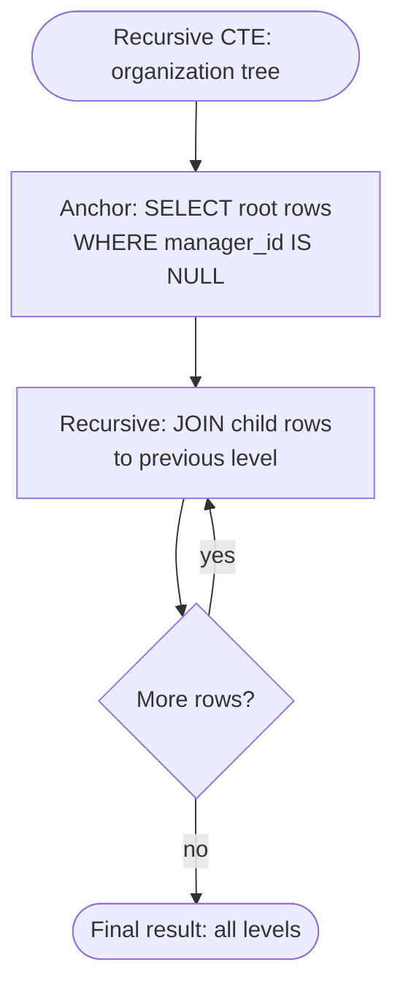

# Subqueries and CTEs

> **One-liner**: A subquery is a query inside another query; a CTE (`WITH`) is a named subquery you can reuse and read top-to-bottom — including recursively.

---

## Quick Reference

| Form | Where it goes | Example |
|------|---------------|---------|
| Scalar subquery | Anywhere a value is expected | `WHERE id = (SELECT MAX(id) FROM …)` |
| Row subquery | Equality on multi-column | `WHERE (a, b) = (SELECT …)` |
| Table subquery | In `FROM` (with alias) | `FROM (SELECT … FROM …) AS t` |
| Correlated subquery | References outer query columns | `WHERE EXISTS (SELECT 1 FROM o WHERE o.uid = u.id)` |
| `IN` / `NOT IN` | Set membership | `WHERE id IN (SELECT user_id FROM …)` |
| `EXISTS` / `NOT EXISTS` | Existence (often faster than IN) | `WHERE EXISTS (SELECT 1 …)` |
| `ANY` / `ALL` | Comparator vs set | `WHERE total > ALL (SELECT total FROM …)` |
| CTE (WITH) | Named subquery, top-level | `WITH t AS (SELECT …) SELECT * FROM t` |
| Recursive CTE | CTE that references itself | `WITH RECURSIVE …` |

---

## Core Concept

A **subquery** is a `SELECT` nested inside another statement. The inner query runs first (logically), and its result feeds the outer query.

A **CTE** (Common Table Expression) is a subquery you give a name with `WITH` and reference like a table:

```sql
WITH active_users AS (SELECT * FROM users WHERE is_active)
SELECT name FROM active_users;
```

CTEs read top-to-bottom and let you build a query in stages. They also allow **recursion** — a CTE can reference itself, which is how you traverse trees and graphs in SQL.

`EXISTS` is the existence test: it returns true as soon as it finds one matching row. It's typically faster than `IN (SELECT …)` for big datasets, especially when used with `NOT EXISTS` (the planner handles NULLs better than `NOT IN`).

---

## Diagram



---

## Syntax & API

### Scalar subquery
```sql
-- Most recent order per user (one of several ways)
SELECT id, email,
       (SELECT MAX(placed_at) FROM orders o WHERE o.user_id = u.id) AS last_order
FROM users u;
```

### Subquery in FROM (derived table)
```sql
SELECT user_id, total_orders
FROM (
    SELECT user_id, COUNT(*) AS total_orders
    FROM orders
    GROUP BY user_id
) AS counts
WHERE total_orders > 5;
```

### IN / EXISTS
```sql
-- IN: set membership
SELECT * FROM users
WHERE id IN (SELECT user_id FROM orders WHERE total > 100);

-- EXISTS: same idea, often faster
SELECT * FROM users u
WHERE EXISTS (SELECT 1 FROM orders o WHERE o.user_id = u.id AND o.total > 100);

-- NOT EXISTS: anti-join (find users with NO matching order)
SELECT * FROM users u
WHERE NOT EXISTS (SELECT 1 FROM orders o WHERE o.user_id = u.id);
```

### Correlated subquery
```sql
-- For each user, get their largest order
SELECT u.name,
       (SELECT MAX(total) FROM orders o WHERE o.user_id = u.id) AS biggest
FROM users u;
-- Inner runs once per outer row. Nice to read; can be slow.
```

### CTE — basic
```sql
WITH user_totals AS (
    SELECT user_id, SUM(total) AS revenue
    FROM orders
    GROUP BY user_id
)
SELECT u.name, t.revenue
FROM users u
JOIN user_totals t ON t.user_id = u.id
ORDER BY t.revenue DESC
LIMIT 10;
```

### Multiple CTEs in sequence
```sql
WITH
    big_orders AS (SELECT * FROM orders WHERE total > 100),
    big_users  AS (SELECT user_id, COUNT(*) AS n FROM big_orders GROUP BY user_id)
SELECT u.name, b.n
FROM users u JOIN big_users b ON b.user_id = u.id;
```

### Recursive CTE — walk a tree
```sql
-- categories(id, name, parent_id)
WITH RECURSIVE tree AS (
    -- Anchor: roots
    SELECT id, name, parent_id, 0 AS depth
    FROM categories
    WHERE parent_id IS NULL

    UNION ALL

    -- Recursive: children of nodes already collected
    SELECT c.id, c.name, c.parent_id, t.depth + 1
    FROM categories c
    JOIN tree t ON c.parent_id = t.id
)
SELECT REPEAT('  ', depth) || name AS indented, depth
FROM tree
ORDER BY depth, name;
```

### Recursive CTE — generate a series
```sql
-- 10 dates starting today
WITH RECURSIVE days(d) AS (
    SELECT CURRENT_DATE
    UNION ALL
    SELECT d + 1 FROM days WHERE d < CURRENT_DATE + 9
)
SELECT * FROM days;
-- (In real life: SELECT generate_series(CURRENT_DATE, CURRENT_DATE + 9, '1 day'))
```

---

## Common Patterns

```sql
-- Pattern: keep subquery results materialized for re-use
WITH recent AS MATERIALIZED (
    SELECT * FROM events WHERE occurred_at > now() - INTERVAL '7 days'
)
SELECT user_id, COUNT(*) FROM recent GROUP BY user_id;
-- MATERIALIZED forces evaluation once (Postgres 12+)
```

```sql
-- Pattern: WRITABLE CTE — INSERT/UPDATE/DELETE in a CTE returning rows
WITH archived AS (
    DELETE FROM orders
    WHERE placed_at < now() - INTERVAL '5 years'
    RETURNING *
)
INSERT INTO orders_archive
SELECT * FROM archived;
```

---

## Gotchas & Tips

- **`NOT IN` and NULLs are dangerous** — if the subquery returns any NULL, `NOT IN` returns nothing (NULL semantics). Prefer `NOT EXISTS` or filter NULLs in the subquery.
- **Correlated subqueries can be slow** — a per-row inner query is often a hidden N+1. Rewrite as a JOIN or window function when perf matters.
- **CTEs were optimization fences before Postgres 12** — they were always materialized. From PG 12 the planner can inline them; if you want the old behavior use `WITH … AS MATERIALIZED`.
- **A CTE used once is just sugar** — for clarity, fine. For perf, no different from a subquery on PG 12+.
- **Recursive CTEs need a stop condition** — bad anchor or join can loop forever (Postgres caps at `max_recursive_depth` but it's a safety net, not a design).
- **`UNION ALL` not `UNION` in recursive CTEs** — `UNION` deduplicates each step (slow); `UNION ALL` is what you want.
- **Subquery in `SELECT` returns at most one row** — error if it returns more. Use `LIMIT 1` if you only want the first.
- **Use CTEs to break up monsters** — a 5-CTE query is far easier to debug than one 100-line nested SELECT.

---

## See Also

- [[02 - SQL Fundamentals]]
- [[06 - Joins]]
- [[07 - Aggregations and Grouping]]
- [[10 - Window Functions]]
