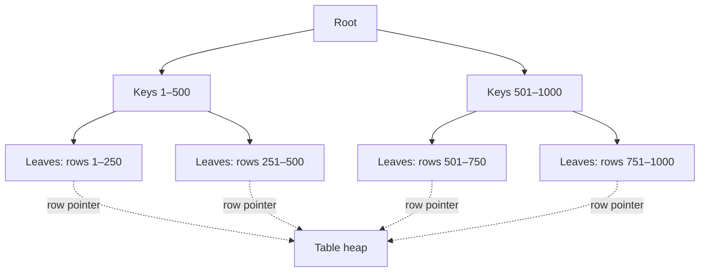

# Indexes Basics

> **One-liner**: An index is a separate data structure that maps column values to rows so the DB can find rows by value without scanning the whole table.

---

## Quick Reference

| Item | Syntax / fact |
|------|---------------|
| Default index type | B-tree |
| Create | `CREATE INDEX idx_users_email ON users(email);` |
| Unique index | `CREATE UNIQUE INDEX … ON users(email);` |
| Multi-column | `CREATE INDEX … ON orders(user_id, placed_at DESC);` |
| Drop | `DROP INDEX idx_users_email;` |
| Inspect | `\d users` (psql) or `SELECT * FROM pg_indexes WHERE tablename = 'users';` |
| Force build without locking writes | `CREATE INDEX CONCURRENTLY …` (slower, no `ACCESS EXCLUSIVE` lock) |
| When indexes help | equality, range, prefix `LIKE 'abc%'`, ORDER BY, JOIN columns |
| When indexes hurt | small tables, write-heavy without read benefit, low-selectivity columns |

---

## Core Concept

A **table** in Postgres is stored as an unordered "heap" of rows. To find a row by a column value without an index, the DB must read every row — a **sequential scan**.

An **index** is a sorted, balanced data structure (default: **B-tree**) that maps column values to row locations (`ctid` — physical row pointer). The DB walks the tree (`O(log n)`) to find rows by value.

PKs and `UNIQUE` columns are **automatically** indexed. Foreign-key columns are **not** — you must add the index yourself, or DELETEs and JOINs on the FK side will be slow.

Indexes cost storage and slow down writes (every `INSERT`/`UPDATE`/`DELETE` updates the index). Add them when:
- The column appears in `WHERE`, `JOIN`, or `ORDER BY`
- The table is non-trivial (more than a few hundred rows)
- The column is selective (many distinct values; not "true/false")

---

## Diagram



---

## Syntax & API

### Create and use
```sql
CREATE TABLE users (
    id    INT GENERATED ALWAYS AS IDENTITY PRIMARY KEY,
    email TEXT NOT NULL UNIQUE,        -- auto-creates a unique index
    name  TEXT NOT NULL
);

-- Explicit index on a non-unique column
CREATE INDEX idx_users_name ON users (name);

-- See the plan
EXPLAIN ANALYZE
SELECT * FROM users WHERE email = 'a@b.com';
-- Will show "Index Scan using users_email_key on users"
```

### Multi-column (composite) index
```sql
-- For: WHERE user_id = ? ORDER BY placed_at DESC
CREATE INDEX idx_orders_user_date
    ON orders (user_id, placed_at DESC);
```

The order matters. The index helps queries that filter by:
- `user_id`
- `user_id` AND `placed_at`

It does **not** help queries filtering only by `placed_at` (left-prefix rule).

### Add an index to an FK column
```sql
-- Postgres does NOT auto-index FK columns
CREATE INDEX idx_orders_user_id ON orders (user_id);
```

### Build without blocking writes
```sql
CREATE INDEX CONCURRENTLY idx_users_email
    ON users (email);
-- Can't be in a transaction; takes longer, but no ACCESS EXCLUSIVE lock
```

### Inspect / drop
```sql
\d orders                                  -- shows indexes
SELECT * FROM pg_indexes WHERE tablename = 'orders';

DROP INDEX idx_orders_user_id;
DROP INDEX CONCURRENTLY idx_orders_user_id; -- non-blocking drop
```

### EXPLAIN to verify use
```sql
EXPLAIN ANALYZE
SELECT * FROM orders WHERE user_id = 42;

-- Look for "Index Scan" or "Index Only Scan" — good
-- "Seq Scan" on a big table = no useful index
```

---

## Common Patterns

```sql
-- Pattern: index on the column you ORDER BY (with the same direction)
CREATE INDEX idx_posts_published_desc ON posts (published_at DESC);
-- Avoids a sort step for "latest posts" queries
```

```sql
-- Pattern: covering index (Postgres 11+)
CREATE INDEX idx_orders_user_covering
    ON orders (user_id) INCLUDE (total, placed_at);
-- Allows "Index Only Scans" — no heap fetch
```

```sql
-- Pattern: partial index for hot rows
CREATE INDEX idx_orders_pending
    ON orders (placed_at)
    WHERE status = 'pending';
-- Tiny index, only covers the rows you actually filter
```

```sql
-- Pattern: expression index for case-insensitive search
CREATE INDEX idx_users_email_lower ON users (LOWER(email));

-- Use the SAME expression in the query
SELECT * FROM users WHERE LOWER(email) = LOWER('A@B.com');
```

---

## Gotchas & Tips

- **Indexes aren't free** — every write updates them. A table with 10 indexes pays 10× the index-write cost on each insert.
- **`SELECT *` rarely benefits from "covering"** — covering indexes only help when all selected columns are in the index. With `*`, the DB still hits the heap.
- **Function calls hide indexes** — `WHERE LOWER(email) = ?` won't use `idx_users(email)`. Either index the expression or normalize before storing.
- **Leading-wildcard `LIKE '%foo'` can't use a normal index** — use a trigram index (`pg_trgm`) for substring search.
- **NULLs are indexed** — Postgres includes NULLs in B-tree indexes. `WHERE col IS NULL` can use the index.
- **B-tree is the default and fits ~95% of cases** — other types: GIN (arrays/JSONB/full-text), GiST (geometry/range), BRIN (huge time-series), Hash (rare). See [[05 - Indexes Advanced]].
- **Index cost is proportional to selectivity** — an index on `is_active BOOLEAN` is usually useless (50% match → faster to scan).
- **`pg_stat_user_indexes`** tells you which indexes are unused. Drop dead weight.
- **Always `CREATE INDEX CONCURRENTLY` in production** — a regular `CREATE INDEX` takes an `ACCESS EXCLUSIVE` lock; concurrent does not.
- **Composite-index column order** — put the column you filter on first. `(a, b)` helps `WHERE a = ? AND b = ?` and `WHERE a = ?`, but not `WHERE b = ?`.

---

## See Also

- [[02 - SQL Fundamentals]]
- [[09 - Constraints]]
- [[05 - Indexes Advanced]]
- [[06 - Query Optimization]]
