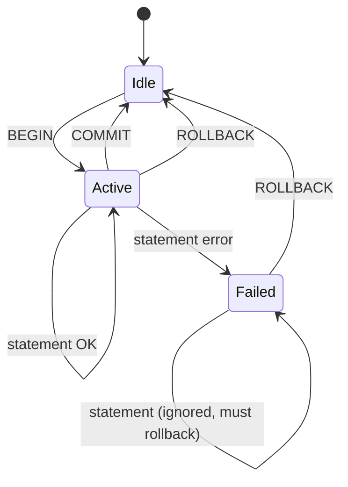

# Transactions and ACID

> **One-liner**: A transaction is a unit of work the database treats atomically — either every change persists, or none of them do.

---

## Quick Reference

| Statement | Effect |
|-----------|--------|
| `BEGIN` (or `START TRANSACTION`) | Start a transaction |
| `COMMIT` | Persist all changes; release locks |
| `ROLLBACK` | Discard all changes since `BEGIN` |
| `SAVEPOINT name` | Marker you can roll back to without aborting the whole tx |
| `ROLLBACK TO SAVEPOINT name` | Undo to that marker; continue tx |
| `RELEASE SAVEPOINT name` | Drop the marker |
| `SET TRANSACTION ISOLATION LEVEL …` | Choose isolation (see [[03 - Isolation Levels]]) |
| `SET TRANSACTION READ ONLY` | Reject writes for this tx |

| ACID | Guarantee |
|------|-----------|
| **A**tomicity | All-or-nothing |
| **C**onsistency | Constraints hold before and after |
| **I**solation | Concurrent txs don't interfere (per chosen level) |
| **D**urability | Committed changes survive crashes (WAL/fsync) |

---

## Core Concept

A **transaction** groups statements into one atomic unit. The classic example: transfer $100 from account A to B requires two updates; if the second fails, the first must be undone or money disappears.

ACID is what makes a relational DB worth using:

- **Atomicity** — partial completion is impossible. The DB rolls back on error.
- **Consistency** — every committed state respects all declared constraints (FK, CHECK, unique).
- **Isolation** — concurrent transactions appear to run alone (subject to the chosen isolation level — see [[03 - Isolation Levels]]).
- **Durability** — once `COMMIT` returns, the data is on stable storage. Postgres uses WAL (write-ahead log) flushed by `fsync`.

A **savepoint** is a nested rollback point. You can undo part of a transaction without aborting the whole thing — useful for retrying optional steps.

In Postgres, **every statement runs in a transaction**. Without an explicit `BEGIN`, each statement is its own auto-commit transaction.

---

## Diagram



---

## Syntax & API

### Basic transfer
```sql
BEGIN;
    UPDATE accounts SET balance = balance - 100 WHERE id = 1;
    UPDATE accounts SET balance = balance + 100 WHERE id = 2;
COMMIT;
```

If anything fails, the application should issue `ROLLBACK`.

### Auto-rollback on error (Postgres behavior)
```sql
BEGIN;
    UPDATE accounts SET balance = balance - 100 WHERE id = 1;
    -- This statement errors:
    INSERT INTO orders (id, user_id) VALUES (1, 999);  -- FK violation
    -- Now the transaction is in "aborted" state.
    -- Any further statement fails with "current transaction is aborted".
ROLLBACK;
```

### Savepoints — partial rollback
```sql
BEGIN;
    INSERT INTO orders (user_id, total) VALUES (1, 50);

    SAVEPOINT before_items;
        INSERT INTO order_items (order_id, product_id, qty) VALUES (currval('orders_id_seq'), 999, 1);
        -- Imagine product 999 doesn't exist; this errors.
    ROLLBACK TO SAVEPOINT before_items;

    -- Order header still there; bad item discarded.
    INSERT INTO order_items (order_id, product_id, qty) VALUES (currval('orders_id_seq'), 1, 1);
COMMIT;
```

### Read-only transaction
```sql
BEGIN READ ONLY;
    SELECT SUM(total) FROM orders;
COMMIT;
-- Useful for snapshots / reports; rejects accidental writes.
```

### Choosing an isolation level
```sql
BEGIN ISOLATION LEVEL REPEATABLE READ;
    -- snapshot of the database is frozen at the first statement
    SELECT SUM(balance) FROM accounts;
COMMIT;
```

See [[03 - Isolation Levels]] for what each level does.

### Application-side (.NET / Npgsql)
```csharp
await using var conn = new NpgsqlConnection(connStr);
await conn.OpenAsync();
await using var tx = await conn.BeginTransactionAsync();
try
{
    await using var cmd1 = new NpgsqlCommand("UPDATE accounts SET balance = balance - @a WHERE id = @i", conn, tx);
    cmd1.Parameters.AddWithValue("a", 100m);
    cmd1.Parameters.AddWithValue("i", 1);
    await cmd1.ExecuteNonQueryAsync();

    await using var cmd2 = new NpgsqlCommand("UPDATE accounts SET balance = balance + @a WHERE id = @i", conn, tx);
    cmd2.Parameters.AddWithValue("a", 100m);
    cmd2.Parameters.AddWithValue("i", 2);
    await cmd2.ExecuteNonQueryAsync();

    await tx.CommitAsync();
}
catch
{
    await tx.RollbackAsync();
    throw;
}
```

---

## Common Patterns

```sql
-- Pattern: idempotent upsert in one statement (single tx)
INSERT INTO settings (user_id, key, value) VALUES ($1, $2, $3)
ON CONFLICT (user_id, key) DO UPDATE SET value = EXCLUDED.value;
```

```sql
-- Pattern: financial double-entry in one transaction
BEGIN;
    INSERT INTO ledger (account, delta) VALUES (1, -100);
    INSERT INTO ledger (account, delta) VALUES (2, +100);
    -- CHECK constraint enforces SUM(delta) = 0 across the tx via DEFERRABLE
COMMIT;
```

```sql
-- Pattern: SELECT FOR UPDATE — lock rows until commit
BEGIN;
    SELECT * FROM accounts WHERE id = 1 FOR UPDATE;     -- prevents concurrent change
    UPDATE accounts SET balance = balance - 100 WHERE id = 1;
COMMIT;
```

---

## Gotchas & Tips

- **Auto-commit by default** — without `BEGIN`, every statement runs in its own transaction. Multi-statement work without `BEGIN` is *not* atomic.
- **Aborted state is sticky** — after one error, every subsequent statement fails until `ROLLBACK`. Some tooling hides this; libraries like Npgsql surface it.
- **Long transactions are toxic** — they hold locks, delay autovacuum, and bloat tables. Keep transactions as short as the work allows.
- **`COMMIT` is when durability happens** — until then, data lives in the WAL but isn't "yours". Don't return success to a user before commit.
- **`fsync` matters for durability** — disabling it speeds writes but risks losing committed data on crash. Never do it in production.
- **Don't span user input** — opening a tx, asking the user to confirm, then committing means a long-held lock. Use optimistic concurrency or read-modify-rewrite.
- **Read-only is a useful safety belt** — for reports and replicas.
- **Postgres has no nested transactions** — only savepoints. Frameworks emulate nesting via savepoints.
- **`RETURNING`** lets you read inserted/updated rows without a second `SELECT` — great inside transactions.

---

## See Also

- [[03 - Isolation Levels]]
- [[04 - Locking and Concurrency]]
- [[05 - Distributed Transactions]]
- [[14 - ADO.NET and Dapper]]
