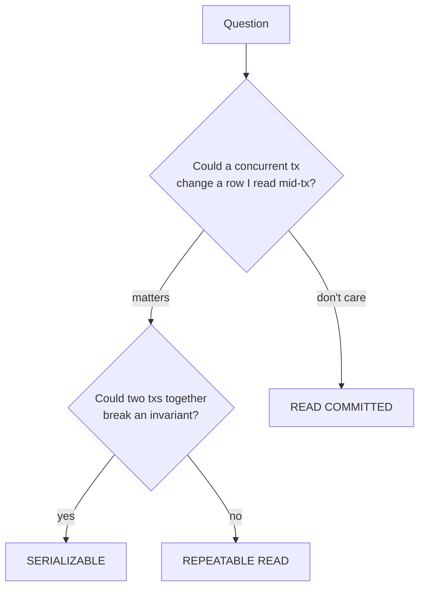

# Isolation Levels

> **One-liner**: Isolation level decides which concurrency anomalies your transaction can see — looser = faster + weirder, stricter = safer + slower.

---

## Quick Reference

| Level | Dirty read | Non-repeatable read | Phantom read | Serialization anomaly |
|-------|------------|---------------------|--------------|------------------------|
| `READ UNCOMMITTED` | possible* | possible | possible | possible |
| `READ COMMITTED` (Postgres default) | impossible | possible | possible | possible |
| `REPEATABLE READ` (PG = Snapshot Isolation) | impossible | impossible | impossible | possible |
| `SERIALIZABLE` (PG = SSI) | impossible | impossible | impossible | impossible |

*Postgres treats `READ UNCOMMITTED` as `READ COMMITTED` — there are no truly dirty reads.

| Phenomenon | What goes wrong |
|------------|-----------------|
| **Dirty read** | You read uncommitted data from another tx |
| **Non-repeatable read** | Same row, two reads in your tx, different value (a concurrent tx updated it) |
| **Phantom read** | Same `WHERE`, two reads in your tx, different row count (concurrent insert/delete) |
| **Serialization anomaly** | Concurrent serializable txs produce a result no serial order would |

---

## Core Concept

When transactions run concurrently, they can interfere unless the engine prevents it. The **isolation level** is the dial that controls how much interference is allowed.

In **Postgres specifically**:

- **READ COMMITTED** (default) — every statement sees a fresh snapshot. Two `SELECT`s in the same tx can return different data if a concurrent tx commits between them.
- **REPEATABLE READ** — the *whole transaction* uses the snapshot taken at the first statement. No non-repeatable reads, no phantom reads. Postgres's REPEATABLE READ is actually **Snapshot Isolation** (a stricter superset of standard REPEATABLE READ).
- **SERIALIZABLE** — Postgres uses **SSI** (Serializable Snapshot Isolation). Concurrent serializable txs may abort with `serialization_failure` (SQLSTATE `40001`); the app retries.

The right answer is application-specific:
- "Can a row I just read change during my work?" → REPEATABLE READ
- "Could two concurrent txs together violate an invariant no single one violates?" → SERIALIZABLE
- Otherwise → READ COMMITTED is fine and fastest

---

## Diagram



---

## Syntax & API

### Set per-transaction
```sql
BEGIN ISOLATION LEVEL READ COMMITTED;       -- default
-- ...
COMMIT;

BEGIN ISOLATION LEVEL REPEATABLE READ;
-- ...
COMMIT;

BEGIN ISOLATION LEVEL SERIALIZABLE;
-- ...
COMMIT;
```

### Set as session default
```sql
SET SESSION CHARACTERISTICS AS TRANSACTION ISOLATION LEVEL REPEATABLE READ;
```

### Demonstration: non-repeatable read under READ COMMITTED
```sql
-- Session A
BEGIN;
SELECT balance FROM accounts WHERE id = 1;   -- 100

-- (Session B commits an UPDATE setting balance = 50)

SELECT balance FROM accounts WHERE id = 1;   -- 50 — different read, same tx
COMMIT;
```

### Same scenario under REPEATABLE READ
```sql
BEGIN ISOLATION LEVEL REPEATABLE READ;
SELECT balance FROM accounts WHERE id = 1;   -- 100

-- (Session B commits an UPDATE setting balance = 50)

SELECT balance FROM accounts WHERE id = 1;   -- still 100 — snapshot frozen
COMMIT;
```

### Serializable — handle the conflict
```sql
BEGIN ISOLATION LEVEL SERIALIZABLE;
    SELECT SUM(balance) FROM accounts;
    INSERT INTO summary (total) VALUES (...);
COMMIT;
-- May fail with: ERROR: could not serialize access due to read/write dependencies
-- SQLSTATE 40001 → application retries the transaction
```

### Retry pattern (.NET)
```csharp
const int MaxAttempts = 3;
for (int attempt = 1; attempt <= MaxAttempts; attempt++)
{
    try
    {
        await using var tx = await conn.BeginTransactionAsync(IsolationLevel.Serializable);
        // ...work...
        await tx.CommitAsync();
        break;
    }
    catch (PostgresException ex) when (ex.SqlState == "40001" && attempt < MaxAttempts)
    {
        await Task.Delay(50 * attempt);   // backoff
    }
}
```

### `SELECT ... FOR UPDATE` — pessimistic locking under any level
```sql
BEGIN;
SELECT * FROM accounts WHERE id = 1 FOR UPDATE;   -- locks the row
UPDATE accounts SET balance = balance - 100 WHERE id = 1;
COMMIT;
```

---

## Common Patterns

```sql
-- Pattern: lost update protection via REPEATABLE READ
-- Two clerks try to add $50 each starting from balance 100. We want 200, not 150.
BEGIN ISOLATION LEVEL REPEATABLE READ;
    UPDATE accounts SET balance = balance + 50 WHERE id = 1;
    -- If another tx already committed +50, this fails to serialize.
COMMIT;
```

```sql
-- Pattern: read-only report at a stable snapshot
BEGIN ISOLATION LEVEL REPEATABLE READ READ ONLY;
    -- All queries see the same data, even if writes happen mid-report
    SELECT ...; SELECT ...; SELECT ...;
COMMIT;
```

```sql
-- Pattern: serializable for invariants across rows
-- "Total active reservations per room must be ≤ 1"
BEGIN ISOLATION LEVEL SERIALIZABLE;
    SELECT COUNT(*) FROM reservations
    WHERE room_id = 1 AND tsrange(start_at, end_at) && tsrange(:s, :e);
    -- if zero:
    INSERT INTO reservations (...) VALUES (...);
COMMIT;
-- SSI catches concurrent inserts that would violate the invariant
```

---

## Gotchas & Tips

- **Postgres `REPEATABLE READ` is Snapshot Isolation** — it prevents phantoms (unlike standard ANSI REPEATABLE READ). Stronger than the spec.
- **Default is `READ COMMITTED`** — fine for most CRUD. Step up only when a real anomaly matters.
- **Always have a retry loop for `SERIALIZABLE`** — `40001` is normal, not exceptional.
- **`FOR UPDATE` is orthogonal to isolation level** — it's pessimistic locking. You can use it under READ COMMITTED to avoid lost updates without going to REPEATABLE READ.
- **Long-running serializable txs make conflicts more likely** — keep them short.
- **Mixing isolation levels in one app is fine** — different operations have different needs.
- **`READ UNCOMMITTED` doesn't actually do anything in Postgres** — it's READ COMMITTED in disguise. (The MVCC architecture has no dirty reads.)
- **MVCC explainer** — Postgres keeps row versions; readers don't block writers and vice versa. Snapshot Isolation is a natural fit.

---

## See Also

- [[02 - Transactions and ACID]]
- [[04 - Locking and Concurrency]]
- [[09 - Performance Tuning]]
- [[10 - Deadlocks and Blocking]]
