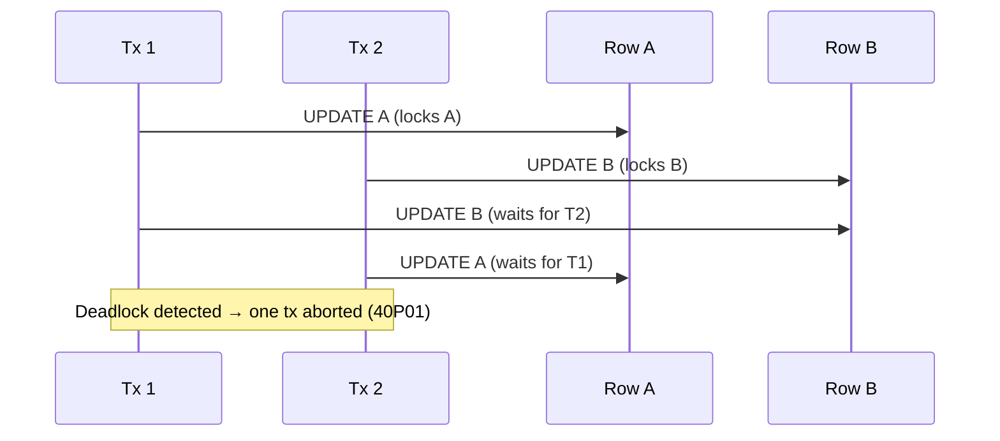

# Locking and Concurrency

> **One-liner**: Locks coordinate concurrent transactions so they don't corrupt each other; you choose pessimistic (lock first) or optimistic (try, retry on conflict).

---

## Quick Reference

| Lock mode | Acquired by | Conflicts with |
|-----------|-------------|-----------------|
| `ACCESS SHARE` | `SELECT` | `ACCESS EXCLUSIVE` only |
| `ROW SHARE` | `SELECT FOR UPDATE/SHARE` | `EXCLUSIVE`, `ACCESS EXCLUSIVE` |
| `ROW EXCLUSIVE` | `INSERT`, `UPDATE`, `DELETE` | `SHARE`, `SHARE ROW EXCLUSIVE`, `EXCLUSIVE`, `ACCESS EXCLUSIVE` |
| `SHARE` | `CREATE INDEX` (non-concurrent) | writes |
| `EXCLUSIVE` | `REFRESH MATERIALIZED VIEW CONCURRENTLY` | most things |
| `ACCESS EXCLUSIVE` | `DROP TABLE`, `ALTER TABLE`, `CREATE INDEX` (non-concurrent) | everything |

| Row-level lock | Use |
|----------------|-----|
| `SELECT … FOR UPDATE` | "I plan to update this row" — blocks other writers/lockers |
| `SELECT … FOR NO KEY UPDATE` | weaker — won't block FK refs |
| `SELECT … FOR SHARE` | "I plan to read this row consistently" — blocks updaters |
| `SELECT … FOR KEY SHARE` | weakest — for FK enforcement |
| `… SKIP LOCKED` | Skip locked rows entirely (great for queues) |
| `… NOWAIT` | Fail immediately instead of blocking |

---

## Core Concept

Postgres uses **MVCC** (multi-version concurrency control): readers don't block writers, writers don't block readers. But two writers updating the same row do conflict — only one commits at a time.

You have two strategies for that conflict:

- **Pessimistic** — lock the row before doing the work (`SELECT … FOR UPDATE`). Other writers wait. Simple, but bad for high contention or long transactions.
- **Optimistic** — assume no conflict, do the work, detect on commit. Use a version column or check the timestamp before update. If conflict, the app retries.

Locks operate at multiple levels: **table** locks (for DDL), **row** locks (for `UPDATE`), **predicate** locks (under SERIALIZABLE). Most app code only deals with row-level locks.

A **deadlock** happens when two transactions each hold a lock the other wants. Postgres detects them, kills one, returns SQLSTATE `40P01`. Always be prepared to retry.

---

## Diagram



---

## Syntax & API

### Pessimistic — lock before update
```sql
BEGIN;
SELECT * FROM accounts WHERE id = 1 FOR UPDATE;
-- Other txs trying SELECT … FOR UPDATE on this row wait until COMMIT/ROLLBACK
UPDATE accounts SET balance = balance - 100 WHERE id = 1;
COMMIT;
```

### Optimistic — version column
```sql
ALTER TABLE accounts ADD COLUMN version INT NOT NULL DEFAULT 0;

-- Read
SELECT id, balance, version FROM accounts WHERE id = 1;
-- (id=1, balance=100, version=7)

-- Update only if version unchanged
UPDATE accounts
   SET balance = balance - 100,
       version = version + 1
 WHERE id = 1
   AND version = 7;          -- 0 rows = lost update; retry

-- Application checks affected rows; if 0, re-read and retry.
```

### `SKIP LOCKED` — work-queue pattern
```sql
-- Worker picks a job nobody else is processing
BEGIN;
WITH next AS (
    SELECT id FROM jobs
    WHERE status = 'pending'
    ORDER BY created_at
    LIMIT 1
    FOR UPDATE SKIP LOCKED
)
UPDATE jobs SET status = 'running'
WHERE id IN (SELECT id FROM next)
RETURNING *;
COMMIT;
-- Each worker grabs a different row; no contention, no double-processing
```

### `NOWAIT` — fail fast
```sql
SELECT * FROM accounts WHERE id = 1 FOR UPDATE NOWAIT;
-- ERROR: could not obtain lock on row in relation "accounts"
-- App can return "busy, try again" immediately
```

### Inspect locks
```sql
-- Currently held locks
SELECT pid, locktype, mode, relation::regclass AS rel, granted
FROM pg_locks
WHERE NOT granted OR mode LIKE '%Exclusive';

-- Activity + locks
SELECT pid, state, wait_event_type, wait_event, query
FROM pg_stat_activity
WHERE state != 'idle';

-- Cancel / kill a stuck query
SELECT pg_cancel_backend(<pid>);     -- polite (cancels current statement)
SELECT pg_terminate_backend(<pid>);  -- nuclear (kills the connection)
```

### Deadlock retry pattern (.NET)
```csharp
const int MaxAttempts = 3;
for (int attempt = 1; attempt <= MaxAttempts; attempt++)
{
    try
    {
        await using var tx = await conn.BeginTransactionAsync();
        // ... your work ...
        await tx.CommitAsync();
        break;
    }
    catch (PostgresException ex) when (ex.SqlState is "40P01" or "40001" && attempt < MaxAttempts)
    {
        await Task.Delay(Random.Shared.Next(20, 100));   // jittered backoff
    }
}
```

---

## Common Patterns

```sql
-- Pattern: advisory lock (named, app-level)
SELECT pg_advisory_lock(42);
-- Only one session holds the lock; others wait. Useful for cron jobs.
-- Release on disconnect or explicitly:
SELECT pg_advisory_unlock(42);

-- Try without waiting:
SELECT pg_try_advisory_lock(42);   -- true if got it
```

```sql
-- Pattern: avoid holding locks across user think-time
-- WRONG: lock + ask user to confirm + commit (locks held for minutes)
-- RIGHT: optimistic update with version column; conflict → "page changed, refresh"
```

```sql
-- Pattern: order updates consistently to avoid deadlocks
BEGIN;
-- Always lock rows in PK order
SELECT * FROM accounts WHERE id IN (1, 2) ORDER BY id FOR UPDATE;
-- ... updates ...
COMMIT;
```

---

## Gotchas & Tips

- **MVCC ≠ no locks** — writers still lock rows they update. MVCC frees readers, not writers.
- **`UPDATE` takes a row-level lock implicitly** — you don't need `FOR UPDATE` if you're updating in the same statement.
- **`FOR UPDATE` is for SELECTs that precede an UPDATE/DELETE** — it tells the DB "I'm reading this so I can change it."
- **`FOR UPDATE SKIP LOCKED` is the canonical work-queue primitive** — no need for Redis/Kafka for simple background jobs.
- **Deadlocks are not bugs** — they're a normal outcome under contention. Retry with backoff.
- **Always lock rows in a consistent order** — alphabetical by PK is a common rule. Inconsistent ordering is the #1 deadlock cause.
- **`ACCESS EXCLUSIVE` blocks everything** — `ALTER TABLE` in production needs care. Postgres has fast-path optimizations (e.g. adding NULL columns, NOT NULL with default in PG 11+) that avoid table rewrite.
- **Long transactions = long locks** — never open a tx, hit an external API, then commit. Lock duration is your enemy.
- **`pg_locks` × `pg_stat_activity` joined by `pid`** is the standard "who's blocking whom" query.
- **Advisory locks survive across queries but not across sessions** — they release when the connection closes.

---

## See Also

- [[02 - Transactions and ACID]]
- [[03 - Isolation Levels]]
- [[10 - Deadlocks and Blocking]]
- [[09 - Performance Tuning]]
