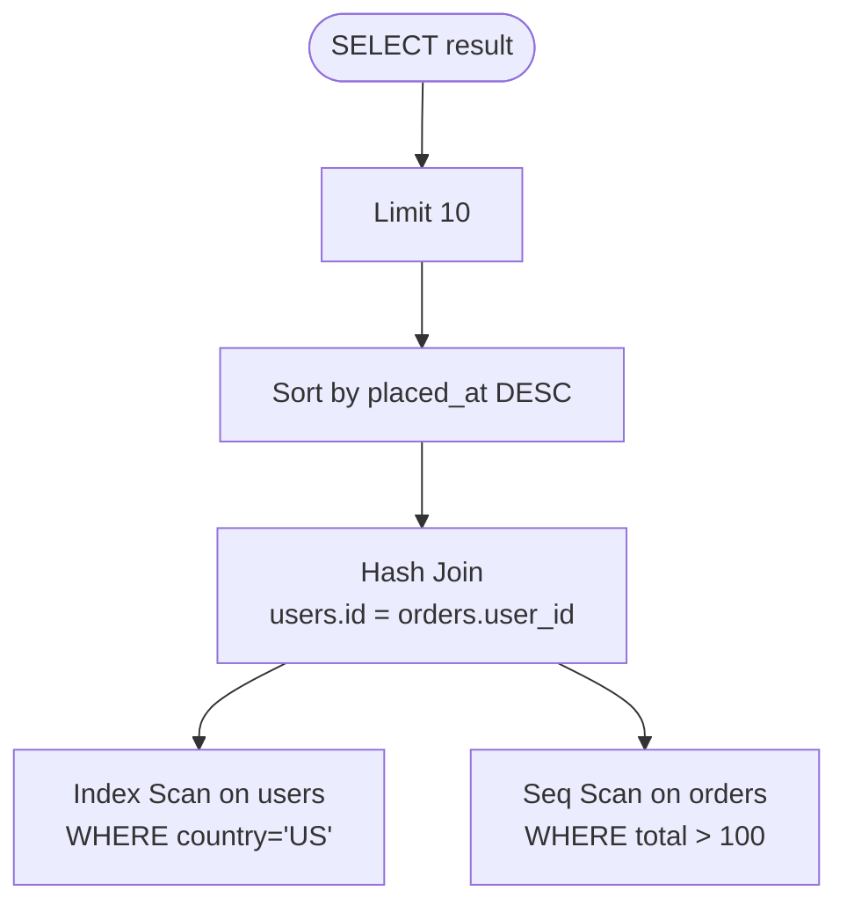

# Query Optimization

> **One-liner**: `EXPLAIN ANALYZE` shows what Postgres actually does; tuning is removing sequential scans, sorts, and Nested Loops with millions of rows.

---

## Quick Reference

| Tool | Use |
|------|-----|
| `EXPLAIN <query>` | Show plan without running |
| `EXPLAIN ANALYZE <query>` | Run it and show actual times + row counts |
| `EXPLAIN (ANALYZE, BUFFERS) …` | + cache hit / disk-read counts |
| `EXPLAIN (ANALYZE, BUFFERS, FORMAT JSON) …` | machine-readable for tooling |
| `\timing on` | psql shows query duration |
| `pg_stat_statements` | aggregated stats per normalized query |
| **explain.depesz.com / explain.dalibo.com** | visualize plan output |

| Plan node | Meaning |
|-----------|---------|
| **Seq Scan** | full-table read — bad on big tables |
| **Index Scan** | walked B-tree, fetched from heap |
| **Index Only Scan** | answered from index alone — best case |
| **Bitmap Index Scan + Bitmap Heap Scan** | combine indexes / many matches |
| **Nested Loop** | for each row in outer, look up inner — fast for tiny outer, slow if huge |
| **Hash Join** | build hash of one side, probe with the other |
| **Merge Join** | both sides sorted, walk in parallel |
| **Sort** | explicit sort — try to remove with index |
| **Aggregate / GroupAggregate / HashAggregate** | grouping strategies |

---

## Core Concept

Postgres compiles every query into a **plan tree** — a series of nodes, each producing rows for the next. The **planner** estimates costs (using table **statistics** collected by `ANALYZE`) and picks the cheapest plan.

`EXPLAIN ANALYZE` runs the query and prints the plan annotated with **actual rows**, **actual time**, and **loops**. The classic optimization loop:

1. Find the slow query (`pg_stat_statements`)
2. Run `EXPLAIN ANALYZE` and identify the worst node (highest actual time)
3. Decide why — missing index, bad estimate, suboptimal join
4. Add an index, rewrite the query, or update statistics
5. Re-run and confirm

A query is **sargable** ("Search ARGument ABLE") if its predicates allow index use. `WHERE LOWER(email) = 'x'` is not sargable against an index on `email`. `WHERE email = 'x'` is.

Bad statistics → bad plans. Run `ANALYZE table_name` after big data changes if autovacuum hasn't.

---

## Diagram



(In `EXPLAIN`, the *bottom* nodes execute first.)

---

## Syntax & API

### EXPLAIN basics
```sql
EXPLAIN
SELECT * FROM users WHERE email = 'a@b.com';
-- Shows planned cost; doesn't execute

EXPLAIN ANALYZE
SELECT * FROM users WHERE email = 'a@b.com';
-- Executes; shows actual time and rows
```

### EXPLAIN ANALYZE with buffers (recommended default)
```sql
EXPLAIN (ANALYZE, BUFFERS, VERBOSE)
SELECT u.name, COUNT(o.id) AS orders
FROM users u
LEFT JOIN orders o ON o.user_id = u.id
GROUP BY u.id
ORDER BY orders DESC LIMIT 10;
```

Read the output bottom-up:
- *Buffers: shared hit=N, read=M* — `read` = disk, `hit` = cache. Many `read`s = cold cache or huge scan.
- *actual time=X..Y rows=R loops=L* — total time for one loop is `(Y - X) * L`.

### Find slow queries via pg_stat_statements
```sql
CREATE EXTENSION IF NOT EXISTS pg_stat_statements;
-- Add to postgresql.conf: shared_preload_libraries = 'pg_stat_statements'
-- Restart Postgres.

SELECT
    LEFT(query, 80)                AS query,
    calls,
    total_exec_time / 1000 / 60    AS minutes,
    mean_exec_time                 AS ms_per_call,
    rows / NULLIF(calls,0)         AS avg_rows
FROM pg_stat_statements
ORDER BY total_exec_time DESC
LIMIT 20;
```

### Update statistics
```sql
ANALYZE orders;                              -- refresh stats for one table
VACUUM ANALYZE;                              -- whole DB
ALTER TABLE orders ALTER COLUMN status SET STATISTICS 1000;   -- more samples
```

### Rewrite for sargability
```sql
-- BAD — function on column hides the index
SELECT * FROM users WHERE LOWER(email) = 'a@b.com';

-- GOOD — store lowercased, or use an expression index
CREATE INDEX idx_users_email_lower ON users (LOWER(email));
-- now the original query uses the index
```

```sql
-- BAD — wrapping in CAST when types differ
SELECT * FROM events WHERE date::TEXT = '2026-04-29';

-- GOOD — match the column's natural type
SELECT * FROM events WHERE date = DATE '2026-04-29';
```

```sql
-- BAD — leading wildcard with B-tree
SELECT * FROM users WHERE name LIKE '%alice%';

-- GOOD — pg_trgm GIN index
CREATE INDEX idx_users_name_trgm ON users USING gin (name gin_trgm_ops);
SELECT * FROM users WHERE name ILIKE '%alice%';
```

---

## Common Patterns

```sql
-- Pattern: pagination with keyset (avoid OFFSET on large tables)
-- BAD: SELECT * FROM orders ORDER BY id LIMIT 25 OFFSET 100000;
-- GOOD:
SELECT * FROM orders WHERE id > :last_id ORDER BY id LIMIT 25;
```

```sql
-- Pattern: EXISTS instead of COUNT > 0
-- BAD:
IF (SELECT COUNT(*) FROM orders WHERE user_id = 1) > 0 ...
-- GOOD:
IF EXISTS (SELECT 1 FROM orders WHERE user_id = 1) ...
-- EXISTS short-circuits on first match
```

```sql
-- Pattern: pre-aggregate before joining (avoid cartesian explosion)
WITH order_counts AS (
    SELECT user_id, COUNT(*) AS n FROM orders GROUP BY user_id
)
SELECT u.*, COALESCE(oc.n, 0) AS orders
FROM users u
LEFT JOIN order_counts oc ON oc.user_id = u.id;
```

```sql
-- Pattern: use IN over multiple OR for the same column
-- BAD:  WHERE status='paid' OR status='shipped'
-- GOOD: WHERE status IN ('paid','shipped')
```

---

## Gotchas & Tips

- **Estimate vs actual rows mismatch** — if `actual rows` is 100x off `estimated rows`, the planner picked a bad plan. Run `ANALYZE`, increase `default_statistics_target`, or use a custom statistics target.
- **`Seq Scan` isn't always bad** — on small tables (a few hundred rows) it's faster than an index seek. The planner knows.
- **`OFFSET` is O(N)** — Postgres scans and discards. Use keyset pagination (`WHERE id > :cursor`) for big tables.
- **`SELECT *` defeats covering indexes** — be explicit about columns.
- **`OR` across different columns is hard to index** — split into `UNION ALL` of two indexed queries if it matters.
- **Function calls on columns hide indexes** — use expression indexes if you can't change the query.
- **Stale stats hurt** — autovacuum is on by default; tune for big tables. Manually `ANALYZE` after large bulk inserts.
- **`EXPLAIN ANALYZE` runs the query** — including writes! Use `EXPLAIN ANALYZE` inside a transaction with `ROLLBACK` for INSERT/UPDATE/DELETE testing.
- **Visualize with explain.depesz.com / dalibo** — much easier than reading tree-format output.
- **Set `track_io_timing = on`** — otherwise `BUFFERS` won't show I/O timing.

---

## See Also

- [[05 - Indexes Advanced]]
- [[09 - Performance Tuning]]
- [[10 - Window Functions]]
- [[10 - Deadlocks and Blocking]]
