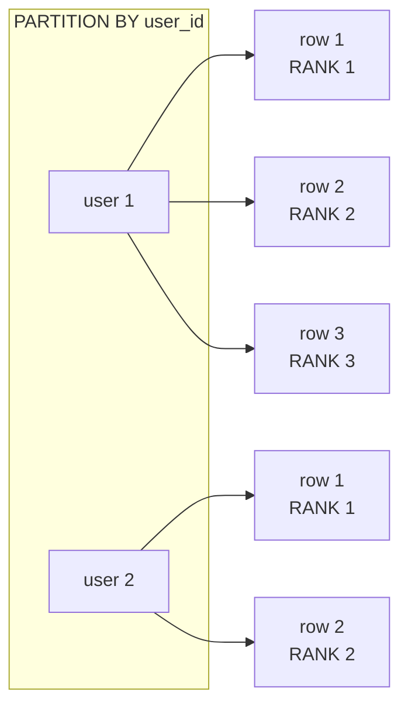

# Window Functions

> **One-liner**: Window functions compute per-row results using a "window" of related rows — like aggregates, but without collapsing the rows.

---

## Quick Reference

| Function | What it returns |
|----------|-----------------|
| `ROW_NUMBER()` | 1, 2, 3 — distinct per partition |
| `RANK()` | ties share rank, gaps after | 
| `DENSE_RANK()` | ties share rank, no gaps |
| `NTILE(n)` | bucket each row into one of n |
| `LAG(col, k)` / `LEAD(col, k)` | value k rows before / after |
| `FIRST_VALUE(col)` / `LAST_VALUE(col)` | first / last in window |
| `NTH_VALUE(col, n)` | nth in window |
| Aggregates as window: `SUM`, `AVG`, `COUNT`, `MIN`, `MAX` over a window | running totals, moving averages |
| `PERCENT_RANK()`, `CUME_DIST()` | percentiles |

| Clause | Effect |
|--------|--------|
| `OVER ()` | whole result set is the window |
| `OVER (PARTITION BY col)` | one window per distinct value of col |
| `OVER (ORDER BY col)` | window grows row-by-row in this order (running) |
| `OVER (PARTITION BY a ORDER BY b)` | running within each partition |
| `OVER (… ROWS BETWEEN n PRECEDING AND CURRENT ROW)` | sliding window frame |

---

## Core Concept

An aggregate function (`SUM`, `COUNT`) reduces N rows to 1. A **window function** computes a result for *each* row using a *window* of other rows — without collapsing.

The `OVER` clause defines that window:

- `OVER ()` — every row sees the entire result set
- `PARTITION BY group` — every row sees only rows in its group
- `ORDER BY col` — within the window, rows are ordered (gives "running" semantics)
- `ROWS/RANGE BETWEEN …` — restricts to a moving frame

This unlocks problems that are awkward with plain `GROUP BY`:

- "Each user's most recent order" (top-N per group)
- "Running total of revenue per day"
- "Difference from previous row's value"
- "Each row's rank among its peers"

The default frame for `ORDER BY` (without explicit `ROWS BETWEEN`) is `RANGE BETWEEN UNBOUNDED PRECEDING AND CURRENT ROW` — meaning "all rows up to and including this one in the order."

---

## Diagram



---

## Syntax & API

### Setup
```sql
CREATE TABLE orders (
    id        INT,
    user_id   INT,
    placed_at TIMESTAMPTZ,
    total     NUMERIC
);
INSERT INTO orders VALUES
    (1, 1, '2026-01-01', 50),
    (2, 1, '2026-01-15', 30),
    (3, 1, '2026-02-01', 80),
    (4, 2, '2026-01-10', 100),
    (5, 2, '2026-02-10', 200);
```

### ROW_NUMBER, RANK, DENSE_RANK
```sql
SELECT id, user_id, total,
       ROW_NUMBER() OVER (PARTITION BY user_id ORDER BY total DESC) AS rn,
       RANK()       OVER (PARTITION BY user_id ORDER BY total DESC) AS rk,
       DENSE_RANK() OVER (PARTITION BY user_id ORDER BY total DESC) AS dr
FROM orders;
```

### Top-N per group (canonical pattern)
```sql
WITH ranked AS (
    SELECT *, ROW_NUMBER() OVER (PARTITION BY user_id ORDER BY total DESC) AS rn
    FROM orders
)
SELECT user_id, id, total
FROM ranked
WHERE rn <= 2;
-- Top 2 orders by total per user
```

### Running total
```sql
SELECT id, user_id, placed_at, total,
       SUM(total) OVER (PARTITION BY user_id ORDER BY placed_at)
           AS running_total
FROM orders
ORDER BY user_id, placed_at;
```

### Difference from previous row (LAG)
```sql
SELECT id, placed_at, total,
       total - LAG(total) OVER (ORDER BY placed_at) AS diff_from_prev
FROM orders;
```

### Days since previous order per user (LAG with PARTITION)
```sql
SELECT user_id, placed_at,
       placed_at - LAG(placed_at) OVER (PARTITION BY user_id ORDER BY placed_at)
           AS gap
FROM orders;
```

### Moving 3-day average
```sql
SELECT id, placed_at, total,
       AVG(total) OVER (
           ORDER BY placed_at
           RANGE BETWEEN INTERVAL '2 days' PRECEDING AND CURRENT ROW
       ) AS avg_3d
FROM orders;
```

### NTILE for percentile bucketing
```sql
SELECT id, total,
       NTILE(4) OVER (ORDER BY total) AS quartile
FROM orders;
```

### Named windows (cleaner reuse)
```sql
SELECT id, total,
       ROW_NUMBER() OVER w AS rn,
       SUM(total) OVER w   AS running
FROM orders
WINDOW w AS (PARTITION BY user_id ORDER BY placed_at);
```

---

## Common Patterns

```sql
-- Pattern: deduplicate keeping latest by some column
WITH ranked AS (
    SELECT *, ROW_NUMBER() OVER (PARTITION BY email ORDER BY updated_at DESC) AS rn
    FROM users
)
DELETE FROM users
WHERE id IN (SELECT id FROM ranked WHERE rn > 1);
```

```sql
-- Pattern: gap detection (find missing IDs / dates)
SELECT id, id - LAG(id) OVER (ORDER BY id) AS gap
FROM events
WHERE id - LAG(id) OVER (ORDER BY id) > 1;   -- (won't work — see note)
-- Wrap in subquery so WHERE can reference the alias
SELECT id, gap FROM (
    SELECT id, id - LAG(id) OVER (ORDER BY id) AS gap FROM events
) t WHERE gap > 1;
```

```sql
-- Pattern: percent-of-total per group
SELECT user_id, id, total,
       100.0 * total / SUM(total) OVER (PARTITION BY user_id) AS pct_of_user
FROM orders;
```

```sql
-- Pattern: identify session boundaries (gap > 30 minutes = new session)
SELECT user_id, occurred_at,
       SUM(CASE WHEN gap > INTERVAL '30 min' THEN 1 ELSE 0 END)
           OVER (PARTITION BY user_id ORDER BY occurred_at) AS session_id
FROM (
    SELECT user_id, occurred_at,
           occurred_at - LAG(occurred_at) OVER (PARTITION BY user_id ORDER BY occurred_at) AS gap
    FROM events
) t;
```

---

## Gotchas & Tips

- **Window functions can't appear in `WHERE`** — they're computed *after* `WHERE`. Use a subquery or CTE.
- **Default frame is "running" with `ORDER BY`** — `SUM(x) OVER (ORDER BY y)` is a running sum, not a total. Add `OVER ()` (no ORDER BY) for the grand total.
- **`RANK()` vs `DENSE_RANK()`** — RANK skips after ties (1,2,2,4); DENSE_RANK doesn't (1,2,2,3).
- **`ROW_NUMBER()` is unique per partition** — even on ties. Use it for "pick exactly one per group."
- **`LAG`/`LEAD` accept a default** — `LAG(col, 1, 0)` returns 0 for the first row instead of NULL.
- **Window functions are computed after grouping** — you can apply window functions on top of `GROUP BY` results in the same query.
- **`PARTITION BY` doesn't sort the output** — only the window. Add an outer `ORDER BY` if you want sorted rows.
- **`RANGE BETWEEN INTERVAL …` only works with date/time** ordering — for row-count-based frames use `ROWS BETWEEN n PRECEDING AND CURRENT ROW`.
- **Memory** — large partitions buffer in memory; for very wide windows use indexes that match the window's `ORDER BY` to avoid sorts.

---

## See Also

- [[07 - Aggregations and Grouping]]
- [[08 - Subqueries and CTEs]]
- [[06 - Query Optimization]]
- [[11 - Set Operations and Pivoting]]
