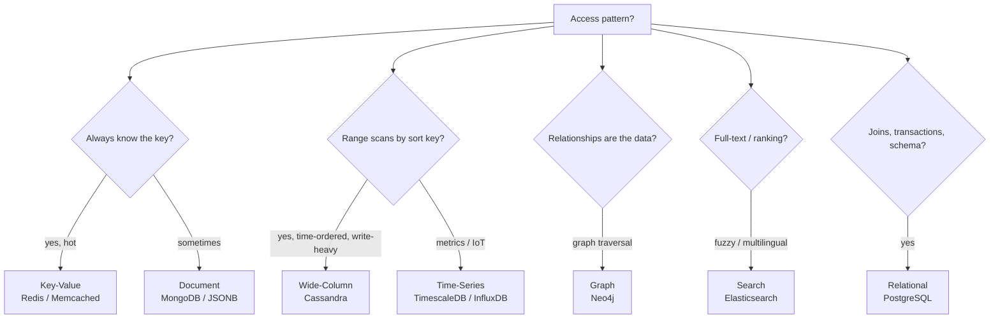

# NoSQL Fundamentals

> **One-liner**: NoSQL is a family of non-relational stores — pick by access pattern (document/key-value/wide-column/graph), not by hype.

---

## Quick Reference

| Family | Examples | Best for |
|--------|----------|----------|
| **Document** | MongoDB, Couchbase, ArangoDB | nested JSON-shaped data, flexible schema |
| **Key-Value** | Redis, DynamoDB (KV mode), Memcached | cache, session, rate-limit, hot keys |
| **Wide-Column** | Cassandra, ScyllaDB, HBase | time-series, write-heavy, predictable access patterns |
| **Graph** | Neo4j, JanusGraph, ArangoDB | relationships are the data (social, fraud, recommendation) |
| **Search** | Elasticsearch, OpenSearch, Solr | inverted indexes, ranking |
| **Time-Series** | InfluxDB, TimescaleDB, Prometheus | metrics, IoT, append-only ordered data |

| Concept | Most NoSQL | Postgres equivalent |
|---------|-----------|---------------------|
| Document | nested JSON object | JSONB column |
| Collection / table | bucket of docs | table |
| Index | secondary B-tree / hash / inverted | B-tree / GIN / GiST |
| Sharding | built-in partitioning | declarative partitioning + Citus |
| Consistency | tunable (eventual/strong) | strong by default |
| Schema | optional / on-read | enforced at write |

---

## Core Concept

"NoSQL" originally meant "Not Only SQL" — non-relational engines that prioritized one of: scale, flexibility, latency, or relationship traversal, even at the cost of ACID or query expressiveness.

Four practical questions that should drive your choice:

1. **What's the access pattern?** If you always know the key, a key-value store wins. If you traverse a graph, a graph DB wins. If you read a single document mostly whole, a document store fits. If you slice/dice many ways, relational fits.
2. **How much consistency do you need?** Banking → strong. Likes counter → eventual is fine.
3. **How big and how distributed?** Cassandra-class scale and global distribution change the answer; until then, stick with what you know.
4. **What do you give up?** Most NoSQL trade away JOINs, transactions, or schema enforcement. Make sure you don't actually need them.

A modern Postgres handles documents (JSONB), key-value (`hstore` / generic table), full-text search, time-series (with TimescaleDB), and even vectors (`pgvector`). For most apps, **start with Postgres**; reach for specialized stores when measurements show you need them.

---

## Diagram



---

## Syntax & API

### Document — MongoDB
```javascript
// Mongo shell / Compass
db.users.insertOne({
    email: 'a@b.com',
    name:  'Alice',
    addresses: [{ city: 'NYC', primary: true }],
    tags: ['founder', 'admin']
});

db.users.find({ 'addresses.city': 'NYC', tags: 'admin' });
db.users.updateOne({ email: 'a@b.com' }, { $push: { tags: 'beta' } });

// Aggregation pipeline
db.orders.aggregate([
    { $match: { country: 'US' } },
    { $group: { _id: '$user_id', total: { $sum: '$amount' } } },
    { $sort: { total: -1 } },
    { $limit: 10 }
]);
```

### Equivalent in Postgres JSONB
```sql
INSERT INTO users (email, name, profile)
VALUES ('a@b.com', 'Alice',
        '{"addresses":[{"city":"NYC","primary":true}],"tags":["founder","admin"]}');

SELECT * FROM users
WHERE profile @> '{"addresses":[{"city":"NYC"}], "tags":["admin"]}';

UPDATE users
SET profile = jsonb_set(profile, '{tags,-1}', '"beta"'::jsonb, true)
WHERE email = 'a@b.com';
```

### Key-Value — Redis
```bash
SET user:42:session "abc123" EX 3600
GET user:42:session
INCR rate:limit:ip:1.2.3.4
EXPIRE rate:limit:ip:1.2.3.4 60

# Hash (multiple fields per key)
HSET user:42 email a@b.com name Alice
HGETALL user:42

# Sorted set (leaderboard)
ZADD leaderboard 1500 alice 1200 bob 1700 carol
ZREVRANGE leaderboard 0 9 WITHSCORES        # top 10

# Pub/sub
SUBSCRIBE orders
PUBLISH orders '{"id":1, "total":50}'

# Streams (Kafka-like)
XADD mystream * field1 value1
XREAD COUNT 10 STREAMS mystream 0
```

### Wide-Column — Cassandra (CQL)
```sql
CREATE KEYSPACE shop WITH REPLICATION = {'class':'NetworkTopologyStrategy','dc1':3};

USE shop;

CREATE TABLE orders_by_user (
    user_id      UUID,
    placed_at    TIMESTAMP,
    order_id     UUID,
    total        DECIMAL,
    PRIMARY KEY ((user_id), placed_at)         -- partition key + clustering
) WITH CLUSTERING ORDER BY (placed_at DESC);

INSERT INTO orders_by_user (user_id, placed_at, order_id, total)
VALUES (uuid(), toTimestamp(now()), uuid(), 99.99);

-- Efficient: same partition, ordered by clustering key
SELECT * FROM orders_by_user
WHERE user_id = ? AND placed_at > ?
LIMIT 100;
```

### Graph — Neo4j (Cypher)
```cypher
// Create
CREATE (alice:User {name:'Alice'})
CREATE (bob:User   {name:'Bob'})
CREATE (alice)-[:FOLLOWS]->(bob)

// Friends-of-friends
MATCH (a:User {name:'Alice'})-[:FOLLOWS]->()-[:FOLLOWS]->(fof)
WHERE NOT (a)-[:FOLLOWS]->(fof) AND fof <> a
RETURN DISTINCT fof.name LIMIT 10

// Shortest path
MATCH p = shortestPath((a:User {name:'Alice'})-[:FOLLOWS*..6]->(b:User {name:'Carol'}))
RETURN p
```

### .NET clients
```csharp
// MongoDB driver
var client = new MongoClient("mongodb://localhost:27017");
var db = client.GetDatabase("shop");
var users = db.GetCollection<BsonDocument>("users");
await users.InsertOneAsync(new BsonDocument { { "email", "a@b.com" }, { "name", "Alice" } });

// Redis (StackExchange.Redis)
var muxer = await ConnectionMultiplexer.ConnectAsync("localhost");
var db = muxer.GetDatabase();
await db.StringSetAsync("user:42:session", "abc123", TimeSpan.FromHours(1));
```

---

## Common Patterns

```text
Pattern: cache aside (Redis in front of Postgres)
1. read → cache hit → return
2. cache miss → DB read → set cache (TTL) → return
3. write → DB write → invalidate or update cache

Pattern: write-only event log to wide-column
- Cassandra/Scylla shines for "millions of writes/sec, predictable access pattern"
- Model partitions to match the *read* path (e.g., partition by (user_id, day))

Pattern: graph for relationship-heavy queries, relational for tables
- Use Postgres for the system of record
- Mirror "social graph" subset to Neo4j for traversals
- Synced via CDC (see 13 - ETL and CDC)
```

---

## Gotchas & Tips

- **"Schema-less" is a mirage** — every read assumes some shape. The schema lives in your code instead of the DB. Make it explicit.
- **Joins disappear** — most NoSQL stores can't (or shouldn't) JOIN. Either denormalize or move logic into the app.
- **Eventual consistency is real** — read your own writes might not work without explicit settings. Plan for it.
- **Transactions are limited** — Mongo has multi-doc transactions but they're slow. Cassandra uses lightweight transactions sparingly. Keep the tx scope tiny.
- **Indexing patterns differ** — Cassandra indexes are weak; you design schemas around expected queries, not the other way around.
- **Hot partition kills wide-column DBs** — a partition key that gets all the writes overwhelms one node. Plan key distribution.
- **Postgres covers a lot of "NoSQL" turf** — JSONB, hstore, FTS, pgvector. Don't introduce a new store without measuring you need it.
- **Operational cost compounds** — each new store is monitoring, backups, security, on-call. NoSQL ROI requires real scale or feature gaps.
- **CAP isn't a checkbox** — see [[04 - CAP and PACELC]]. "AP" doesn't mean infinite availability under all conditions.
- **Vendor lock-in** — DynamoDB queries don't transfer to Mongo or Cassandra. Plan exit strategy.

---

## See Also

- [[01 - Database Overview]]
- [[18 - JSON and JSONB]]
- [[04 - CAP and PACELC]]
- [[14 - Time-Series Databases]]
- [[15 - Graph Databases]]
- [[16 - Search Engines]]
