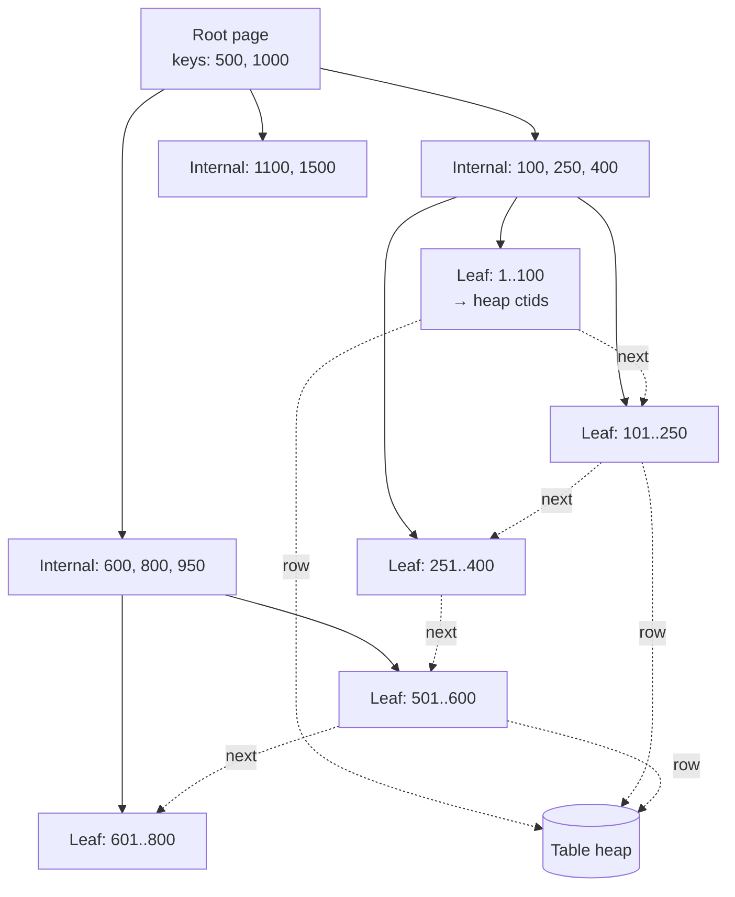

# B-Tree Internals

> **One-liner**: A B-tree is a sorted, balanced multi-way tree that finds any row in `O(log n)` — but only if your `WHERE` clause lets the planner walk the tree from the root. Most "slow query" tickets are queries that *look* indexed but secretly defeat the walk.

---

## Quick Reference

| Item | Value / fact |
|------|--------------|
| Default index in Postgres | B-tree (literally a **B+tree**) |
| Lookup complexity | `O(log n)` — height ~3–4 even for 1B rows |
| Operators it supports | `=`, `<`, `<=`, `>`, `>=`, `BETWEEN`, `IN`, `IS NULL`, `LIKE 'prefix%'` |
| Operators it does **not** support | `LIKE '%suffix'`, `LIKE '%middle%'`, `<>`, `!=`, `NOT IN` (mostly) |
| Page size | 8 KB by default → ~hundreds of keys per page → very high fanout |
| Sorted? | Yes — leaves are doubly linked for in-order range scans |
| Killers of B-tree use | function-wrapped column, leading wildcard, type mismatch, `OR` with unindexed sibling, low selectivity |
| Cure for `LIKE '%foo%'` | `pg_trgm` GIN index, full-text search, or external search engine |
| Inspect | `EXPLAIN (ANALYZE, BUFFERS) <query>` |

---

## Core Concept

A **B-tree** (Postgres uses a **B+tree** variant) is a sorted, self-balancing tree built for disk. Three properties make it the workhorse of relational databases:

1. **High fanout** — each 8 KB page stores hundreds of keys, so the tree stays shallow. A B-tree over 1 billion rows is typically 4 levels deep. Three or four random page reads finds any row.
2. **Sorted leaves with sibling pointers** — once you locate the start of a range, you walk leaves left-to-right without going back to the root. That makes `WHERE x BETWEEN a AND b` and `ORDER BY x` essentially free.
3. **Self-balancing** — inserts split full pages; deletes merge sparse pages. The tree height changes only rarely.

**Why B-tree dominates**: it answers equality, range, sort, `IS NULL`, and **prefix** `LIKE` — the four predicate shapes that cover ~95% of OLTP queries. Other index types (GIN, GiST, BRIN) only beat B-tree for specific shapes (substring search, JSONB containment, geometry, append-only time-series).

**Why queries silently bypass it**: the planner can only walk the tree if the `WHERE` predicate **isolates a starting key**. Any expression that hides the column's literal value behind a function, cast, or wildcard prefix turns the lookup into a sequential scan. This is the **sargability** rule, and it is the #1 cause of "we have an index but the query is still slow".

---

## Diagram



*Lookup of key `350`*: Root says "350 < 500" → go left. Internal says "250 ≤ 350 < 400" → go to Leaf `251..400`. Leaf has the key and a pointer to the heap row. Three page reads, done.

*Range scan of `300 ≤ key ≤ 700`*: Find `300` (3 reads), then walk leaf siblings rightward until you cross `700`. No re-traversal.

---

## Syntax & API

### Build, inspect, drop

```sql
CREATE TABLE orders (
    id          BIGINT GENERATED ALWAYS AS IDENTITY PRIMARY KEY,
    user_id     BIGINT NOT NULL,
    placed_at   TIMESTAMPTZ NOT NULL,
    status      TEXT NOT NULL,
    total_cents BIGINT NOT NULL
);

-- Default = B-tree; "USING btree" is implicit
CREATE INDEX idx_orders_user        ON orders (user_id);
CREATE INDEX idx_orders_placed_desc ON orders (placed_at DESC);
CREATE INDEX idx_orders_user_placed ON orders (user_id, placed_at DESC);

\d orders                              -- list indexes (psql)
SELECT * FROM pg_indexes
WHERE tablename = 'orders';

DROP INDEX CONCURRENTLY idx_orders_user;
```

### Verify the planner uses it

```sql
EXPLAIN (ANALYZE, BUFFERS)
SELECT id, total_cents
FROM orders
WHERE user_id = 42
ORDER BY placed_at DESC
LIMIT 10;

-- Good plan:
--   Limit
--     -> Index Scan using idx_orders_user_placed on orders
--          Index Cond: (user_id = 42)
```

If you see `Seq Scan` on a big table, your predicate isn't sargable, the table is small enough that the planner picked a scan, or statistics are stale (`ANALYZE orders;`).

---

## Common Patterns

### Equality + range together

```sql
-- Query: WHERE user_id = ? AND placed_at >= ?
CREATE INDEX idx_orders_user_placed ON orders (user_id, placed_at);
-- Equality column FIRST, range column SECOND. Always.
```

The planner walks the tree to `(user_id = 42, placed_at = lower_bound)`, then scans leaves rightward. If you reverse the order — `(placed_at, user_id)` — every distinct `placed_at` requires a separate sub-scan. Slower by orders of magnitude.

### Prefix LIKE — yes, this works

```sql
CREATE INDEX idx_users_email ON users (email);

EXPLAIN ANALYZE
SELECT * FROM users WHERE email LIKE 'alice@%';
-- Index Scan using idx_users_email
--   Index Cond: (email >= 'alice@' AND email < 'alice@A0')
```

The planner *rewrites* `LIKE 'alice@%'` into a half-open range. **Critical caveat**: this only works if the database collation is `C` / binary, or if you create the index with `text_pattern_ops`:

```sql
-- Required if your DB collation is en_US.UTF-8 or similar
CREATE INDEX idx_users_email_pattern
    ON users (email text_pattern_ops);
```

Without `text_pattern_ops`, locale-aware sort order means `'alice@'` and `'alice@~'` aren't necessarily adjacent in the index, and `LIKE 'foo%'` falls back to a sequential scan.

### Range + ORDER BY without a sort step

```sql
-- DESC index direction matches the query's ORDER BY
CREATE INDEX idx_posts_published_desc ON posts (published_at DESC);

SELECT id, title FROM posts
WHERE published_at >= now() - INTERVAL '7 days'
ORDER BY published_at DESC
LIMIT 20;
-- Plan: Index Scan, no Sort node. Reads first 20 leaf entries, stops.
```

Without the matching direction, Postgres can still walk the index backward — but for composite indexes, mixed directions (`a ASC, b DESC`) require explicit `ORDER BY a, b DESC` or you lose the sort optimization.

### Covering for index-only scans

```sql
CREATE INDEX idx_orders_user_cover
    ON orders (user_id) INCLUDE (total_cents, placed_at);

SELECT total_cents, placed_at
FROM orders WHERE user_id = 42;
-- Index Only Scan — never touches the heap (assuming visibility map is fresh)
```

Index-only scans are 5–20× faster than heap fetches because they skip the random I/O to the table.

### Partial index for hot subsets

```sql
CREATE INDEX idx_orders_pending
    ON orders (placed_at)
    WHERE status = 'pending';

SELECT * FROM orders WHERE status = 'pending' ORDER BY placed_at LIMIT 1;
-- Tiny index (only "pending" rows), tiny tree height, lightning fast
```

---

## The LIKE Trap — Why a Single Wildcard Destroys Performance

This is the single most common reason "indexed" queries are slow in production. A B-tree is sorted lexicographically by the **leading characters** of the indexed column. Walking the tree requires a **known prefix** to navigate from the root.

| Pattern | Sargable? | Why |
|---------|-----------|-----|
| `LIKE 'alice%'` | ✅ Yes | Rewritten as `email >= 'alice' AND email < 'alicf'` — clean range walk |
| `LIKE '%@gmail.com'` | ❌ **No** | No leading anchor. Could match `'a@gmail.com'`, `'zz@gmail.com'`, anything. Full scan. |
| `LIKE '%alice%'` | ❌ **No** | Substring. No anchor at either end. Full scan. |
| `ILIKE 'alice%'` | ⚠️ Usually no | Case-insensitive — `'A'` and `'a'` live in different parts of the tree. Use `LOWER()` + expression index, or `citext`. |
| `LIKE 'a_ice'` | ⚠️ Partial | `_` after the prefix `a` is OK; planner uses `a` as the range start, then re-checks each row. |

### Worked example — the `%search%` disaster

A frontend "search" input naively wraps user text in `%`:

```sql
-- Innocent-looking ORM query
SELECT id, name FROM users
WHERE name ILIKE '%' || $1 || '%';
```

With 5 million users:

```sql
EXPLAIN ANALYZE
SELECT id, name FROM users WHERE name ILIKE '%alic%';

--  Seq Scan on users  (cost=0.00..104250.00 rows=500 width=40)
--    Filter: (name ~~* '%alic%'::text)
--  Execution Time: 2847.213 ms
```

Every. Single. Row. Read. Filtered. Discarded. 2.8 seconds, full CPU on the DB box, autoscaler wakes up at 2 AM.

The `B-tree on name` exists. The planner cannot use it. The wildcard at the front means there is no key prefix to seek to — the only correct answer is to read every row and apply the filter.

### Three real fixes

**Fix 1 — change the UX to prefix search.** Often the simplest. "Starts with" matches user mental models for autocomplete.

```sql
SELECT id, name FROM users WHERE name ILIKE 'alic%';
-- With LOWER() expression index OR text_pattern_ops index → fast
CREATE INDEX idx_users_name_lower ON users (LOWER(name) text_pattern_ops);
SELECT id, name FROM users WHERE LOWER(name) LIKE 'alic%';
```

**Fix 2 — trigram GIN index** (`pg_trgm`). The only built-in index type that handles `LIKE '%foo%'`. Splits each string into 3-character grams and indexes the grams.

```sql
CREATE EXTENSION IF NOT EXISTS pg_trgm;

CREATE INDEX idx_users_name_trgm
    ON users USING gin (name gin_trgm_ops);

EXPLAIN ANALYZE
SELECT id, name FROM users WHERE name ILIKE '%alic%';
-- Bitmap Index Scan on idx_users_name_trgm
-- Execution Time: 18.4 ms       ← 150× faster
```

Tradeoffs: GIN indexes are larger and slower to write. Acceptable if reads dominate.

**Fix 3 — full-text search** (`tsvector` + GIN). For natural-language search across multiple columns with ranking and stemming. Heavier setup, much better relevance. See [[19 - Full-Text Search]].

**Fix 4 — reverse-string trick for suffix-only.** When you genuinely need `LIKE '%@example.com'`:

```sql
CREATE INDEX idx_users_email_reversed ON users (reverse(email) text_pattern_ops);

SELECT * FROM users
WHERE reverse(email) LIKE reverse('%@example.com');
-- equivalent to: reverse(email) LIKE 'moc.elpmaxe@%'
-- Now it's a prefix scan on the reversed index
```

---

## Other Sneaky Index Killers

The same "no anchor in the tree" failure mode appears whenever you transform the indexed column. The index is on `email`, not on `LOWER(email)` — so the tree key for row `{email: 'X@Y.com'}` is `'X@Y.com'`, not `'x@y.com'`. The planner has no way to map a query value back through your transformation.

### Function on the indexed column

```sql
-- ❌ idx_users_email is useless here
SELECT * FROM users WHERE LOWER(email) = 'a@b.com';

-- ✅ Either match the index expression…
CREATE INDEX idx_users_email_lower ON users (LOWER(email));
SELECT * FROM users WHERE LOWER(email) = 'a@b.com';

-- …or normalize at write time and query the raw column
INSERT INTO users (email) VALUES (LOWER($1));
SELECT * FROM users WHERE email = 'a@b.com';
```

### Arithmetic on the indexed column

```sql
-- ❌ Index on (price) won't be used
SELECT * FROM products WHERE price * 1.2 > 100;

-- ✅ Move the math to the literal side
SELECT * FROM products WHERE price > 100 / 1.2;
```

### Implicit type cast (the silent killer)

```sql
-- Column is BIGINT; parameter sent as text from a buggy client
SELECT * FROM orders WHERE id = '42';
-- Postgres injects ::bigint cast. Usually fine, but the dual case bites:

-- Column is TEXT (e.g., a SKU stored as text), parameter sent as int
SELECT * FROM products WHERE sku = 12345;
-- Postgres rewrites to: WHERE sku::bigint = 12345
-- Now the column is wrapped in a cast → index on (sku) is bypassed.

-- ✅ Match the parameter type to the column type
SELECT * FROM products WHERE sku = '12345';
```

`.NET` callers using Dapper or ADO.NET should pass the correct DbType (`DbType.String` for text columns), or pass typed values — not literals.

### `OR` across columns where one is unindexed

```sql
-- Index on (email), no index on (phone)
SELECT * FROM users WHERE email = 'x' OR phone = 'y';
-- Planner falls back to Seq Scan because phone has no index
```

**Fix**: index both columns and let Postgres do `BitmapOr`, or split into two queries `UNION ALL`.

### Negative predicates

```sql
SELECT * FROM users WHERE status <> 'active';
-- B-tree can't seek to "everything except X" efficiently. Usually a Seq Scan.
```

If most rows have `status = 'active'` and you want the rare exceptions, use a partial index:

```sql
CREATE INDEX idx_users_inactive ON users (id) WHERE status <> 'active';
```

### Low-selectivity columns

```sql
-- 50% of rows are is_active = true. Index is bigger than useful.
CREATE INDEX idx_users_active ON users (is_active);
SELECT * FROM users WHERE is_active = true;
-- Planner correctly chooses Seq Scan; the index sits there wasting writes.
```

A B-tree only earns its keep when the predicate filters the table down to **<5–10%** of rows. For low-selectivity flags, use a **partial index** that only contains the rare value, or no index at all.

### Out-of-order composite columns

```sql
CREATE INDEX idx_orders_user_status ON orders (user_id, status);

SELECT * FROM orders WHERE status = 'pending';
-- ❌ Skips user_id → can't use the index. Left-prefix rule.
```

Add a separate index on `(status)` or reorder the composite. See [[10 - Indexes Basics]].

---

## Use Cases — When B-Tree Is the Right Choice

| Scenario | Why B-tree wins |
|----------|----------------|
| **Primary key lookup** (`WHERE id = ?`) | Equality on a unique column; one tree walk, one heap fetch |
| **Foreign-key joins** | Walk the FK index on the inner side of the join |
| **Time-range queries** (`WHERE created_at BETWEEN … AND …`) | Range walk on sorted leaves |
| **`ORDER BY` + `LIMIT`** | Index direction matches → no sort step, stops after `LIMIT` |
| **Top-N per group** with composite `(group_id, sort_col DESC)` | Walk to group, take first N leaves |
| **Uniqueness enforcement** (`UNIQUE` constraint) | B-tree's sorted structure makes "does this value exist" O(log n) |
| **Prefix autocomplete** (`LIKE 'inp%'`) | Range rewrite, walks leaves until prefix changes |
| **`IS NULL` lookup** | Postgres indexes NULLs; planner can seek straight to them |

### When B-tree is the *wrong* choice

| Scenario | Better choice |
|----------|---------------|
| Substring / fuzzy text search (`LIKE '%foo%'`) | GIN + `pg_trgm` ([[05 - Indexes Advanced]]) |
| Containment in arrays / JSONB (`@>`, `?`) | GIN |
| Range / geometry containment | GiST |
| Billion-row append-only logs queried by time | BRIN |
| Vector similarity (embeddings) | `pgvector` HNSW / IVFFlat |

---

## Gotchas & Tips

- **`text_pattern_ops` is required for `LIKE 'prefix%'` on non-C collations.** Default `en_US.UTF-8` databases will fall back to `Seq Scan` on a normal text index. Either create the index with `text_pattern_ops` or initialize the DB with `--locale=C`.
- **Implicit casts are invisible in your code but visible in `EXPLAIN`.** Look for `(col)::text` or `(col)::numeric` in the `Filter` line — that's a wrapped column, no index use. Fix the parameter type at the application layer.
- **Composite-index column order is the #1 design choice.** Equality columns first, range column last. `(user_id, placed_at)` not `(placed_at, user_id)`.
- **`ORDER BY DESC` works without a `DESC` index** — Postgres walks B-trees in either direction. But a *composite* `ORDER BY a ASC, b DESC` needs an index that exactly matches, or the planner adds a `Sort` node.
- **Bloat eats performance.** Heavy `UPDATE`/`DELETE` churn leaves dead entries in B-tree pages. Run `REINDEX INDEX CONCURRENTLY idx_name;` periodically (or rely on Postgres 14+'s in-place recycling, which is much better).
- **`pg_stat_user_indexes` reveals dead weight.** `WHERE idx_scan = 0` after a representative production window → drop those indexes. Each unused index slows every write.
- **`ANALYZE` keeps the planner honest.** After bulk loads or large data changes, manually `ANALYZE table_name` so row-count and selectivity estimates are fresh. Bad stats → planner picks `Seq Scan` over a perfectly good index.
- **`Index Scan` vs `Index Only Scan`** — the latter avoids the heap entirely, possible when (a) the index is covering and (b) the visibility map says all rows are visible. Run `VACUUM` to keep the visibility map fresh.
- **`LIKE` with a parameter that *starts* with `%` is the most common production footgun.** Audit your ORM / search code paths. If the input pattern is constructed with leading `%`, you have a Seq Scan in disguise.
- **Use `EXPLAIN (ANALYZE, BUFFERS)` not `EXPLAIN`.** The estimated plan often differs from the actual one. `BUFFERS` reveals whether you're hitting cache or disk — critical for diagnosing inconsistent latency.
- **B-tree `IS NULL` is supported but not `IS NOT NULL`-selective.** If most rows are non-null, `IS NOT NULL` is a near-full scan. Add a partial index `WHERE col IS NULL` if NULL is the rare case.

---

## See Also

- [[10 - Indexes Basics]] — entry point: what an index is, when to add one
- [[05 - Indexes Advanced]] — GIN, GiST, BRIN, partial, covering
- [[06 - Query Optimization]] — `EXPLAIN ANALYZE`, sargability, plan reading
- [[19 - Full-Text Search]] — `tsvector` + GIN for natural-language search
- [[18 - JSON and JSONB]] — JSONB indexing patterns
- [[09 - Performance Tuning]] — `pg_stat_statements`, plan regression
