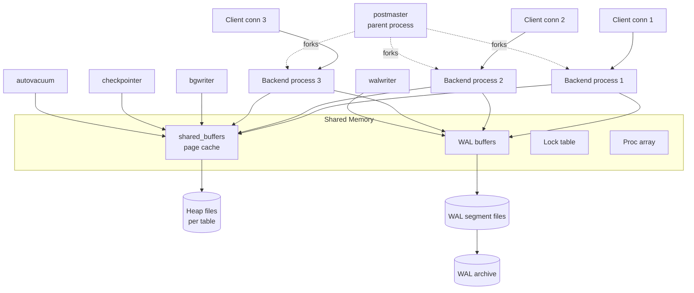

# PostgreSQL Architecture

> **One-liner**: PostgreSQL is a process-per-connection RDBMS that achieves concurrency through MVCC (every write creates a new row version) and durability through the WAL — a single sequential log every change is appended to before it touches the heap.

---

## Quick Reference

| Item | Value / Fact |
|------|--------------|
| Process model | `postmaster` forks one OS process per client connection |
| Concurrency control | MVCC — readers never block writers, writers never block readers |
| Durability mechanism | Write-Ahead Log (WAL) — flushed before commit returns |
| Default page size | 8 KB |
| Storage layout | Heap files per table + per-index B-tree files + TOAST for >2 KB values |
| Default index type | B-tree (B+tree variant) |
| Background workers | `checkpointer`, `bgwriter`, `walwriter`, `autovacuum launcher/workers`, `archiver`, `logical replication workers` |
| Default isolation | Read Committed |
| Replication | Streaming (physical, byte-for-byte WAL) or Logical (decoded change stream) |
| Pluggable storage engine | No — heap-only since v12 introduced the API but no in-tree alternative |
| Extensibility | First-class: PostGIS, pgvector, TimescaleDB, pg_trgm, pg_stat_statements, citus |
| Inspect runtime | `pg_stat_activity`, `pg_stat_bgwriter`, `pg_stat_replication`, `pg_stat_wal` |

---

## Core Concept

PostgreSQL runs as a **family of cooperating OS processes**, not threads. The `postmaster` supervisor listens on the TCP port and **forks a dedicated backend process** for every new client connection. All backends share one region of OS-level **shared memory**. The model is crash-isolated (one backend can't corrupt another) and is why a single Postgres connection costs ~10 MB of resident memory.

Inside shared memory live four critical structures: `shared_buffers` is the page cache holding 8 KB pages; the **WAL buffer** stages log records before flush; the **lock table** records every row, page, and relation lock; the **proc array** lists every active backend and its current transaction ID. Background workers — `bgwriter`, `checkpointer`, `walwriter`, `autovacuum` — read and write these structures without ever holding a client.

Concurrency is **MVCC** (Multi-Version Concurrency Control). An `UPDATE` does not overwrite a row — it inserts a new tuple version and marks the old one with the updating transaction's ID. Readers see whichever version was visible at the start of their snapshot. The consequence: **readers never take row locks and never block writers**, and vice versa. The cost: dead tuples accumulate, and `autovacuum` must continuously reclaim them.

Durability is the **WAL**. Every page modification is first appended as a WAL record. On `COMMIT`, the WAL is `fsync`-ed to disk; only later — during a `CHECKPOINT` — does the dirty heap page get written back. If the cluster crashes, recovery replays the WAL from the last checkpoint forward. The WAL is also the substrate for streaming replication, PITR, and logical decoding.

Postgres scales **vertically first**. Horizontal scale is layered on: read replicas via streaming replication, sharding via Citus or app-level partitioning, and logical replication for selective fan-out.

---

## Diagram

### Process and memory model



### Write path for an UPDATE

```mermaid
sequenceDiagram
    participant C as Client
    participant BE as Backend
    participant SB as shared_buffers
    participant WB as WAL buffer
    participant DSK as Disk
    C->>BE: BEGIN; UPDATE...
    BE->>SB: Load page (cache miss → read from disk)
    BE->>SB: Insert NEW tuple version<br/>mark OLD tuple xmax=tx_id
    BE->>WB: Append WAL record
    C->>BE: COMMIT
    BE->>WB: WAL flush (fsync)
    WB->>DSK: WAL durable
    BE-->>C: OK
    Note over SB,DSK: Heap page stays dirty in cache;<br/>checkpointer flushes later
```

*Reading the diagrams together*: the backend does **all the work inside shared memory** — it reads the heap page through `shared_buffers`, writes the new tuple version there, and appends the change to the WAL buffer. The only synchronous disk I/O on the hot path is the WAL `fsync` at commit. The heap page itself isn't required to hit disk until the next checkpoint, which is what lets Postgres absorb write bursts.

---

## Syntax & API

### Inspect the running cluster

```sql
-- Who is connected, what are they running, and are they idle in transaction?
SELECT pid, usename, application_name, state, wait_event_type, wait_event,
       now() - xact_start AS tx_age, query
FROM pg_stat_activity
WHERE state IS NOT NULL
ORDER BY tx_age DESC NULLS LAST;

-- Background writer / checkpointer stats — are checkpoints bursty?
SELECT checkpoints_timed, checkpoints_req,
       checkpoint_write_time, checkpoint_sync_time,
       buffers_checkpoint, buffers_clean, buffers_backend
FROM pg_stat_bgwriter;

-- WAL-generation rate (Postgres 14+)
SELECT wal_records, wal_fpi, wal_bytes, wal_buffers_full, wal_write_time, wal_sync_time
FROM pg_stat_wal;

-- Current memory and WAL settings
SHOW shared_buffers;     -- e.g. '128MB' (dev default) → '8GB' in prod
SHOW max_wal_size;       -- target ceiling between checkpoints
SHOW max_connections;    -- hard cap; raise carefully
```

```bash
# psql meta-commands — list databases with sizes and tablespaces
psql -U postgres -c '\l+'

# Per-database object sizes
psql -d mydb -c '\dt+'   # tables
psql -d mydb -c '\di+'   # indexes
```

### Watch MVCC in action

Open two psql sessions side by side. The point is that **Session B's SELECT is never blocked** by Session A's open `UPDATE`, and the visibility flips the instant Session A commits.

```sql
-- Session A
BEGIN;
UPDATE users SET name = 'Alice v2' WHERE id = 1;
-- DO NOT COMMIT YET
```

```sql
-- Session B (runs concurrently — does NOT block)
SELECT id, name FROM users WHERE id = 1;
-- → 'Alice v1'  (old version, A's tx not yet visible)
```

```sql
-- Session A
COMMIT;
```

```sql
-- Session B
SELECT id, name FROM users WHERE id = 1;
-- → 'Alice v2'  (new version is now committed and visible)
```

Inspect the system columns that drive the visibility check. `xmin` is the transaction that created the row version; `xmax` is the transaction that deleted/superseded it (0 if still live).

```sql
SELECT id, name, xmin, xmax FROM users WHERE id = 1;
-- After the COMMIT above, the row will have a fresh xmin and xmax = 0.
-- The OLD version still sits in the heap with xmax = (A's tx id) until autovacuum reaps it.
```

### Inspect WAL and force a checkpoint

```sql
-- Current WAL position (Log Sequence Number) — opaque cursor into the log
SELECT pg_current_wal_lsn();
-- → 0/4F3A8B20

-- Translate the LSN to the on-disk WAL file name
SELECT pg_walfile_name(pg_current_wal_lsn());
-- → 000000010000000000000004

-- Force a switch to a new WAL segment (useful for log shipping / testing)
SELECT pg_switch_wal();

-- Force a checkpoint NOW (writes dirty buffers, fsyncs, marks WAL recyclable).
-- Requires superuser. Avoid on a busy production box — it generates a write storm.
CHECKPOINT;
```

---

## Common Patterns

### Tuning checkpoint behavior

Checkpoints flush every dirty `shared_buffers` page to disk. The default settings produce **bursty I/O** — long quiet periods punctuated by write storms that stall foreground queries.

```sql
-- postgresql.conf (or ALTER SYSTEM SET ...)
checkpoint_timeout = '15min';            -- default 5min; longer = fewer, bigger checkpoints
max_wal_size = '8GB';                    -- ceiling between checkpoints; raise to delay them
checkpoint_completion_target = 0.9;      -- spread writes over 90% of the interval
```

Rule of thumb: aim for **timed** checkpoints (`checkpoints_timed`) to outnumber **requested** ones (`checkpoints_req`) in `pg_stat_bgwriter` by at least 10:1. A high `checkpoints_req` count means `max_wal_size` is too small — Postgres is forced to checkpoint to free WAL space.

### Autovacuum tuning

`autovacuum_vacuum_scale_factor` is the fraction of a table's rows that must change before autovacuum kicks in. The default of `0.2` (20%) is far too lazy for large, hot tables — a 100 M-row table waits for 20 M dead rows before vacuuming.

```sql
-- Global override (postgresql.conf)
autovacuum_vacuum_scale_factor = 0.1;

-- Per-table override — preferred. Hot tables get aggressive vacuum, cold tables don't.
ALTER TABLE orders SET (autovacuum_vacuum_scale_factor = 0.05);
ALTER TABLE orders SET (autovacuum_vacuum_cost_limit = 2000);

-- Inspect: when did autovacuum last run, how many dead tuples?
SELECT relname, n_live_tup, n_dead_tup,
       last_autovacuum, autovacuum_count
FROM pg_stat_user_tables
ORDER BY n_dead_tup DESC
LIMIT 10;
```

### Streaming replication (physical) — minimal setup

Streaming replication sends raw WAL bytes from primary to standby. The standby continuously replays WAL and stays a few milliseconds behind. Failover promotes a standby to primary.

```bash
# On the PRIMARY: create a replication user and allow it in pg_hba.conf
psql -c "CREATE ROLE replicator WITH REPLICATION LOGIN PASSWORD 'changeme';"
echo "host replication replicator 10.0.0.0/24 scram-sha-256" >> $PGDATA/pg_hba.conf

# postgresql.conf on the primary
# wal_level = replica       (default)
# max_wal_senders = 10
# wal_keep_size = '1GB'

# On the STANDBY: take a base backup, stream WAL while doing so
pg_basebackup \
  -h primary.host -U replicator -D /var/lib/postgresql/data \
  -X stream -P -R                # -R writes standby.signal + primary_conninfo

# Start the standby — it boots into recovery and streams from the primary
pg_ctl -D /var/lib/postgresql/data start
```

```bash
# Verify on the primary
psql -c "SELECT client_addr, state, sync_state, replay_lag FROM pg_stat_replication;"
```

### Logical replication — minimal setup

Logical replication decodes WAL into a stream of row-level changes and replicates **selected tables** to a different cluster (possibly different Postgres major version, different schema, different platform).

```sql
-- On the PUBLISHER (source)
-- postgresql.conf: wal_level = logical
CREATE PUBLICATION orders_pub FOR TABLE orders, order_items;

-- On the SUBSCRIBER (destination), schema must already exist
CREATE SUBSCRIPTION orders_sub
  CONNECTION 'host=publisher.host dbname=appdb user=repl password=changeme'
  PUBLICATION orders_pub;

-- Inspect progress on the subscriber
SELECT subname, received_lsn, latest_end_lsn, latest_end_time
FROM pg_stat_subscription;
```

Use logical replication for: cross-version upgrades, selective replication, sharding-like fan-out. Use physical streaming for: HA standbys, exact byte-for-byte clones, PITR archives.

### Comparison with the other two engines

| Dimension | PostgreSQL | SQL Server | MongoDB |
|-----------|------------|------------|---------|
| **Model** | Relational (SQL) | Relational (T-SQL) | Document (BSON) |
| **Process model** | Process-per-connection (postmaster forks a backend) | Single process, user-mode scheduler (SQLOS) with thread pool | Single process (`mongod`), thread-per-connection |
| **Storage unit** | 8 KB pages, heap files + TOAST for large values | 8 KB pages grouped into 64 KB extents (`.mdf`/`.ndf`) | BSON documents in collections; WiredTiger files |
| **Storage engine** | Heap + B-tree/GIN/GiST/BRIN indexes | Pluggable (rowstore, columnstore, in-memory Hekaton) | WiredTiger (default; B-tree or LSM) |
| **Concurrency** | MVCC via heap-tuple versioning (no read locks) | Locking by default; optional MVCC via Snapshot Isolation / RCSI | MVCC via WiredTiger, document-level locking |
| **Durability** | WAL (Write-Ahead Log) + fsync at commit | Transaction log (`.ldf`) + WAL discipline | Journal (per-write) + oplog (per-replica-set) |
| **Default isolation** | Read Committed | Read Committed (locking) | Snapshot (within a transaction); read-uncommitted-ish outside |
| **Transactions** | Full ACID, any statement set | Full ACID, any statement set | Multi-document since 4.0 (replica set) / 4.2 (sharded) |
| **Replication** | Streaming (physical WAL) + Logical (decoded) | Always On Availability Groups (sync/async) + log shipping | Replica set: primary + secondaries replay the oplog |
| **HA / failover** | Patroni / repmgr / pg_auto_failover (external) | Built-in AG automatic failover with WSFC quorum | Built-in via replica set election (Raft-like) |
| **Horizontal scale** | Manual partitioning + Citus extension | Partitioned tables; sharding via SQL Sharding/Synapse | First-class sharding via `mongos` + config servers |
| **Query planner** | Cost-based, plans cached per prepared statement | Cost-based, plans cached aggressively in the plan cache | Rule-based + cost-based hybrid; plan cache per query shape |
| **Extension model** | First-class extensions (PostGIS, pgvector, TimescaleDB, pg_trgm) | Built-in feature surface + CLR assemblies; few "extensions" in the Postgres sense | Limited; some features behind Atlas-only flags |
| **Strongest fit** | OLTP + mixed analytics, JSON-and-SQL, GIS, embeddings, open-source TCO | Windows/.NET enterprises, BI stack (SSAS/SSRS/SSIS), Azure SQL hybrid | Flexible schema, hierarchical/polymorphic data, content/CMS, IoT |
| **Weakest fit** | Massive horizontal scale without extensions | Cross-platform OSS preferences; licensing cost at scale | Cross-document joins/transactions at scale; strict relational integrity |

---

## Gotchas & Tips

- **MVCC means every `UPDATE` is effectively `DELETE` + `INSERT` at the row level.** Heavily updated tables bloat without aggressive autovacuum — a 1 GB table with a 50 %-churn workload can balloon to 5 GB if vacuum can't keep up.
- **`VACUUM` does not return disk to the OS.** It marks space inside the file as reusable. Only `VACUUM FULL` rewrites the table to a new file (and takes an `ACCESS EXCLUSIVE` lock, blocking everything). For online compaction use the `pg_repack` extension.
- **A backend process costs ~10 MB+ of resident memory** and includes a private catalog cache, query plan cache, and work_mem allocation. 5,000 idle connections = 50 GB of RAM evaporated. Always front Postgres with **PgBouncer** in transaction-pooling mode. See [[13 - Connection Management]].
- **`synchronous_commit = off` trades durability for throughput.** Commits return *before* the WAL is fsynced; a crash can lose the last ~200 ms of "committed" transactions. Acceptable for analytics ingest, never for financial transactions.
- **The WAL is the only source of truth for replication and PITR.** If you `rm` a WAL segment or set `wal_keep_size` too low, standbys fall behind and have to be rebuilt from scratch. Use a replication slot to pin WAL retention to actual standby progress.
- **`pg_stat_statements` is the highest-ROI performance extension.** Enable it in every cluster. It aggregates per-query-shape execution time, call count, and I/O, and is the entry point to every Postgres performance investigation. See [[09 - Performance Tuning]].
- **Default `shared_buffers = 128 MB` is a developer-laptop default.** In production, set it to **~25 % of system RAM** (e.g. 8 GB on a 32 GB box). The OS page cache handles the rest — Postgres deliberately relies on double-buffering with the kernel.
- **`max_connections` interacts with shared memory sizing.** Each connection slot reserves lock-table and proc-array entries at startup. Bumping `max_connections` from 100 to 5000 inflates static shared-memory allocation and offers diminishing returns versus a connection pooler. Pool first, raise the cap second.
- **Long-running transactions hold back the global `xmin` horizon.** While a transaction is open, autovacuum **cannot reclaim** any tuple version that might still be visible to it — even on unrelated tables. A single forgotten `BEGIN` in psql can cause cluster-wide bloat. Hunt them with `SELECT pid, xact_start, query FROM pg_stat_activity WHERE state = 'idle in transaction';`.
- **The planner uses `ANALYZE` statistics, not live data.** After bulk loads, large deletes, or schema changes, run `ANALYZE table_name;` manually. Stale stats lead the planner to pick `Seq Scan` over a perfectly good index, or to mis-estimate join sizes by orders of magnitude.
- **`autovacuum` and `ANALYZE` run together by default, but on different triggers.** `ANALYZE` fires on `autovacuum_analyze_scale_factor` (default 10 %), `VACUUM` on `autovacuum_vacuum_scale_factor` (default 20 %). Both can be tuned per table.
- **TOAST is silent and automatic for values > 2 KB.** Large text / JSONB columns are compressed and stored out-of-line in a sibling TOAST table. Queries that don't reference the large column are unaffected — but `SELECT *` pulls the TOAST entries and amplifies I/O.

---

## See Also

- [[01 - Database Overview]] — engine taxonomy and where Postgres fits
- [[02 - Transactions and ACID]] — the MVCC visibility rules in depth
- [[03 - Isolation Levels]] — Read Committed, Repeatable Read, Serializable in Postgres
- [[04 - Locking and Concurrency]] — row locks, advisory locks, deadlocks
- [[05 - Indexes Advanced]] — GIN, GiST, BRIN, partial, covering
- [[09 - Performance Tuning]] — `pg_stat_statements`, autovacuum, plan regressions
- [[13 - Connection Management]] — PgBouncer, Npgsql pooling
- [[15 - Backup and Restore]] — `pg_basebackup`, PITR, WAL archiving
- [[02 - Replication]] — streaming and logical replication
- [[21 - B-Tree Internals]] — the default index data structure
- [[23 - SQL Server Architecture]] — sibling architecture note
- [[24 - MongoDB Architecture]] — sibling architecture note
