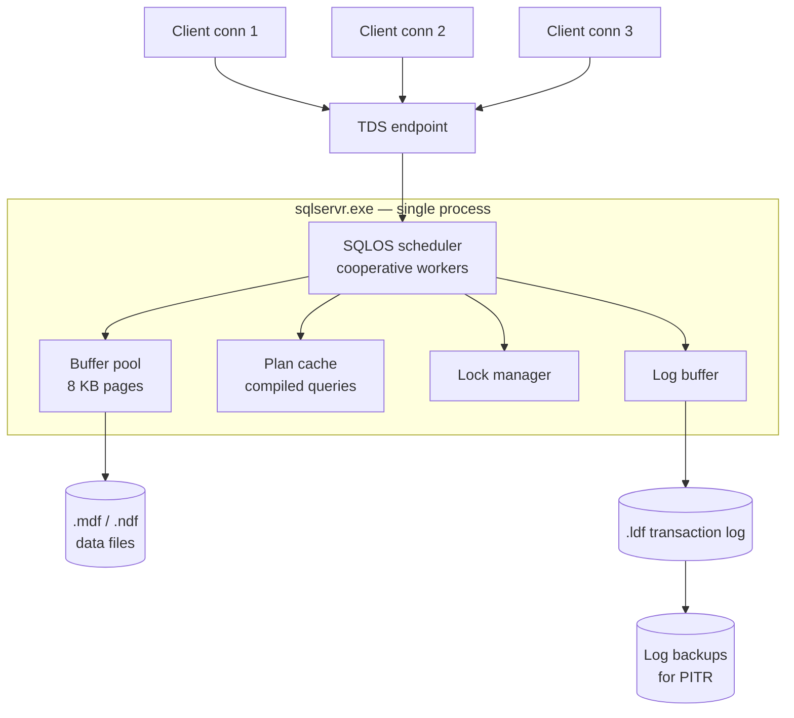

# SQL Server Architecture

> **One-liner**: SQL Server is a single-process RDBMS that runs its own cooperative scheduler (SQLOS) on top of the OS, uses a buffer pool + plan cache for hot data and parsed queries, defaults to pessimistic locking, and writes durability through a per-database transaction log.

---

## Quick Reference

| Item | Value / Fact |
|------|--------------|
| Process model | Single `sqlservr.exe` process; SQLOS schedules thread-like "tasks" via fibers/workers |
| Concurrency control | Locking by default; optional MVCC via Read Committed Snapshot (RCSI) or Snapshot Isolation |
| Durability mechanism | Per-database transaction log (`.ldf`) — WAL discipline; flushed before commit returns |
| Default page size | 8 KB; 8 pages = one 64 KB **extent** |
| Storage files | `.mdf` primary data, `.ndf` secondary data, `.ldf` transaction log |
| Storage engines | Rowstore (default), Columnstore (analytics), In-Memory OLTP (Hekaton) |
| Default index type | B-tree (clustered + nonclustered) |
| Default isolation | Read Committed (locking flavor) |
| High availability | Always On Availability Groups (sync/async commit), Failover Cluster Instances, log shipping |
| Query optimizer | Cost-based; plan cache aggressively reused; "parameter sniffing" tradeoffs |
| Editions | Express (free, 10 GB), Standard, Enterprise, Developer (free for dev), Azure SQL (managed) |
| Inspect runtime | `sys.dm_exec_requests`, `sys.dm_os_wait_stats`, `sys.dm_exec_query_stats` |

---

## Core Concept

SQL Server runs as a **single OS process** (`sqlservr.exe`). Inside it lives **SQLOS** — a user-mode cooperative scheduler that sits between the engine and the kernel. SQLOS creates one scheduler per logical CPU and binds a pool of workers to each. Tasks (the engine's unit of work) run on workers and **yield voluntarily** at well-defined points; nothing is preemptively descheduled by the engine. When workers can't get CPU time they pile up as `SOS_SCHEDULER_YIELD` waits — the canonical signal of CPU pressure.

Memory is organized around four big consumers. The **buffer pool** caches 8 KB data pages and is usually the largest. The **plan cache** holds compiled query plans keyed by statement text/hash, so repeat queries skip parsing and optimization. The **lock manager** tracks every row/page/table lock the workload holds. The **columnstore object pool** caches compressed segments for analytical queries. All four compete for the same `max server memory` budget.

Storage is file-based. Every database has at least one **`.mdf`** primary data file, optional **`.ndf`** secondary data files, and one **`.ldf`** transaction log. Data files hold 8 KB pages grouped into 64 KB extents; the log is purely sequential.

**Concurrency is locking by default** — readers acquire shared locks unless `READ_COMMITTED_SNAPSHOT` is on, at which point Read Committed becomes MVCC-flavored using a version store in `tempdb`. This pessimistic-default is the loudest behavioral contrast with Postgres.

The transaction log enforces **WAL discipline**: every change is appended as a log record, and `COMMIT` does not return until those records are `fsync`-ed to the `.ldf`. Checkpoints flush dirty data pages; recovery replays the log from the last checkpoint. Resemblances to Postgres are everywhere — B-tree indexes, opt-in MVCC, WAL durability — but defaults and process model differ sharply.

---

## Diagram

### Process, SQLOS, and memory



### Write path for an UPDATE

```mermaid
sequenceDiagram
    participant C as Client
    participant Q as Query exec
    participant BP as Buffer pool
    participant LB as Log buffer
    participant LDF as .ldf on disk
    participant MDF as .mdf on disk
    C->>Q: BEGIN TRAN; UPDATE...
    Q->>BP: Load page (read from MDF if cold)
    Q->>BP: Modify row in-place (dirty page)
    Q->>LB: Write log record (LSN assigned)
    C->>Q: COMMIT
    Q->>LB: Flush log records up to commit LSN
    LB->>LDF: fsync — durable
    Q-->>C: OK
    Note over BP,MDF: Dirty page stays in pool; CHECKPOINT flushes later
```

*Reading the diagrams together*: every connection lands on a SQLOS scheduler and runs as a worker inside the single `sqlservr.exe` process. The hot-path I/O at commit is a single `fsync` of the log buffer to the `.ldf`. The dirty data page in the buffer pool isn't required to hit the `.mdf` until the next `CHECKPOINT`, which is what lets SQL Server absorb write bursts while still being crash-safe.

---

## Syntax & API

### Inspect SQLOS, memory, and live work

```sql
-- Version, edition, build
SELECT @@VERSION;
SELECT SERVERPROPERTY('Edition'),
       SERVERPROPERTY('ProductVersion'),
       SERVERPROPERTY('EngineEdition');

-- Per-database isolation/recovery posture
SELECT name, recovery_model_desc,
       is_read_committed_snapshot_on,
       snapshot_isolation_state_desc
FROM sys.databases
ORDER BY name;

-- One row per scheduler — is_online, current_tasks_count, runnable_tasks_count
-- A consistently nonzero runnable_tasks_count means workers are waiting for CPU.
SELECT scheduler_id, cpu_id, status, is_online,
       current_tasks_count, runnable_tasks_count, work_queue_count
FROM sys.dm_os_schedulers
WHERE scheduler_id < 255;     -- exclude DAC + hidden schedulers

-- Cumulative waits — top waits since last instance restart (or DBCC SQLPERF reset)
SELECT TOP 10 wait_type, waiting_tasks_count,
       wait_time_ms, signal_wait_time_ms
FROM sys.dm_os_wait_stats
WHERE wait_type NOT IN (N'CLR_AUTO_EVENT', N'SLEEP_TASK', N'BROKER_TASK_STOP')
ORDER BY wait_time_ms DESC;

-- Memory consumption by component (buffer pool is usually the dominant clerk)
SELECT TOP 10 type, name,
       pages_kb / 1024 AS pages_mb,
       virtual_memory_committed_kb / 1024 AS vm_committed_mb
FROM sys.dm_os_memory_clerks
ORDER BY pages_kb DESC;

-- What is every session currently running, with the SQL text
SELECT r.session_id, r.status, r.command,
       r.wait_type, r.wait_time, r.blocking_session_id,
       SUBSTRING(t.text, (r.statement_start_offset / 2) + 1,
           ((CASE r.statement_end_offset
                 WHEN -1 THEN DATALENGTH(t.text)
                 ELSE r.statement_end_offset
             END - r.statement_start_offset) / 2) + 1) AS current_statement
FROM sys.dm_exec_requests AS r
CROSS APPLY sys.dm_exec_sql_text(r.sql_handle) AS t
WHERE r.session_id > 50;       -- skip system sessions
```

### Locking vs RCSI — two-session demo

Open two `sqlcmd` or SSMS sessions side by side. The point is that **default Read Committed blocks**, while **RCSI returns the last committed version without blocking**.

```sql
-- One-time setup
CREATE DATABASE Shop;
GO
USE Shop;
GO
CREATE TABLE dbo.Users (Id INT PRIMARY KEY, Name NVARCHAR(100));
INSERT INTO dbo.Users (Id, Name) VALUES (1, N'Alice');
```

```sql
-- Session A — default Read Committed (locking)
USE Shop;
BEGIN TRAN;
UPDATE dbo.Users SET Name = N'Alicia' WHERE Id = 1;
-- DO NOT COMMIT YET
```

```sql
-- Session B — under default Read Committed, this BLOCKS on A's exclusive lock
USE Shop;
SELECT Name FROM dbo.Users WHERE Id = 1;
-- → spinner; waits for A
```

Now turn on RCSI and try again:

```sql
ALTER DATABASE Shop SET READ_COMMITTED_SNAPSHOT ON;

-- Session A
BEGIN TRAN;
UPDATE Users SET Name = N'Alicia' WHERE Id = 1;
-- (do NOT commit)
```

```sql
-- Session B (under RCSI — does not block)
SELECT Name FROM Users WHERE Id = 1;
-- → N'Alice'  (snapshot read of last committed version)

-- Without RCSI, Session B would block on Session A's exclusive lock.
```

After Session A commits, Session B sees `N'Alicia'` on the next read. The pre-update version was served from the row-version store in `tempdb`.

### .NET integration with `Microsoft.Data.SqlClient`

```csharp
// dotnet add package Microsoft.Data.SqlClient
using Microsoft.Data.SqlClient;
using System.Data;
using System.Transactions;

const string connStr =
    "Server=tcp:localhost,1433;Database=Shop;User Id=app;Password=...;"
    + "Encrypt=True;TrustServerCertificate=True;";

// Parameterized async query — never concatenate strings into SQL
public static async Task<string?> GetUserNameAsync(int id, CancellationToken ct)
{
    await using var conn = new SqlConnection(connStr);
    await conn.OpenAsync(ct);

    await using var cmd = new SqlCommand(
        "SELECT Name FROM dbo.Users WHERE Id = @id;", conn);
    cmd.Parameters.Add("@id", SqlDbType.Int).Value = id;

    var result = await cmd.ExecuteScalarAsync(ct);
    return result as string;
}

// Explicit transaction at the command level
public static async Task TransferAsync(int fromId, int toId, decimal amount, CancellationToken ct)
{
    await using var conn = new SqlConnection(connStr);
    await conn.OpenAsync(ct);

    await using var tx = (SqlTransaction)await conn.BeginTransactionAsync(
        IsolationLevel.ReadCommitted, ct);

    await using (var debit = new SqlCommand(
        "UPDATE dbo.Accounts SET Balance = Balance - @a WHERE Id = @id;", conn, tx))
    {
        debit.Parameters.Add("@a",  SqlDbType.Decimal).Value = amount;
        debit.Parameters.Add("@id", SqlDbType.Int).Value     = fromId;
        await debit.ExecuteNonQueryAsync(ct);
    }
    await using (var credit = new SqlCommand(
        "UPDATE dbo.Accounts SET Balance = Balance + @a WHERE Id = @id;", conn, tx))
    {
        credit.Parameters.Add("@a",  SqlDbType.Decimal).Value = amount;
        credit.Parameters.Add("@id", SqlDbType.Int).Value     = toId;
        await credit.ExecuteNonQueryAsync(ct);
    }
    await tx.CommitAsync(ct);
}

// Ambient transaction with TransactionScope — flows across calls and connections
public static async Task EnrollAndChargeAsync(int userId, decimal price, CancellationToken ct)
{
    using var scope = new TransactionScope(
        TransactionScopeOption.Required,
        new TransactionOptions { IsolationLevel = System.Transactions.IsolationLevel.ReadCommitted },
        TransactionScopeAsyncFlowOption.Enabled);

    await EnrollAsync(userId, ct);
    await ChargeAsync(userId, price, ct);

    scope.Complete();   // commit; without Complete() the transaction rolls back on dispose
}
```

See [[14 - ADO.NET and Dapper]] for parameterization patterns and Dapper micro-ORM usage.

---

## Common Patterns

### Always On Availability Groups (AG)

An AG is a set of database replicas — one **primary** and one or more **secondaries** — that share a transaction-log stream. Each replica can be **synchronous** (the primary waits for the secondary to harden the log before acknowledging commit) or **asynchronous** (fire-and-forget). The classic three-replica topology trades off latency, durability, and DR distance:

```text
[Primary, sync]  ──→  [Secondary 1, sync, auto-failover candidate]
        │
        └────────────→  [Secondary 2, async, in DR region]
```

AGs run on top of a **Windows Server Failover Cluster (WSFC)** for quorum and lease management — node votes plus an optional file-share or cloud witness decide who owns the primary role. Automatic failover requires a synchronous secondary in a healthy state; the failover detection threshold (`HealthCheckTimeout`, `FailureConditionLevel`) governs how aggressively the cluster reacts to a sick primary.

Secondaries can be made **readable** to offload reporting traffic. Reads on a readable secondary use snapshot isolation under the hood, regardless of the session's requested isolation level. Standard Edition supports a limited "Basic" AG (two replicas, one DB); full multi-replica AGs need Enterprise. See [[03 - High Availability and Failover]].

### Columnstore for analytics

Rowstore tables are great for OLTP but bad for "scan 100 M rows and aggregate". A **clustered columnstore index** rewrites the table column-by-column, compresses each column into **segments** (~1 M rows each), and lets the engine read just the columns the query references:

```sql
CREATE TABLE dbo.Sales (
    SaleId    BIGINT      NOT NULL,
    StoreId   INT         NOT NULL,
    SoldAt    DATETIME2   NOT NULL,
    Amount    DECIMAL(12, 2) NOT NULL,
    SkuId     INT         NOT NULL
);

CREATE CLUSTERED COLUMNSTORE INDEX cci_Sales ON dbo.Sales;
```

The optimizer then chooses **batch-mode** execution (operating on 1,024-row batches with SIMD-friendly tight loops) instead of the classic row-at-a-time iterator. Aggregations and large joins get 10–100× speedups; point lookups get slower. Hybrid OLTP+analytics shops add a **nonclustered columnstore** to a rowstore table so OLTP keeps the rowstore primary and reporting uses the columnstore.

### In-Memory OLTP (Hekaton)

Hekaton is a parallel engine inside SQL Server for **memory-resident tables** with optimistic concurrency and natively compiled stored procedures:

```sql
CREATE TABLE dbo.HotCart (
    CartId    INT          NOT NULL PRIMARY KEY NONCLUSTERED HASH WITH (BUCKET_COUNT = 1000000),
    UserId    INT          NOT NULL,
    UpdatedAt DATETIME2    NOT NULL
) WITH (MEMORY_OPTIMIZED = ON, DURABILITY = SCHEMA_AND_DATA);
```

Key properties: data structures are **latch-free** (no page locks, no shared-memory latches); concurrency is **optimistic MVCC** with row versions kept in memory; access can be via interpreted T-SQL or via **natively compiled** stored procedures that translate to C and skip the interpreter entirely. Durability has two flavors — `SCHEMA_AND_DATA` (logged to the regular `.ldf`) and `SCHEMA_ONLY` (no recovery, perfect for transient session/cache tables that survive only as long as the instance is up).

### Plan cache and parameter sniffing

SQL Server compiles a plan for each statement, caches it keyed by hash, and **reuses the plan on subsequent calls — even when the parameter values differ wildly**. This is "parameter sniffing": the first execution's parameter values shape the plan, and queries with skewed value distributions (e.g. one customer has 10 M orders, the rest have 50) get a plan tuned for whoever called first. Mitigations, in increasing order of bluntness:

```sql
-- Recompile this query every time (best for ad-hoc reports)
SELECT * FROM dbo.Orders WHERE CustomerId = @cid
OPTION (RECOMPILE);

-- Ignore the actual parameter; plan for the histogram average
SELECT * FROM dbo.Orders WHERE CustomerId = @cid
OPTION (OPTIMIZE FOR UNKNOWN);

-- Plan for a specific representative value (the "good" plan)
SELECT * FROM dbo.Orders WHERE CustomerId = @cid
OPTION (OPTIMIZE FOR (@cid = 42));
```

Database-level knobs in **`DATABASE SCOPED CONFIGURATIONS`** let you pin the **cardinality estimator** version (`LEGACY_CARDINALITY_ESTIMATION`), force per-statement parameter sniffing off (`PARAMETER_SNIFFING = OFF`), and toggle Query Store hint behaviour without changing application code. See [[09 - Performance Tuning]].

### Comparison with the other two engines

| Dimension | PostgreSQL | SQL Server | MongoDB |
|-----------|------------|------------|---------|
| **Model** | Relational (SQL) | Relational (T-SQL) | Document (BSON) |
| **Process model** | Process-per-connection (postmaster forks a backend) | Single process, user-mode scheduler (SQLOS) with thread pool | Single process (`mongod`), thread-per-connection |
| **Storage unit** | 8 KB pages, heap files + TOAST for large values | 8 KB pages grouped into 64 KB extents (`.mdf`/`.ndf`) | BSON documents in collections; WiredTiger files |
| **Storage engine** | Heap + B-tree/GIN/GiST/BRIN indexes | Pluggable (rowstore, columnstore, in-memory Hekaton) | WiredTiger (default; B-tree or LSM) |
| **Concurrency** | MVCC via heap-tuple versioning (no read locks) | Locking by default; optional MVCC via Snapshot Isolation / RCSI | MVCC via WiredTiger, document-level locking |
| **Durability** | WAL (Write-Ahead Log) + fsync at commit | Transaction log (`.ldf`) + WAL discipline | Journal (per-write) + oplog (per-replica-set) |
| **Default isolation** | Read Committed | Read Committed (locking) | Snapshot (within a transaction); read-uncommitted-ish outside |
| **Transactions** | Full ACID, any statement set | Full ACID, any statement set | Multi-document since 4.0 (replica set) / 4.2 (sharded) |
| **Replication** | Streaming (physical WAL) + Logical (decoded) | Always On Availability Groups (sync/async) + log shipping | Replica set: primary + secondaries replay the oplog |
| **HA / failover** | Patroni / repmgr / pg_auto_failover (external) | Built-in AG automatic failover with WSFC quorum | Built-in via replica set election (Raft-like) |
| **Horizontal scale** | Manual partitioning + Citus extension | Partitioned tables; sharding via SQL Sharding/Synapse | First-class sharding via `mongos` + config servers |
| **Query planner** | Cost-based, plans cached per prepared statement | Cost-based, plans cached aggressively in the plan cache | Rule-based + cost-based hybrid; plan cache per query shape |
| **Extension model** | First-class extensions (PostGIS, pgvector, TimescaleDB, pg_trgm) | Built-in feature surface + CLR assemblies; few "extensions" in the Postgres sense | Limited; some features behind Atlas-only flags |
| **Strongest fit** | OLTP + mixed analytics, JSON-and-SQL, GIS, embeddings, open-source TCO | Windows/.NET enterprises, BI stack (SSAS/SSRS/SSIS), Azure SQL hybrid | Flexible schema, hierarchical/polymorphic data, content/CMS, IoT |
| **Weakest fit** | Massive horizontal scale without extensions | Cross-platform OSS preferences; licensing cost at scale | Cross-document joins/transactions at scale; strict relational integrity |

---

## Gotchas & Tips

- **Default isolation is locking Read Committed** — heavy readers block writers and vice versa. Turning on `READ_COMMITTED_SNAPSHOT` gives MVCC-like behavior application-wide with no code change, but shifts pressure onto `tempdb` (the version store lives there).
- **`tempdb` is shared across the entire instance** — RCSI/SI versions, sort spills, hash spills, temp tables, table variables, intermediate aggregations all land there. Pre-size it, **split it into multiple equally-sized files** (one per logical CPU up to 8) to relieve PFS/GAM allocation contention, and put it on the fastest disk you have.
- **Plan cache + parameter sniffing** — the same query is fast for some inputs and slow for others because the first compile shaped the plan. Mitigations: `OPTION (RECOMPILE)`, `OPTIMIZE FOR`, `OPTIMIZE FOR UNKNOWN`, Query Store plan forcing, or upgrading the cardinality estimator via `COMPATIBILITY_LEVEL`.
- **Editions matter for licensing AND for feature gating.** Standard caps memory (128 GB), restricts AGs to a basic two-node form, lacks online index rebuild, and disables most Enterprise-only optimizer features. Enterprise unlocks the full surface — and the full price.
- **`sys.dm_os_wait_stats` is the first stop for "why is it slow".** Wait categories reveal where time is going: `SOS_SCHEDULER_YIELD` = CPU pressure, `PAGEIOLATCH_*` = data-file I/O, `LCK_M_*` = blocking, `WRITELOG` = log-disk slowness, `RESOURCE_SEMAPHORE` = memory-grant contention.
- **The backup chain (full + differential + log) is mandatory for PITR.** OLTP databases must use `RECOVERY MODEL = FULL` and have a log-backup job — without one, the log grows forever and you cannot restore to a point in time.
- **TDE protects data at rest at the file level** (the `.mdf`, `.ldf`, and backups are encrypted on disk). **Always Encrypted** protects sensitive columns end-to-end — the server never sees plaintext, only the client driver decrypts. Different threat models, different tools. See [[17 - Encryption]].
- **`WITH (NOLOCK)` = `READ UNCOMMITTED`** — dirty reads, missed rows from page splits, double-counted rows from index reorganizations. Do not use it as a generic "make it faster" hint; enable RCSI instead and let the engine serve consistent snapshots.
- **T-SQL `MERGE` has a long, documented bug history** (race conditions under concurrency, incorrect trigger firing, plan instability). Many shops ban it outright and use explicit `IF EXISTS THEN UPDATE ELSE INSERT` or `INSERT ... ON CONFLICT`-style patterns instead.
- **`COMPATIBILITY_LEVEL` governs cardinality estimator behavior**, not just T-SQL syntax. Upgrading the server instance does **not** auto-upgrade optimizer behavior — databases keep their old `COMPATIBILITY_LEVEL` until you change it. This is intentional, but easy to forget, so plan regressions can hide for years.
- **`tempdb` is auto-grow-prone** because the workload is spiky. Pre-size and pre-grow each file in production so you never pay the auto-grow stall during a critical query. Disable auto-shrink on every database.
- **Connection-pool exhaustion in `Microsoft.Data.SqlClient`** shows up as `InvalidOperationException` and `WAIT_FOR_RESULTS` server-side, not as "out of connections" — always dispose `SqlConnection` (use `await using`), avoid long-lived open connections, and tune `Max Pool Size` to match `max_workers`. See [[13 - Connection Management]].

---

## See Also

- [[01 - Database Overview]] — engine taxonomy
- [[02 - Transactions and ACID]]
- [[03 - Isolation Levels]] — RCSI and Snapshot Isolation specifics
- [[04 - Locking and Concurrency]] — SQL Server's pessimistic default
- [[14 - ADO.NET and Dapper]] — .NET integration
- [[17 - Cloud Databases]] — Azure SQL Database / Managed Instance
- [[22 - PostgreSQL Architecture]] — sibling architecture note
- [[24 - MongoDB Architecture]] — sibling architecture note
