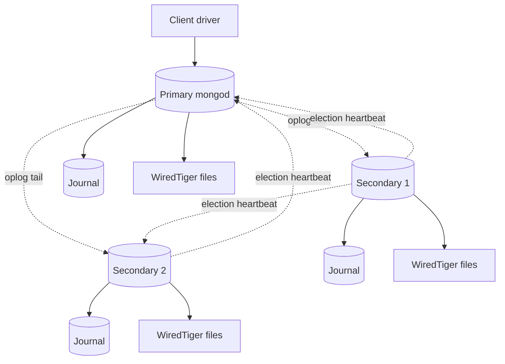
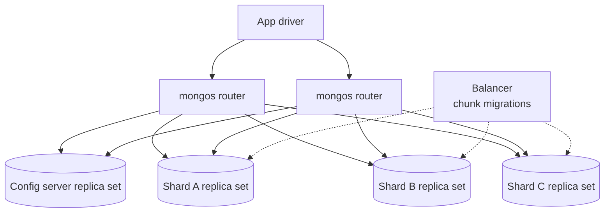

# MongoDB Architecture

> **One-liner**: MongoDB is a document database built around `mongod` and the WiredTiger storage engine; replica sets provide HA via an oplog-driven primary-secondary topology, and sharded clusters provide horizontal scale through a `mongos` router fronting per-shard replica sets.

---

## Quick Reference

| Item | Value / Fact |
|------|--------------|
| Process | `mongod` (data node), `mongos` (sharding router), config-server replica set |
| Document format | BSON — binary JSON with extended types (`ObjectId`, `Date`, `Decimal128`, `Binary`) |
| Default storage engine | WiredTiger |
| Concurrency control | MVCC via WiredTiger; document-level locking |
| Durability mechanism | Journal (per-write, group-commit) + oplog (per-replica-set) |
| Default page / block | ~32 KB internal page in WiredTiger; documents up to 16 MB |
| Replica set | 1 primary + N secondaries (+ optional arbiter); Raft-like election |
| Sharding | `mongos` router + config servers + N shard replica sets; chunks split on shard key |
| Default index type | B-tree (single, compound, multikey, text, geo, hashed, wildcard) |
| Transactions | Multi-document since 4.0 (replica set), 4.2 (sharded); default scope is single-document |
| Read concerns | `local`, `available`, `majority`, `linearizable`, `snapshot` |
| Write concerns | `{ w: 1 }` … `{ w: "majority", j: true, wtimeout: 5000 }` |
| Inspect runtime | `db.serverStatus()`, `db.currentOp()`, `rs.status()`, `sh.status()` |

---

## Core Concept

The unit of data is the **document** — a BSON object up to 16 MB. Collections hold documents; databases hold collections. No schema is enforced by default, but `$jsonSchema` validators can lock down shape, types, and required fields once a design stabilizes. Indexes, transactions, and the query language all operate on documents, not rows.

The storage engine is **WiredTiger** — pluggable but de-facto universal since 3.2. It supports both B-tree (default) and LSM layouts, compresses pages with Snappy/Zstandard, and gives MongoDB **document-level locking** plus **MVCC**: concurrent writers to different documents do not block, and readers see a consistent snapshot per document without taking shared locks.

A **replica set** is the unit of high availability. One node is **primary** and accepts writes; the others are **secondaries** that tail the **oplog** — a capped collection on the primary that records every write — and replay it. On primary failure, surviving nodes hold a **Raft-like election** and a new primary takes over within seconds. Drivers transparently reconnect.

**Sharding** is a first-class scale-out story. Client traffic lands on a stateless `mongos` router, which consults a **config-server replica set** to find which shard owns the relevant shard-key range, then forwards the query to that shard — which is itself a replica set. Each collection splits into **chunks** (ranges of shard-key values) and a balancer migrates chunks to keep load even.

**Read concerns** (`local`, `majority`, `linearizable`, `snapshot`) and **write concerns** (`w: 1`, `w: "majority"`, `j: true`) are tunable per operation. Production writes should generally use `{ w: "majority", j: true }`.

Resemblances to the other two engines are everywhere: B-tree indexes by default, MVCC like Postgres, and WAL-style durability via journal + oplog.

---

## Diagram

### Replica set



### Sharded cluster



*Reading the diagrams together*: a replica set is the unit of durability and failover — every write is journaled locally and tailed by secondaries through the oplog. A sharded cluster is the unit of scale-out — `mongos` is a stateless router that asks the config servers where each shard-key range lives, and each shard is itself an entire replica set. The balancer runs in the background, moving chunks to keep storage and traffic even.

---

## Syntax & API

### Inspect the running cluster

```javascript
// Server-wide health, memory, network, connections, opcounters
db.serverStatus()
db.serverStatus().connections        // { current, available, totalCreated }
db.serverStatus().wiredTiger.cache   // bytes currently in cache vs configured

// Long-running or blocked operations
db.currentOp({ "secs_running": { $gte: 5 } })
db.currentOp({ "waitingForLock": true })

// Per-collection storage and index sizes
db.orders.stats()
db.orders.stats().indexSizes        // bytes per index — find unused / oversized ones
db.orders.aggregate([{ $indexStats: {} }])  // usage count + last access per index

// Replica-set posture — who is primary, lag in seconds, last oplog time
rs.status()
rs.status().members.map(m => ({
    name: m.name,
    state: m.stateStr,
    syncingTo: m.syncSourceHost,
    lagSecs: m.optimeDate ? (rs.status().date - m.optimeDate) / 1000 : null
}))

db.printReplicationInfo()           // oplog size, window, first/last entry
db.printSecondaryReplicationInfo()  // per-secondary lag summary

// Sharded-cluster posture — chunk distribution per collection
sh.status()
sh.status({verbose: true})          // chunk-level detail
```

### Stand up a replica set locally

```bash
# Three mongod processes, all members of replica set "rs0"
mongod --replSet rs0 --port 27017 --dbpath /data/rs0-1 --bind_ip localhost
mongod --replSet rs0 --port 27018 --dbpath /data/rs0-2 --bind_ip localhost
mongod --replSet rs0 --port 27019 --dbpath /data/rs0-3 --bind_ip localhost
```

```javascript
// rs.initiate on the first node
rs.initiate({
    _id: "rs0",
    members: [
        { _id: 0, host: "mongo1:27017" },
        { _id: 1, host: "mongo2:27017" },
        { _id: 2, host: "mongo3:27017" }
    ]
})

rs.status()       // see primary/secondary roles, oplog position
db.printReplicationInfo()
```

A few seconds after `rs.initiate`, one member wins the election and becomes primary. `rs.status().members[i].stateStr` will show `PRIMARY` or `SECONDARY`. From this point, writes only succeed against the primary; the driver figures out which node that is via the `?replicaSet=rs0` URI parameter.

### Multi-document transactions from .NET

```csharp
// dotnet add package MongoDB.Driver
using MongoDB.Bson;
using MongoDB.Driver;

var client = new MongoClient("mongodb://mongo1,mongo2,mongo3/?replicaSet=rs0");
using var session = await client.StartSessionAsync();

session.StartTransaction(new TransactionOptions(
    readConcern: ReadConcern.Snapshot,
    writeConcern: WriteConcern.WMajority));

try {
    var orders   = client.GetDatabase("shop").GetCollection<BsonDocument>("orders");
    var accounts = client.GetDatabase("shop").GetCollection<BsonDocument>("accounts");

    await accounts.UpdateOneAsync(session, Builders<BsonDocument>.Filter.Eq("_id", 1),
        Builders<BsonDocument>.Update.Inc("balance", -100));
    await orders.InsertOneAsync(session, new BsonDocument {
        { "user_id", 1 }, { "total", 100 }
    });

    await session.CommitTransactionAsync();
} catch {
    await session.AbortTransactionAsync();
    throw;
}
```

Multi-document transactions require a replica set (4.0+) or sharded cluster (4.2+). Keep them short — the default `transactionLifetimeLimitSeconds` is 60, and snapshot reads pin oplog/cache state on every shard touched. For single-document operations, use the normal CRUD API; every single-document update is already atomic.

---

## Common Patterns

### Choosing a shard key

The shard key is the single most consequential design decision in a MongoDB cluster. It determines write distribution, query routing, and how often the balancer has to move chunks. A good shard key has three properties: **high cardinality** (many distinct values, so chunks can split fine), **low write frequency on individual values** (so no single chunk becomes a write hotspot), and **non-monotonic** (so sequential inserts spread across shards instead of all hitting the highest chunk).

The classic antipattern is sharding on a monotonically increasing `_id` (default `ObjectId`) or `created_at` — every new write goes to the last shard, leaving the others idle. Fixes: a **hashed shard key** (`sh.shardCollection("shop.orders", { _id: "hashed" })`) scatters writes uniformly, or a **compound key** (`{ tenant_id: 1, _id: 1 }`) gives both routing locality per tenant and write spread across tenants.

### Read preference

Each operation can target the primary or any secondary via the **read preference**:

| Mode | Target | Trade-off |
|------|--------|-----------|
| `primary` (default) | Primary only | Strong consistency; no offload |
| `primaryPreferred` | Primary if up, else secondary | Survives short failovers, may serve stale on degraded state |
| `secondary` | Secondary only | Offloads reads; tolerates replication lag |
| `secondaryPreferred` | Secondary if up, else primary | Best-effort offload |
| `nearest` | Lowest-latency member | Geo-distributed deployments |

Secondaries serve reads at the price of staleness — they are at least one oplog round-trip behind. Pair with `readConcern: "majority"` if you also need to avoid reading writes that could be rolled back.

### Write concerns and journal

Write concern is the other half of the durability dial. The `w` field controls how many replicas must acknowledge; `j: true` requires the journal to be fsync-ed before acknowledgement.

| Concern | Acks | Durable on crash? | Use for |
|---------|------|-------------------|---------|
| `{ w: 0 }` | None (fire-and-forget) | No | Metrics, throwaway telemetry |
| `{ w: 1 }` | Primary only | If primary survives | Historical default — risky |
| `{ w: "majority" }` | Majority of voting members | Survives single-node loss | OLTP default |
| `{ w: "majority", j: true }` | Majority + primary journal fsync | Survives primary crash | Financial / regulated writes |
| `{ w: "majority", j: true, wtimeout: 5000 }` | Same, with 5 s ceiling | Same, but error-bounded | Production default |

Without `wtimeout`, a degraded cluster (no majority reachable) will hang the write forever. Always cap it.

### Schema-design patterns — embed vs reference

The default move in MongoDB is **embed**: put related data inside the same document because the most common access pattern is "fetch user + their addresses + their preferences in one round trip". The limits are the 16 MB document cap and unbounded growth (an embedded array that keeps appending will eventually blow the cap).

When embedding doesn't fit, three patterns recur. **Reference** stores foreign IDs and uses `$lookup` (or, more commonly, an application-side fetch) to join. The **extended reference** pattern caches the few frequently-read fields of the referenced document inline (`{ author_id, author_name, author_avatar_url }`) — fast reads, with an eventual-consistency contract on the cached fields. **Bucketing** groups time-series points into one document per time window (`{ sensor_id, hour, samples: [...] }`); this collapses millions of points-per-day into hundreds of buckets, dramatically cutting index size and improving cache locality.

### Comparison with the other two engines

| Dimension | PostgreSQL | SQL Server | MongoDB |
|-----------|------------|------------|---------|
| **Model** | Relational (SQL) | Relational (T-SQL) | Document (BSON) |
| **Process model** | Process-per-connection (postmaster forks a backend) | Single process, user-mode scheduler (SQLOS) with thread pool | Single process (`mongod`), thread-per-connection |
| **Storage unit** | 8 KB pages, heap files + TOAST for large values | 8 KB pages grouped into 64 KB extents (`.mdf`/`.ndf`) | BSON documents in collections; WiredTiger files |
| **Storage engine** | Heap + B-tree/GIN/GiST/BRIN indexes | Pluggable (rowstore, columnstore, in-memory Hekaton) | WiredTiger (default; B-tree or LSM) |
| **Concurrency** | MVCC via heap-tuple versioning (no read locks) | Locking by default; optional MVCC via Snapshot Isolation / RCSI | MVCC via WiredTiger, document-level locking |
| **Durability** | WAL (Write-Ahead Log) + fsync at commit | Transaction log (`.ldf`) + WAL discipline | Journal (per-write) + oplog (per-replica-set) |
| **Default isolation** | Read Committed | Read Committed (locking) | Snapshot (within a transaction); read-uncommitted-ish outside |
| **Transactions** | Full ACID, any statement set | Full ACID, any statement set | Multi-document since 4.0 (replica set) / 4.2 (sharded) |
| **Replication** | Streaming (physical WAL) + Logical (decoded) | Always On Availability Groups (sync/async) + log shipping | Replica set: primary + secondaries replay the oplog |
| **HA / failover** | Patroni / repmgr / pg_auto_failover (external) | Built-in AG automatic failover with WSFC quorum | Built-in via replica set election (Raft-like) |
| **Horizontal scale** | Manual partitioning + Citus extension | Partitioned tables; sharding via SQL Sharding/Synapse | First-class sharding via `mongos` + config servers |
| **Query planner** | Cost-based, plans cached per prepared statement | Cost-based, plans cached aggressively in the plan cache | Rule-based + cost-based hybrid; plan cache per query shape |
| **Extension model** | First-class extensions (PostGIS, pgvector, TimescaleDB, pg_trgm) | Built-in feature surface + CLR assemblies; few "extensions" in the Postgres sense | Limited; some features behind Atlas-only flags |
| **Strongest fit** | OLTP + mixed analytics, JSON-and-SQL, GIS, embeddings, open-source TCO | Windows/.NET enterprises, BI stack (SSAS/SSRS/SSIS), Azure SQL hybrid | Flexible schema, hierarchical/polymorphic data, content/CMS, IoT |
| **Weakest fit** | Massive horizontal scale without extensions | Cross-platform OSS preferences; licensing cost at scale | Cross-document joins/transactions at scale; strict relational integrity |

---

## Gotchas & Tips

- **The 16 MB document limit is hard.** Append-forever designs (event logs, chat histories, sensor streams) need bucketing into time-windowed documents or a separate collection per logical stream — there is no "increase the limit" knob.
- **`$lookup` exists but is not a JOIN equivalent.** It streams a sub-query from the foreign collection for each outer document, which is fine for occasional reports and pathological for OLTP. Embed or denormalize when reads are hot.
- **Multi-document transactions are expensive and time-bounded.** Default `transactionLifetimeLimitSeconds` is 60; keep transactions short. Snapshot reads pin in-memory versions in WiredTiger cache and pressure every shard the transaction touches.
- **A hot shard key routes all writes to one shard.** Defaulting to the monotonic `ObjectId` `_id` is the most common mistake — use a hashed shard key or a compound `(tenant_id, _id)` to spread inserts.
- **`{ w: 1 }` historically acknowledged only the primary.** If the primary crashes before the write replicates, the acknowledged write is lost during failover. Prefer `{ w: "majority" }` and treat `{ w: 1 }` as legacy.
- **Chunk migrations spike CPU and I/O.** The balancer moves chunks in the background; on busy clusters this competes with foreground traffic. Configure a balancer window (`sh.setBalancerState`) so migrations happen during off-peak hours.
- **The oplog is a capped collection.** Size it (`--oplogSize`, default 5% of disk) to cover your worst-case secondary downtime — if a secondary is offline long enough that the oplog wraps past its last applied entry, the only recovery is a full **initial sync** from another node.
- **Aggregation-pipeline stage order matters.** `$match` before `$group`, projection early, `$sort` ideally on an indexed field. The optimizer reorders some stages but not all — write the pipeline as if it doesn't.
- **Indexes have write cost, and multikey indexes multiply it.** An index on an array field writes one key per array element per document. Audit via `db.collection.aggregate([{ $indexStats: {} }])` and drop indexes whose `accesses.ops` stays at zero.
- **"Schemaless" is true at the storage layer and a liability at the app layer.** Attach a `$jsonSchema` validator to production collections to catch shape drift before it ships malformed documents downstream.
- **Read concern `majority` requires a majority commit point.** During a network partition that costs the cluster majority, `majority` reads stall — which is the desired behavior under CAP, but surprising the first time you see it.
- **MongoDB Atlas and self-hosted differ operationally.** Encryption-at-rest, Atlas Search (Lucene-backed), change-stream limits, and some tuning knobs are Atlas-only. Self-hosted clusters expose more knobs but require you to operate them.

---

## See Also

- [[01 - Database Overview]] — engine taxonomy
- [[18 - JSON and JSONB]] — Postgres's document story
- [[20 - NoSQL Fundamentals]] — document/key-value/wide-column/graph overview
- [[04 - CAP and PACELC]] — consistency vs availability tradeoffs
- [[02 - Replication]] — replication concepts; Mongo replica-set version
- [[01 - Sharding and Partitioning]] — Mongo's first-class sharding model
- [[22 - PostgreSQL Architecture]] — sibling architecture note
- [[23 - SQL Server Architecture]] — sibling architecture note
