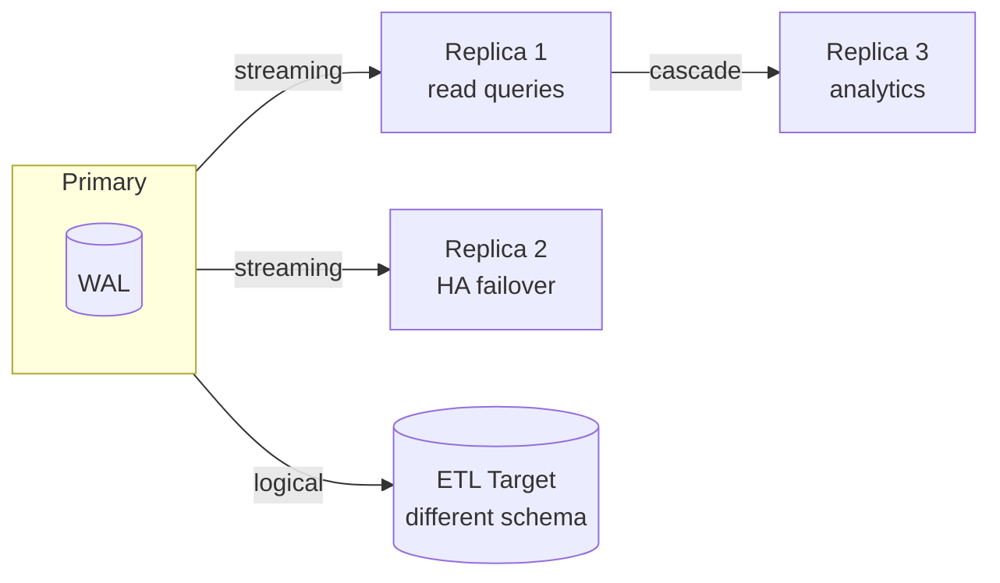

# Replication

> **One-liner**: Replication ships changes from a primary to one or more replicas — physical (byte-level WAL) for HA and read scale, logical (per-row events) for selective sync, ETL, and zero-downtime upgrades.

---

## Quick Reference

| Type | Mechanism | Best for |
|------|-----------|----------|
| **Physical (streaming)** | replays WAL on replica | HA failover, read replicas, identical schema |
| **Logical (publication/subscription)** | decodes WAL → row events | per-table sync, version upgrades, multi-DB ETL |
| **Synchronous** | primary waits for replica ack on commit | zero data loss; slower writes |
| **Asynchronous** (default) | primary commits immediately, replica catches up | fast writes; risk of small data loss on crash |
| **Cascading** | replica replicates to another replica | fan-out without primary load |

| Postgres terms | |
|----------------|---|
| **Primary** (was "master") | source of writes |
| **Replica / standby** | follows primary |
| **Hot standby** | replica that accepts read queries |
| **WAL sender / receiver** | network processes shipping log |
| **Replication slot** | persistent cursor on WAL; prevents premature recycling |
| **`pg_basebackup`** | initial replica seeding |

---

## Core Concept

Postgres replication is built on the **Write-Ahead Log (WAL)**. Every committed change is first written to WAL on the primary; replicas receive that stream and replay.

Two delivery models:

- **Physical (streaming)** — byte-for-byte WAL. Replicas are exact mirrors: same files, same indexes, same internal state. Used for HA and read scaling. Replicas can answer queries (hot standby) but can't accept writes.
- **Logical** — WAL is *decoded* into row-level events (`INSERT`, `UPDATE`, `DELETE` for table T). Subscribers can be selective (some tables), can be different schema, can even be different versions of Postgres. Used for ETL, blue/green migrations, partial replicas.

**Synchronous replication** waits for at least N replicas to confirm WAL flush before commit returns. Stronger durability; latency penalty.

**Replication slots** are persistent server-side cursors on the WAL. They prevent the primary from recycling WAL a replica still needs — at the cost of WAL piling up if a replica goes away.

---

## Diagram



---

## Syntax & API

### Set up streaming replication

#### Primary configuration
```ini
# postgresql.conf
wal_level             = replica
max_wal_senders       = 10
wal_keep_size         = 1GB           # keep WAL for replicas in GB

# pg_hba.conf — let replicas connect
host  replication  replicator  10.0.0.0/8  scram-sha-256
```

```sql
-- Create the replication user
CREATE ROLE replicator WITH REPLICATION LOGIN PASSWORD 'secret';

-- Optional: create a slot the replica will use
SELECT pg_create_physical_replication_slot('replica1');
```

#### Replica seeding
```bash
# Stop the (empty) replica, copy primary's data dir
sudo systemctl stop postgresql
sudo -u postgres rm -rf /var/lib/postgresql/16/main/*

sudo -u postgres pg_basebackup \
    -h primary -U replicator \
    -D /var/lib/postgresql/16/main \
    -X stream -P -R -S replica1
# -R writes standby.signal + primary_conninfo
# -S uses the named slot

sudo systemctl start postgresql
# Replica starts in recovery mode and follows primary
```

### Verify replication
```sql
-- On primary
SELECT client_addr, state, sync_state,
       pg_wal_lsn_diff(sent_lsn, replay_lsn) AS lag_bytes
FROM pg_stat_replication;

-- On replica
SELECT pg_is_in_recovery();                 -- true
SELECT pg_last_wal_replay_lsn();
SELECT now() - pg_last_xact_replay_timestamp() AS lag;
```

### Promote a replica (failover)
```bash
# Trigger promotion (PG 12+ uses pg_promote)
sudo -u postgres psql -c "SELECT pg_promote();"

# Old primary must be removed or rebuilt as a new replica
# (use pg_rewind to fast-rewind it instead of full base backup)
pg_rewind --source-server="host=newprimary user=replicator" \
          --target-pgdata=/var/lib/postgresql/16/main
```

### Synchronous replication
```ini
# postgresql.conf on primary
synchronous_standby_names = 'FIRST 1 (replica1, replica2)'   # require 1 ack
# or 'ANY 2 (...)' for quorum-style
synchronous_commit = on    # default; per-tx override below
```

```sql
-- Per-transaction override (faster writes when ok)
BEGIN;
SET LOCAL synchronous_commit = local;     -- don't wait for replicas this tx
... ;
COMMIT;
```

### Logical replication
```sql
-- On primary (need wal_level = logical)
CREATE PUBLICATION shop_pub FOR TABLE users, orders;

-- Or for everything
CREATE PUBLICATION all_pub FOR ALL TABLES;
```

```sql
-- On subscriber (after creating matching schema)
CREATE SUBSCRIPTION shop_sub
    CONNECTION 'host=primary user=replicator dbname=shop'
    PUBLICATION shop_pub
    WITH (copy_data = true);

-- Inspect
SELECT * FROM pg_subscription;
SELECT * FROM pg_replication_slots;
SELECT * FROM pg_stat_subscription;
```

### Read-only replicas in app
```text
# Two separate connection strings → two pools
PRIMARY_DB:   Host=primary;Application Name=app-write;
REPLICA_DB:   Host=replica;Application Name=app-read;

# Route SELECTs to replica, writes to primary
# Beware replication lag: read-after-write needs primary
```

---

## Common Patterns

```text
Pattern: HA with two replicas + automatic failover
- Primary + 2 replicas (one sync, one async)
- Patroni / repmgr / pg_auto_failover orchestrates promotion
- HAProxy / PgBouncer routes traffic to current primary
- See [[03 - High Availability and Failover]]
```

```text
Pattern: zero-downtime major-version upgrade
1. Set up new cluster on PG 16 next to PG 15 primary
2. Use logical replication to sync data live
3. Cut over traffic when caught up
4. Decommission old cluster
```

```text
Pattern: split read/write workloads
- All writes → primary
- Heavy analytics / dashboards → async replica
- Acceptable if eventual consistency for reports
```

---

## Gotchas & Tips

- **Async lag is real** — even on a LAN, replicas can lag seconds under load. Don't read your own writes from a replica.
- **Replication slot leakage piles up WAL** — if a replica disappears, the slot keeps WAL forever. Monitor `pg_replication_slots.wal_status` and disk.
- **Synchronous is slower than async** — every commit waits for at least one replica ack. Use it where data loss is unacceptable; tune which transactions need it.
- **`pg_rewind` saves base-backup time after failover** — fast-forwards the old primary to follow the new one.
- **Logical replication doesn't replicate DDL** — schema changes must be applied to subscriber separately (PG 16+ has limited DDL support; still careful).
- **Logical replication has lag spikes on large transactions** — a single huge tx blocks others. Watch out for batch-update jobs.
- **Replicas are read-only** — temp tables on replica are okay (PG 14+); other writes will fail.
- **Backups can run on replicas** — `pg_dump` from a replica reduces primary load. Just be aware of replication lag at backup time.
- **Watch for "replication slot too large"** alerts — set up disk-usage monitoring; orphan slots fill disks fast.
- **Cascading replication scales reads** — Postgres lets a replica be the upstream for another replica, fanning out without burdening the primary.

---

## See Also

- [[03 - High Availability and Failover]]
- [[01 - Sharding and Partitioning]]
- [[15 - Backup and Restore]]
- [[13 - ETL and CDC]]
